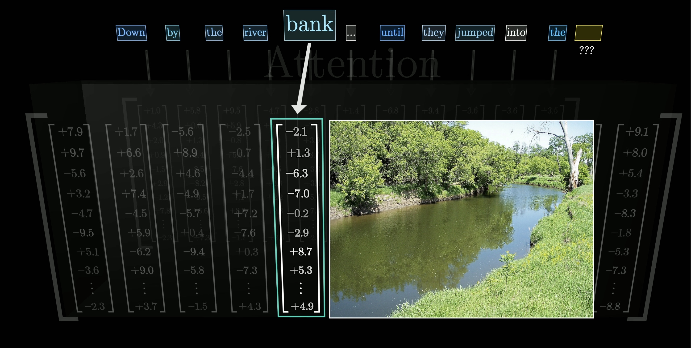
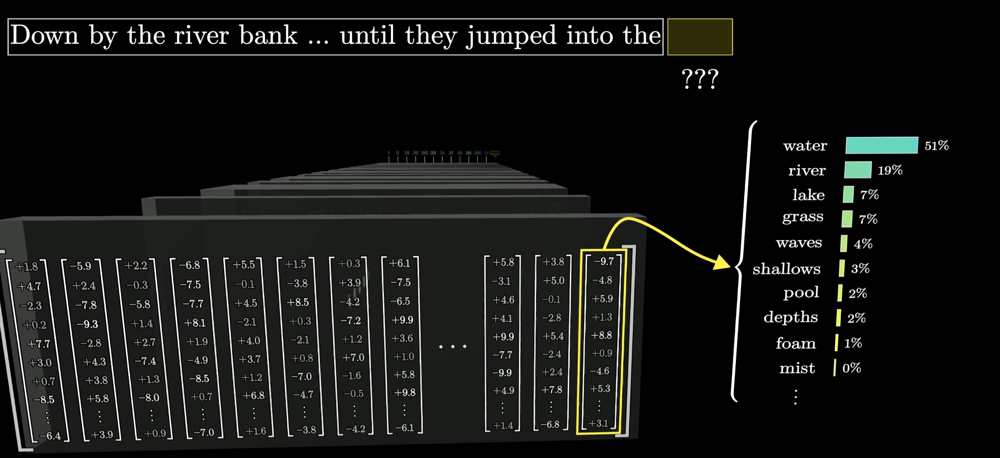

# AI 的能力从哪里来

你问 AI：“请用一句话解释晶体管。”先看常见语言模型不额外检索资料、直接生成文本的情况：模型根据当前输入，连续预测下一个词元的概率。一个词元可能是一个字、一个词或词的一部分。模型选出一个词元，把它接到已有文本后，再根据增长后的整段文本预测下一个。反复执行，回答就逐步形成。

本文是 Grant Sanderson 课程 **Large Language Models explained briefly** 的中文改编，原课程网页的文字改编作者是 Justin Sun。原文与更多动画见 [3Blue1Brown 课程页](https://www.3blue1brown.com/lessons/mini-llm/)。

## 生成回答，就是反复预测下一个词元

大语言模型可以先近似理解为一个复杂的数学函数：输入一段文本，输出词表中每个候选词元作为“下一个词元”的概率。它给出的不是唯一答案，而是一组概率分布。

*图：同一段输入对应多个可能的后续词。概率较高表示模型在当前条件下更倾向于选它，不表示这个词一定正确。图片来自 3Blue1Brown 课程素材。*

聊天应用会先把用户消息、应用规则和必要的对话信息组织成文本，再让模型继续生成“助手”一方的内容。每生成一个词元，新的文本又成为下一次预测的条件。生成时可以按概率选择候选项，因此同一个问题多次运行，措辞可能不同。变化并不表示模型临时学会了新知识，只表示这次生成走了另一条可能路径。

## 预测能力来自训练，而不是人工编写答案

模型开始训练时，参数通常没有形成有用的语言规律。参数也叫权重，是决定模型怎样处理输入并给出概率的大量数值。开发者设计模型结构和训练方法，但不会逐个填写“遇到这个问题就回答那句话”。

训练时，可以拿一段文本做练习：把前面的内容输入模型，让它预测后续词元，再与原文实际出现的词元比较。这里的“真实后续词元”指原文接下来写了什么，不代表训练文本的内容必定属实。训练算法根据预测与原文之间的差异调整参数，让模型更倾向于预测出样本中的后续内容。大量不同文本、许多轮计算不断累积，参数才逐渐编码出语言结构、事实关联、写作形式和部分推理模式。

*图：训练把模型预测与样本中的真实后续词比较，再据此调整参数。单个样本不会直接写入一条可检索答案。图片来自 3Blue1Brown 课程素材。*

这一步通常称为预训练。它解释了能力的主要来源：模型从大量训练实例中压缩出可复用的统计规律，因此可以处理训练材料中没有原样出现过的新问题。不过，预训练的目标偏向续写文本，并不天然等于“做一个可靠、听从要求的助手”。

## 从会续写，到更像助手

面向助手用途的模型，通常还会在预训练之后经历后训练。后训练可以使用示范回答、对多个回答的比较、评分或结果反馈，让模型更倾向于遵循指令、采用合适表达并避开一部分有问题的输出。原课程用“基于人类反馈的强化学习”说明这一阶段。

*图：预训练先建立广泛的语言预测能力，人的比较与反馈再影响模型更偏好怎样的回答。后训练方法不只这一种。图片来自 3Blue1Brown 课程素材。*

后训练改变的是模型在许多可能输出中的倾向，不是为每个用户问题预先保存标准答案。因此，“更像助手”仍不等于每次都正确。模型可能生成流畅但不符合事实的内容，也可能误解任务、遗漏条件，或者在信息不足时补出看似合理的细节。

## Transformer 怎样利用当前上下文

现代大语言模型通常以 Transformer 为基础。文字先被拆成词元并转换成数字向量。模型中的注意力机制让不同位置的信息相互影响，使同一个词能结合周围内容形成更具体的表示。

例如，英文 `bank` 既可能指银行，也可能指河岸。在 `down by the river bank` 中，`river` 和其他上下文会让 `bank` 的表示更接近“河岸”。模型经过多层注意力与前馈神经网络处理后，用最后得到的表示预测下一个词元。

*图：注意力使 `bank` 的表示结合 `river` 等周围信息发生变化。画面是在解释机制，不表示模型内部存在可直接阅读的词义标签。图片来自 3Blue1Brown 课程素材。*

*图：输入经过多层处理，最后转换为下一词元的概率分布；选出的词元会加入文本，开始下一轮。图片来自 3Blue1Brown 课程素材。*

## 训练形成能力，当前输入决定这次怎样使用

模型参数保存的是训练形成的能力与倾向；当前上下文提供这次任务的目标、材料和限制。在通常的生成过程中，模型利用既有参数和当前上下文作答，并不等于每聊一轮就即时训练、改写参数。模型训练过写报告，不代表它原本就掌握这次活动的数据。你提供活动反馈后，它能据此回答，是因为这些记录进入了当前上下文；这也不保证每个数字都被准确使用。

聊天界面里看得到的历史消息，不一定全部送入这次调用。应用可能选择其中一部分，或压缩较早的内容。判断模型这次依据了什么，要看实际提供了哪些信息，而不能只看聊天记录有多长。参见 [Anthropic 关于上下文组织的说明](https://www.anthropic.com/engineering/effective-context-engineering-for-ai-agents)。

如果某条信息需要跨会话继续使用，应用就需要保存它，并在后续调用时再次提供。这样的信息保存与调用，不等于模型参数已经学会了它；也不能据此判断服务方是否会用用户数据训练模型，后者需要查看相应服务的数据政策。

所以，AI 的能力可以追溯到数据、模型结构、训练计算与人的反馈，但一次具体回答仍只是依据当前输入逐步生成的结果。理解这一点，便能同时解释两种现象：它为什么能处理许多没有专门编程的新任务，也为什么语言流畅不能直接证明答案正确。
