# 大语言模型简要说明

想象一下，你偶然看到一段简短的电影剧本，描述了一个人与他的 AI 助手之间的场景。剧本中有这个人向 AI 提出的问题，但 AI 回答的部分被撕掉了。

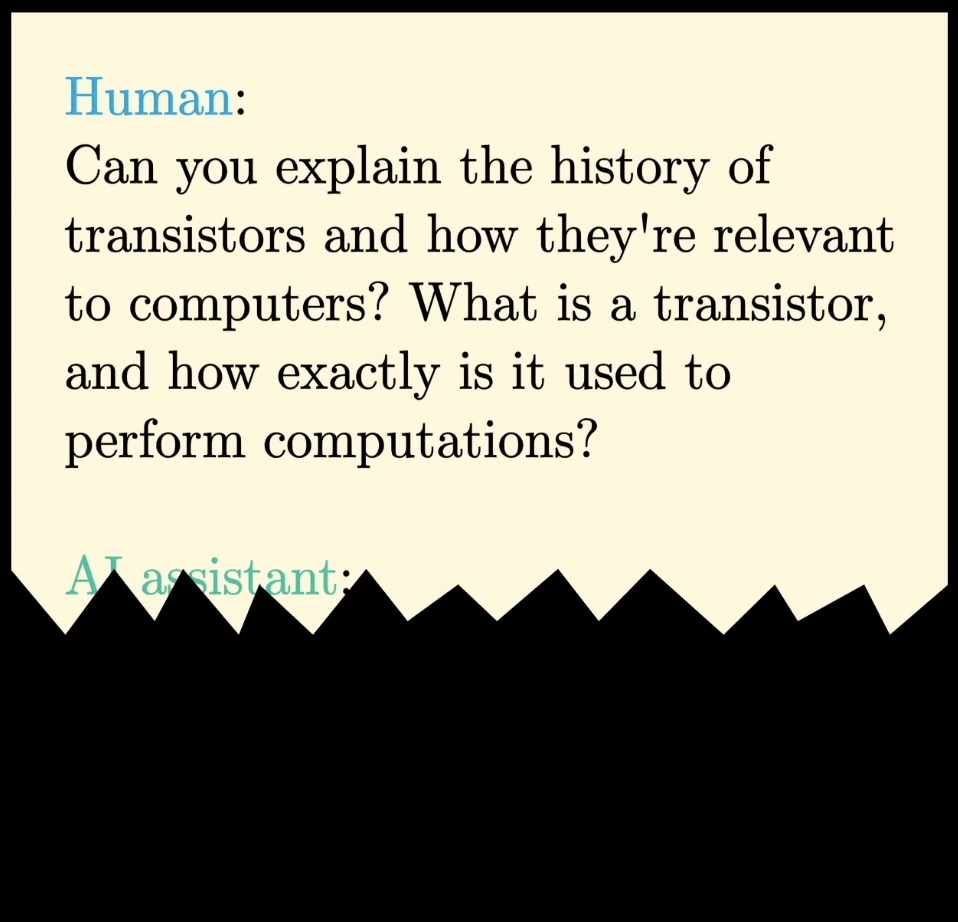

假设你还有一台强大的机器，它可以接收任意文本，并合理地预测下一个词是什么。那么，你就可以把已有的内容输入机器，看看它预测 AI 的回答会如何开头，然后不断重复这个过程，让剧本逐渐变长，补全这段对话。

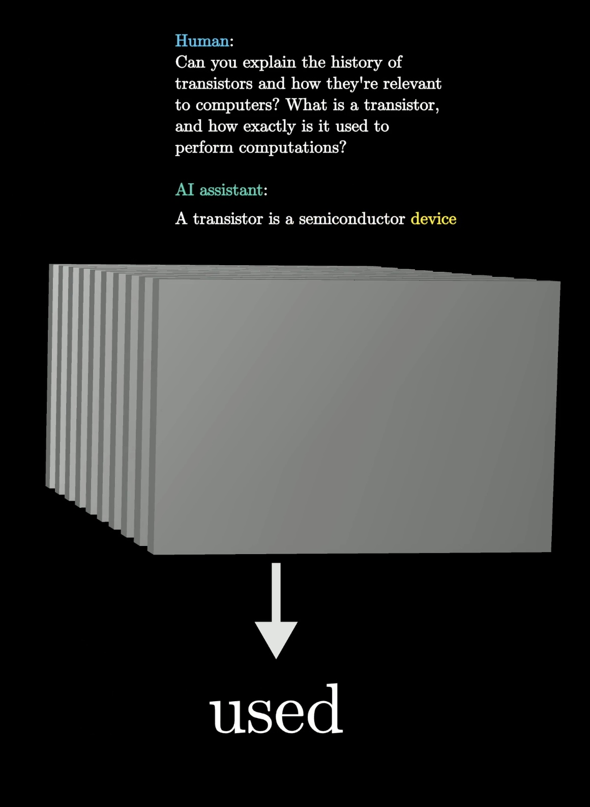

机器接收到**“你能解释……一种半导体器件……”**后，预测出词语 *used*（用于）。

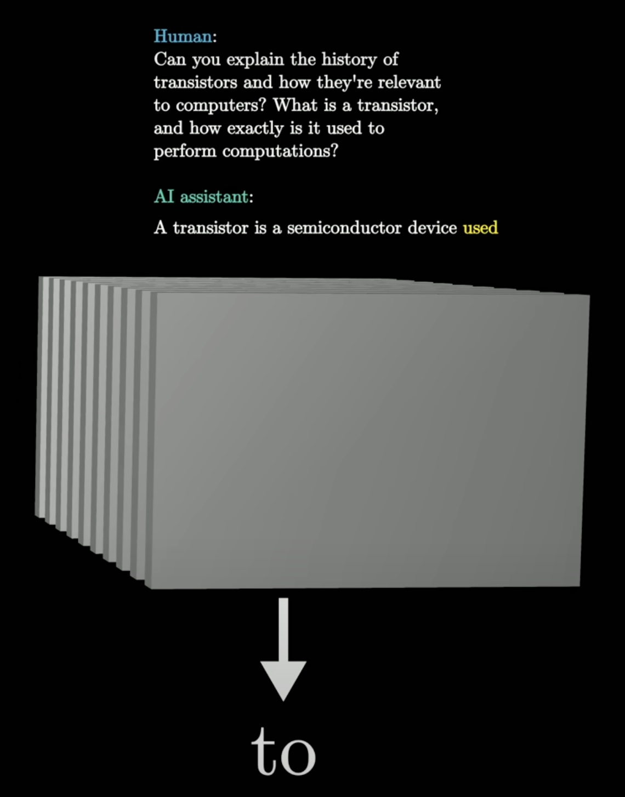

机器接收到**“你能解释……半导体器件用于……”**后，预测出词语 *to*。

当你与聊天机器人互动时，发生的正是这个过程。

## 什么是大语言模型？

大语言模型（LLM）是一个**复杂的数学函数，可以预测任意一段文本接下来会出现什么词**。

不过，它并不是确定地预测某一个词，而是给所有可能的后续词分配一个概率。

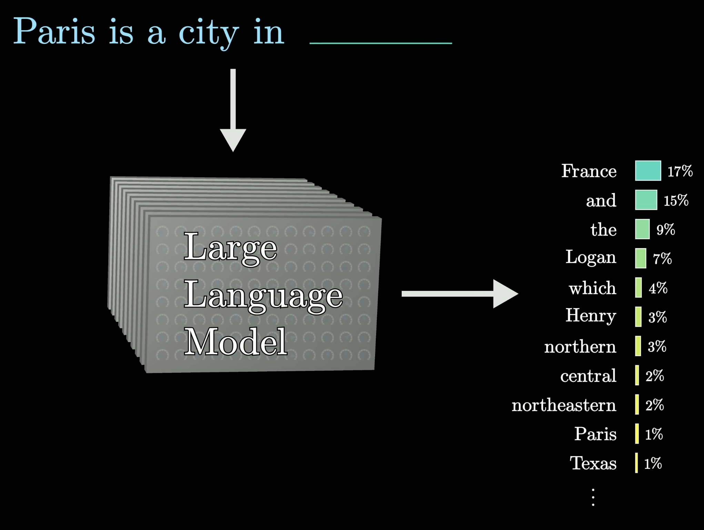

---

要构建一个聊天机器人，首先写下一段文字，描述用户与一个假想的 AI 助手之间的互动。

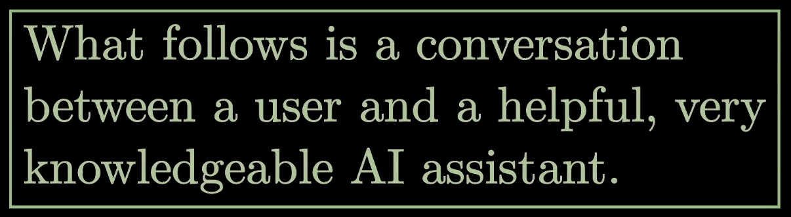

然后，把用户输入的内容加上去，作为这段互动的第一部分。

最后，让模型反复预测这个假想的 AI 助手在回答中接下来会说什么词，而这些内容就是呈现给用户的回答。

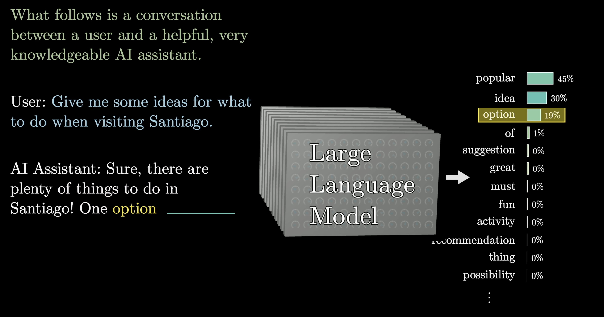

把绿色文字、用户输入，以及模型已经生成的内容输入模型，会得到一个概率分布，模型从中选出词语 *option*（选项）。

你可能注意到，图中模型没有选择概率最高的词。并非每次都会如此，但模型之所以这样做，是因为如果允许它在生成过程中随机选择一些概率较低的词，输出往往会显得自然得多。

这意味着，即使模型本身是确定性的，同一个提示在每次运行时通常也会得到不同的回答。

## 大语言模型如何预测下一个词？

模型通过处理海量文本来学习如何作出这些预测，这些文本通常来自互联网。

一个有趣的事实是：一个普通人要读完用于训练 GPT-3 的文本，即使每天 24 小时、每周 7 天不停地阅读，也需要超过 2,600 年。此后更大的模型，例如 GPT-4，使用的训练数据要多得多。

训练模型可以看作是在调节一台巨大机器上的旋钮。语言模型的行为完全由这些不同的连续数值决定，它们通常被称为*参数*或*权重*。

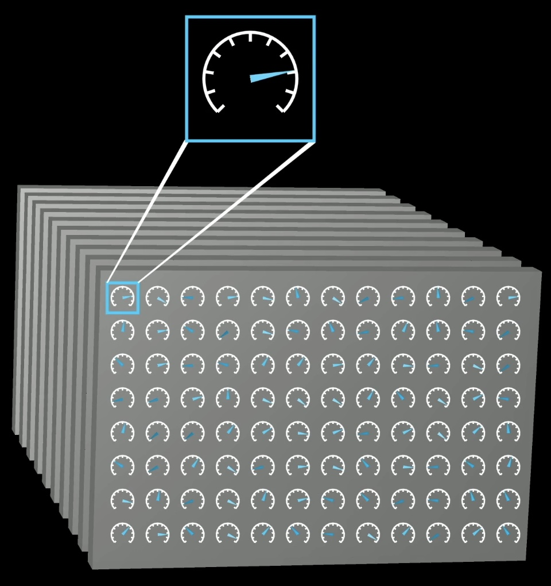

改变这些参数，就像是在改变模型针对给定输入为下一个词分配的概率。

大语言模型中的“大”，指的是它们可以拥有数千亿个这样的参数。

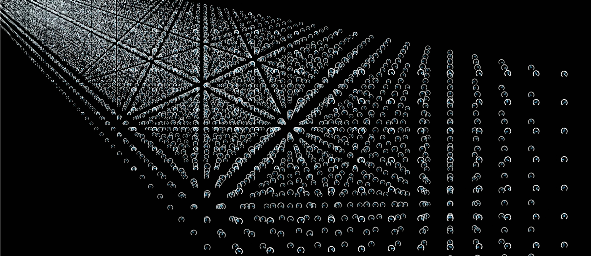

不过，没有人会有意地逐一设定这些参数。相反，它们最初是随机的，这意味着模型只会输出胡言乱语。随后，参数会根据大量示例文本被反复调整。

这些训练样本可能只有几个词，也可能有数千个词。无论哪种情况，训练的方式都是把样本中除最后一个词以外的内容输入模型，再将模型作出的预测与样本中真正的最后一个词进行比较。

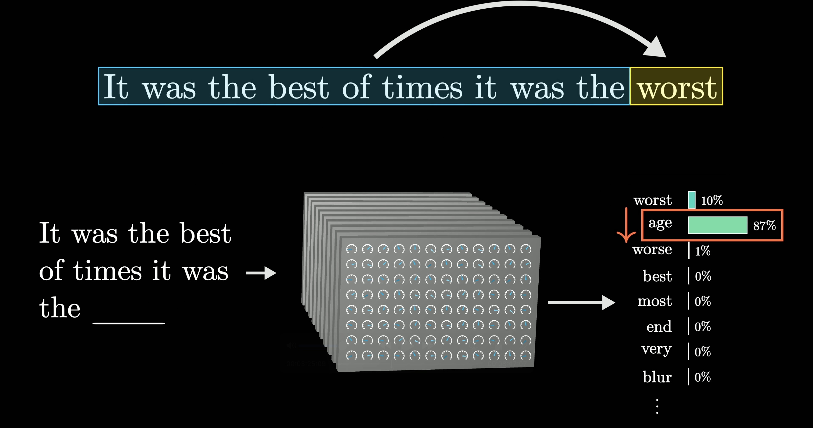

然后，使用一种称为反向传播的算法来微调所有参数，使模型选择真正的最后一个词的概率稍微*提高*，而选择其他所有词的概率稍微*降低*。

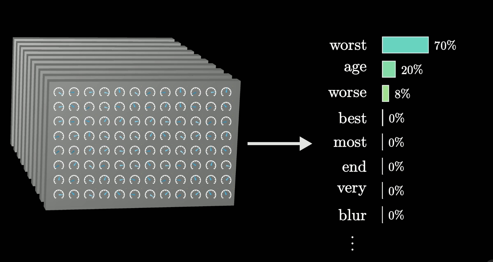

当这个过程在许多万亿个样本上进行后，模型不仅开始对训练数据作出更准确的预测，也开始对从未见过的文本作出更合理的预测。

考虑到庞大的参数数量，以及模型必须处理的海量训练数据，训练大语言模型所涉及的计算规模，至少可以说是令人难以想象的。

为了让你对这个规模有些概念，假设你**每一秒钟**都能完成 1,000,000,000 次加法和乘法运算。你觉得，要完成训练最大规模语言模型所涉及的全部运算，需要多久？一年？10,000 年？
实际上，这会花费你远远超过 **100,000,000** 年的时间。

---

我们刚才讨论的过程叫作**预训练**，它只是聊天机器人所经历的训练的一部分。

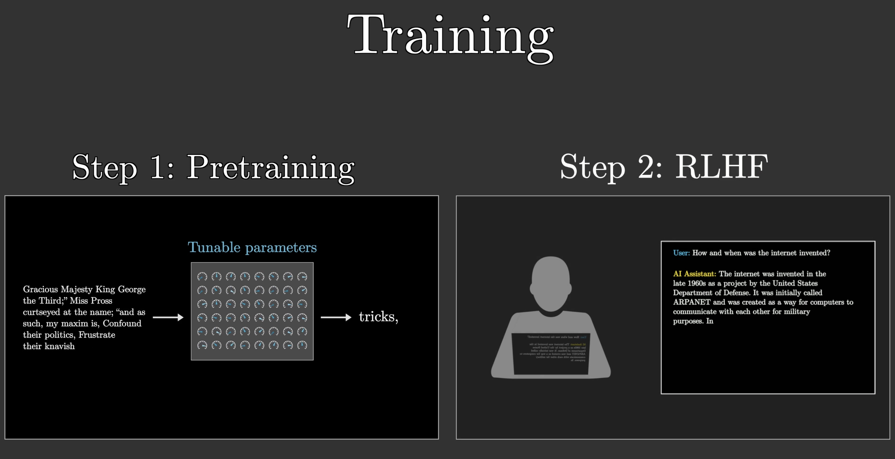

自动补全互联网上一段随机文本的目标，与成为一个优秀 AI 助手的目标非常不同。为了解决这个问题，聊天机器人还会接受另一种同样重要的训练，称为**基于人类反馈的强化学习（RLHF）**。

在这里，工作人员会标记没有帮助或存在问题的预测。他们的纠正会进一步改变模型的参数，使模型更有可能给出用户偏好的预测。

---

不过，回头看预训练，如此惊人的计算量之所以能够完成，是因为使用了专门为并行执行大量运算而优化的计算机芯片，也就是 GPU。

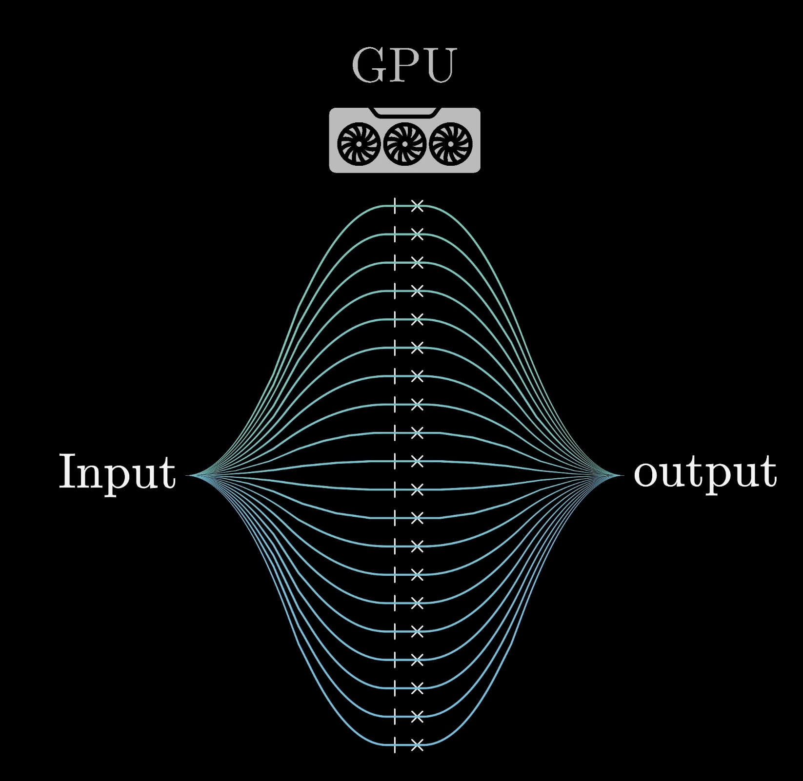

但并不是所有语言模型都容易进行并行化。在 2017 年以前，大多数语言模型都是*一次处理一个词*。后来，Google 的一组研究人员提出了一种名为 **Transformer** 的新模型。

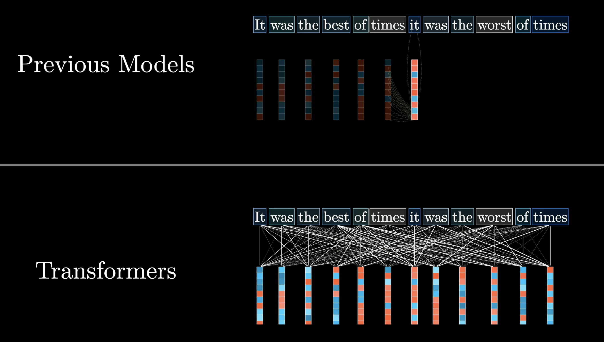

Transformer 不会从头到尾依次阅读文本，而是一次性并行地接收全部文本。

## Transformer

Transformer 内部的第一步，也是大多数其他语言模型的第一步，是把每个词与一长串数字关联起来。这是因为训练过程只能处理连续数值，所以必须以某种方式用数字来编码语言。

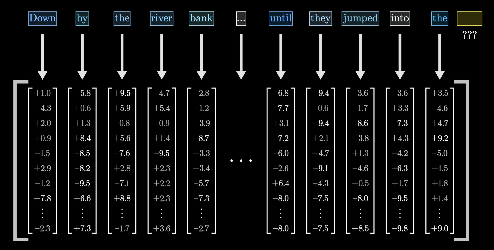

这些长长的数字序列，都必须以某种方式编码对应词语的含义。

Transformer 的独特之处在于，它依赖一种称为注意力的特殊操作。这种操作让所有这些数字序列有机会相互交流，并根据周围的*上下文*细化它们所编码的含义，而这一切都是并行完成的。

例如，在上图中，编码 *bank* 一词的数字，可能会根据周围的上下文，例如 *river*（河流）和 *jumped into*（跳入）而发生变化，从而以某种方式编码更具体的*河岸*概念。

---

Transformer 通常还包含第二种操作，称为前馈神经网络／多层感知机。这种操作让模型具备额外的能力，可以存储更多在训练中学到的语言模式。

所有这些数据随后会反复流经这两种基本操作的多轮迭代。在这个过程中，我们希望每个数字序列都得到丰富，编码更多可能有助于准确预测文本中下一个词的信息。

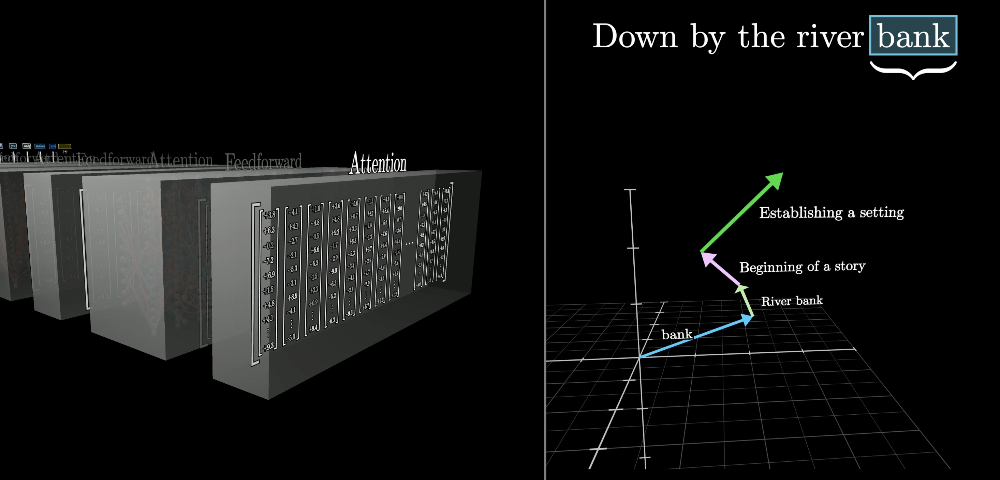

最后，对这个序列中的最后一个向量执行最后一次函数运算。此时，这个向量已经根据输入文本中的全部上下文，以及模型在训练中学到的所有内容得到了更新，用来产生对下一个词的预测。

模型的预测表现为每一个可能的后续词所对应的概率。

虽然研究人员确实设计了这些步骤如何运作的框架，但重要的是要理解：具体行为是基于数千亿个参数在训练中如何被调整而涌现出来的现象。这使得理解模型*为什么*会作出它所作出的那些具体预测，变得极其困难。

## 更多资源

如果读完这一课后，你想进一步了解 Transformer 和注意力的工作原理，这里还有一些资源：

- 大语言模型的更深入技术概述

- 更多关于注意力的内容

- 更多关于前馈神经网络（MLP）的内容

这里还有一场面向 TNG 公司、围绕这一主题进行的演讲：

- [通过演讲介绍技术细节](https://www.youtube.com/watch?v=KJtZARuO3JY)
