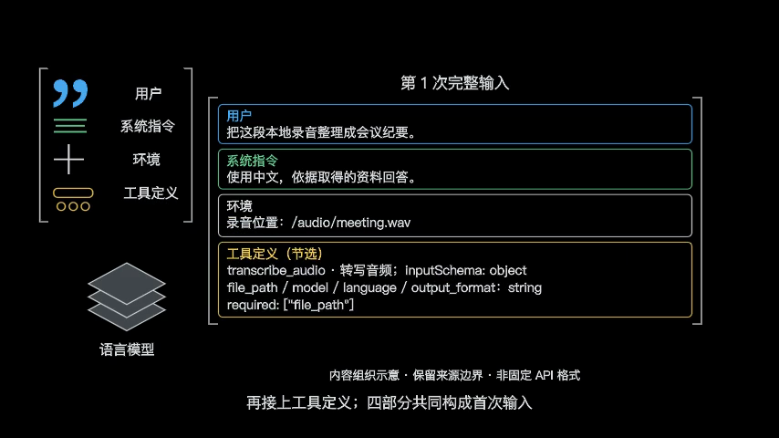
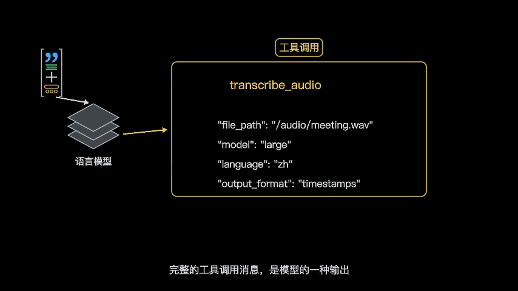
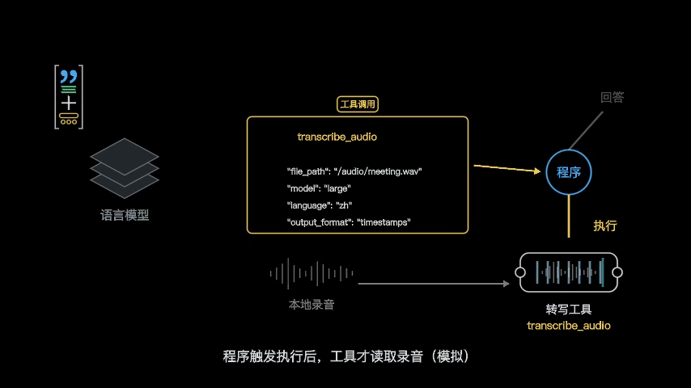
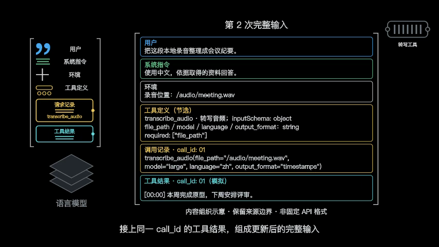
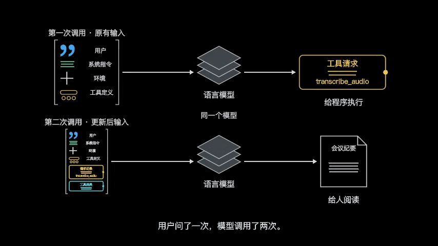

# 信息输入与工具执行

“帮我把这段录音整理成会议纪要。”输入框里只有一句话，后面却可能发生文件定位、语音转写、议题提炼和写盘保存。界面把这些动作收在同一段对话气泡里，容易让我们产生一种错觉：模型只要开始打字，就已经亲手读取了录音、听懂了声音，并把所有事情全部办完了。

理解这个过程，不需要先学会写代码，只要把参与协作的三个角色分开：

1. **语言模型**：负责根据已有的文本连续预测下一个词元。它的输出有时是写给人看的一段话，有时是写给程序看的操作请求。
2. **应用程序**：负责组织每一次送给模型的上下文，检查权限，调用外部服务，并在收到结果后推进下一步。
3. **外部工具**：负责与外部世界打交道——读取音频文件、调用转写算法，或把最终结果保存到磁盘。

下面用一个语言模型配合外部转写工具的教学场景展开说明：用户指定了本地录音 `/audio/meeting.wav`，应用程序连接了转写工具，模型依据转写文本整理纪要。有些模型可以直接处理音频，工具也可能由服务方执行；本文只解释这里由应用程序调用外部工具的流程。看清三个角色怎样协作，才能在任务受阻时知道该检查哪里。

## 模型看到的，为什么远不止你那句话

当你按下回车，应用程序并不会只把“帮我把这段录音整理成会议纪要”这几个字扔给模型。为了让模型知道以什么身份工作、遵守什么规则、有哪些工具可用，应用程序会把多项信息打包在一起，共同构成这次调用的**上下文**。

*图 1：首次输入由应用程序组装。用户消息、系统指令、环境信息与工具定义共同构成此次上下文；输入中出现文件路径，不等于文件内容已被读取。*

在这次调用中，送入模型的完整输入由四个来源组成：
- **用户消息**：你输入的原始需求；
- **系统指令**：规定回答的基本原则（如“使用中文，依据取得的资料回答”）；
- **环境信息**：指明目标文件的位置（`/audio/meeting.wav`）；
- **工具定义**：向模型解释有哪些外部能力可用、如何传参（例如 `transcribe_audio` 接受 `file_path` 等参数）。

这里要分清：**把路径写进输入，不等于模型已经读取了录音。**

此时模型拿到的仅仅是字符串 `"/audio/meeting.wav"`，没有收到录音内容。在本文场景中，读取音频和转写由外部工具完成；仅凭这个路径，模型无法知道会议讨论了什么。

这个区别适用于所有与外部资料协作的场景。把一个网址贴进输入框，不等于模型已经抓取了网页正文；在提示词里提到某个数据库，也不等于模型已经查过了数据。“告诉它在哪里”只是提供了定位线索，还没有发生真实的读取。

## 一个工具请求，还不是一次成功操作

拿到首次输入后，模型开始预测下一个词元。输入中包含了工具定义，模型可以选择请求转写，而不是直接生成纪要。图示采用的就是这条路径：模型输出一条结构化的**工具调用消息**。

*图 2：工具请求也是模型的输出。模型选定 transcribe_audio 并填入参数，这是一条待程序处理的调用消息，不是已经完成的操作。*

在这个步骤中，模型通过应用支持的工具调用接口，指明要调用 `transcribe_audio`，并把录音路径填入 `file_path` 参数。

**结构化调用消息与普通回答文字需要分开看。** 应用程序会识别约定的调用消息，再检查是否执行。普通文字里写出“正在转写录音”、一段 JSON 或代码，都不会自动触发工具；即使发出了有效请求，也不代表执行已经成功。

在本文场景中，真正的操作由下一步的应用程序安排执行。参见 [工具调用流程说明](https://platform.claude.com/docs/en/agents-and-tools/tool-use/overview)。

## 程序怎样连接模型与外部工具

模型把工具请求生成出来之后，对话并没有结束。接收这份输出的不是人类用户，而是后方的应用程序。

*图 3：程序接收模型请求后触发外部执行。此时转写工具才真正读取本地音频文件，并将结果回传给应用程序。*

应用程序识别出这是一条工具调用指令，随后执行一系列现实世界的检查与操作：
1. 检查调用参数是否合法；
2. 确认当前运行环境是否有权限读取 `/audio/meeting.wav`；
3. 将参数传递给专门的转写工具（例如本地运行的语音识别模型或转写程序）；
4. 转写工具真正打开音频文件，运行计算，生成带有时间戳的文本，并将结果返回给应用程序。

如果录音文件路径写错了、磁盘读取权限不足，或者音频格式损坏，这一步就会中断报错。这也是为什么纯粹在提示词里要求“请你务必认真读取录音”毫无作用——如果底层程序连文件都打不开，语言模型措辞再坚定也无济于事。

## 用户只说了一次，模型为什么能继续推进

工具执行完毕、文字转写成功后，应用程序面临一个新问题：用户并没有再发一条消息，任务怎样继续往下走？

答案是：**应用程序组织了第二次模型调用，把工具返回的结果提供给模型。**

*图 4：第二次调用的完整输入。程序将原信息、金色的调用记录与青色的工具返回结果打包在一起，再次送入模型。*

看图 4 可以发现，第二次送入模型的输入已经发生了关键变化：
- 上半部分保留了最初的用户需求、系统指令与环境信息；
- 紧接着追加了上一轮模型发出的**调用记录**（金色的 `transcribe_audio` 请求）；
- 最后追加了外部工具真正返回的**工具结果**（青色的转写文字：`"[00:00] 本周完成原型，下周安排评审。"`）。

**一次用户提问，不等于一次模型调用。** 

在图示流程中，用户只在最初发了一句话，应用程序却发起了两次模型调用，中间还有一次转写工具调用。直到第二次模型调用开始时，模型才在上下文里看到工具返回的转写文本，有了整理纪要的材料。

工具成功返回，不等于转写内容正确。整理后的负责人、日期和待办事项，应对照转写文本核查；有疑问时还要回听录音。录音中没有说清的信息，应标为待确认，不能自行补出负责人或把“下周”编成某个确定日期。

如果工具在执行中失败，程序追加进输入的就会是一段错误提示。模型应在下一次调用中据此解释“未找到录音文件”，而不是假装自己听过了录音、凭空编造一份虚假的会议纪要。

## 两次调用的全景对照

把前后两次模型调用放在一起，可以看清输入和输出怎样变化：

*图 5：两次调用全景对照。用户只提问了一次，图中有两次模型调用和一次转写工具调用：第一次模型调用生成请求给程序，第二次依据工具结果生成纪要给人阅读。*

整个任务经历了两个截然不同的阶段：
1. **第一次调用**：模型面向程序。它读入需求和工具定义，输出的是让程序去跑腿的“工具请求”；
2. **第二次调用**：模型面向人类。它读入回流的转写文本，输出的是给人阅读的“会议纪要”。

如果任务还要求“将纪要保存到桌面”，则需要额外的文件写入操作，并核对保存结果。应用可以通过写入工具或自身的保存功能完成，具体需要几次模型调用、几次工具调用，取决于实现，不能统一称为“第三次工具调用”。

当交付要求包含本地文件时，仅生成纪要还不够。界面上显示出纪要文字，不等于本地文件已经保存成功；看到保存成功的提示，也必须到目标目录确认文件是否真的存在、内容是否完整。
