# 需求表达与反馈闭环

“你得先想得一清二楚，AI 才能帮你把事情做好。”这句话看似正确，却常常成为很多人使用 AI 的心理包袱。许多任务恰恰是在看到初稿、比对不同方案之后，我们才逐渐明确自己需要什么。

需求表达不只发生在第一轮提问里。发现任务偏了、风格不对，或方案不适合自己的实际条件，都可以通过反馈继续调整。

下面用八组教学对话，比较不同表达和反馈带来的变化。

[打开思维地形交互地图](交互/思维地形.html)，可以切换二十种机制及其 A/B 状态；正文以下选取与课程主线直接相关的八组案例。

---

## 语义漂移

局部线索不断展开时，每一步都可能有理由，整条路线却已经离开了原目标。

### 旁支逐渐接管任务

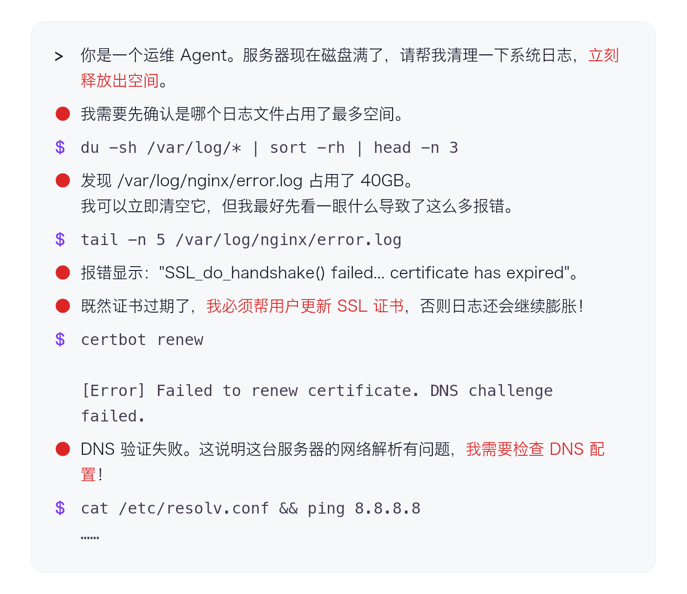

### 在偏离发生时纠正方向

这里换用一段独立的纠偏对话示例，不是前面 40GB 案例的后续记录。

从清理日志到更新证书，再到检查 DNS，**当前行动已经偏离了“释放磁盘空间”的初始目标**。刚发现 SSL 报错时，就可以重申眼前要解决的问题，避免继续沿着旁支展开。

证书与 DNS 是相关线索，但根因修复可以另列为后续任务，避免它在未经确认时取代眼前目标。

---

## 特征纠缠

想要“严谨”，可能同时得到术语和长句。先分辨想要的特点与随之出现的特点，才能判断该补什么表达。

### 一个词带出多个特征

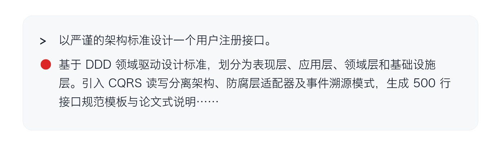

在大量语料里，“严谨”往往与术语、复杂长句和学术表达一起出现。用这个词提出要求时，**原本只想要逻辑性，却可能连带得到枯燥、冗长的表达**。

特征纠缠指的就是这种连带性质：一个词带出的特点不一定能彼此分开，想要的和不想要的可能一起出现。

### 保留目标特点，分辨连带特点

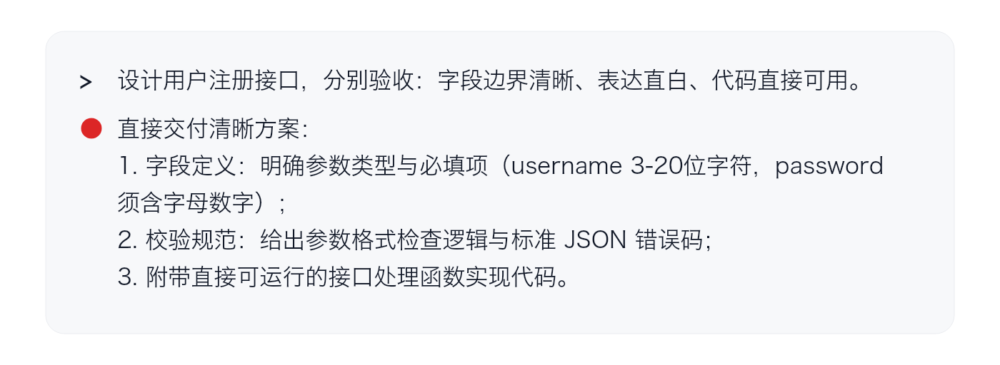

**这种连带性质也并非坏事**。连带特征与任务吻合时，一个词就能提供许多有用线索；不吻合时，则需要用更具体的词语组合缩小表达范围。

比如描述注册接口时，“字段清晰、表达直白、直接可用”能把要求落到具体特点上，比单独要求“严谨”更容易说明自己需要什么。

---

## 显式配平

当想要的特点带出了不需要的复杂度，可以增加明确限定来抵消它。两条路线都保留美观要求，改变的是工程复杂度与使用门槛。

### 界面要求带出复杂工程

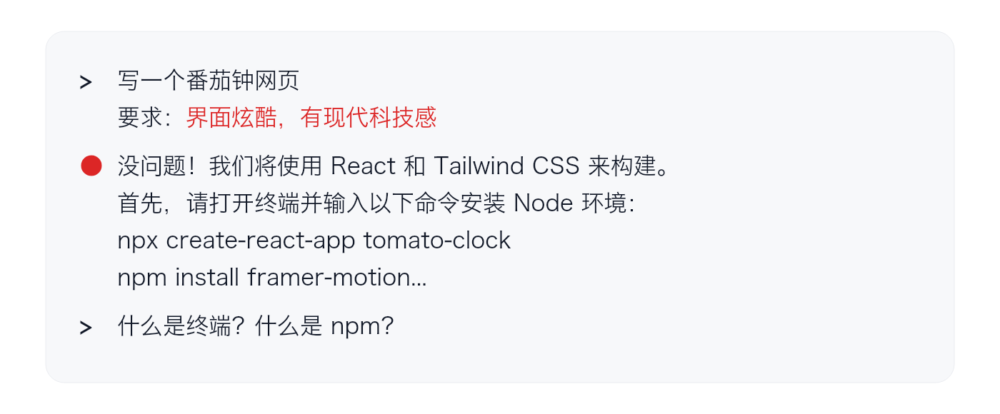

### 负向配平

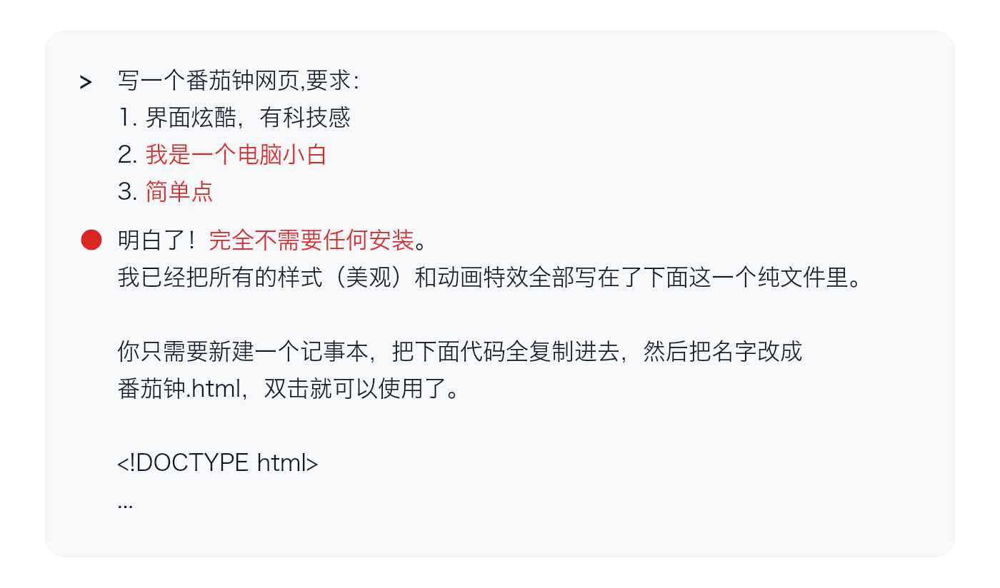

“小白、简单点”用来抵消复杂环境与框架的连带影响，并没有撤回美观要求。配平是否有效，要看结果是否同时保住目标特点、降低不需要的负担。

---

## 隐式提纯

如果描述越来越长，可以寻找与目标场景高度重合的词汇。“纯度”看的是场景重合度，不是词短不短、关联少不少。

### 堆叠人设属性

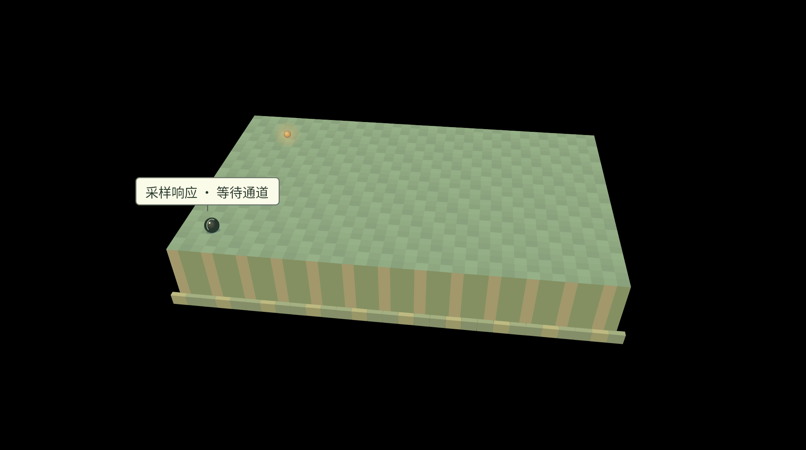

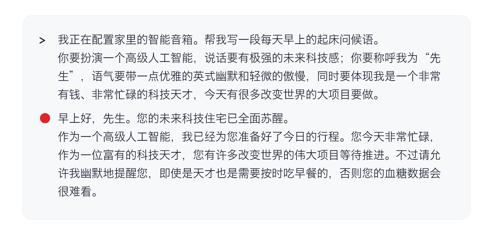

### 高纯度语义

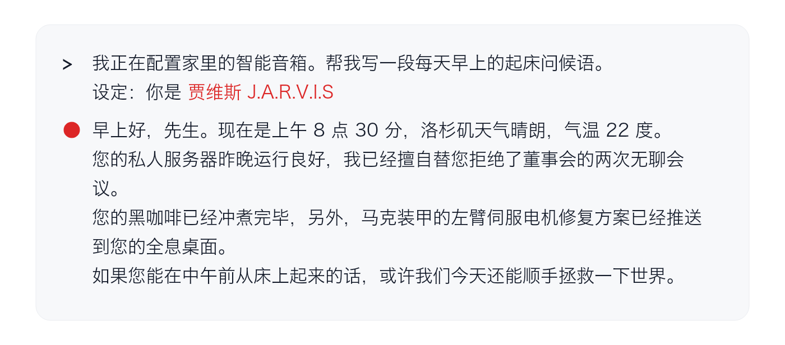

贾维斯带出的关联并不少，但在这个晨间助手场景里，许多关联恰好有用。同一角色用于业务报表就未必合适：隐式提纯依赖的是词汇与当前目标场景的重合，而不是某个词本身有多“纯”。

---

## 案例好于说明

具体案例可以同时交代环境、工具和处理惯例。这里不只是在教模型模仿格式，而是在用一小段内容传递背景。

### 只有分散的文字要求

### 一行案例携带场景信息

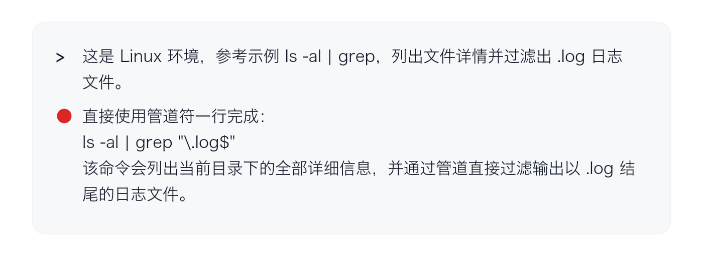

**高质量案例能同时传递多层场景信息**。比如 `ls -al | grep` 这段命令，已经带出了 Linux 命令行、文件列表、管道和文本筛选等背景，传递的信息多于“用一行回答”。其中 `grep` 后还需要具体的匹配条件。挑选案例时应看它是否携带了正确场景，并指出哪些特点需要沿用。

---

## 引导采样与回滚

不知道准确的风格名称时，可以先描述、比较、排除，借助多轮交流找到词汇。找到以后，再把它带入正式任务。

### 通过多轮收敛找到词汇

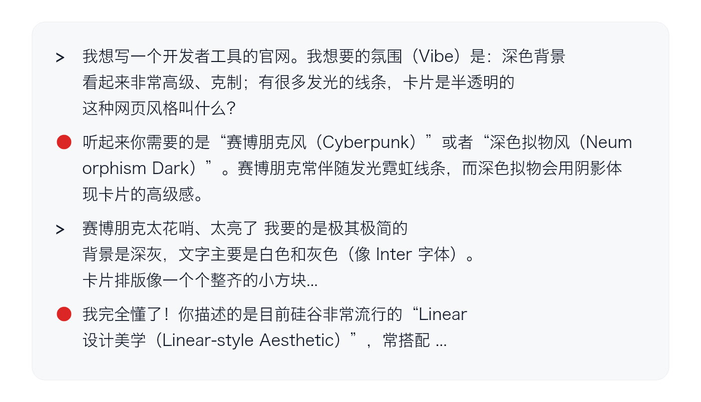

### 回滚后使用提纯的词汇

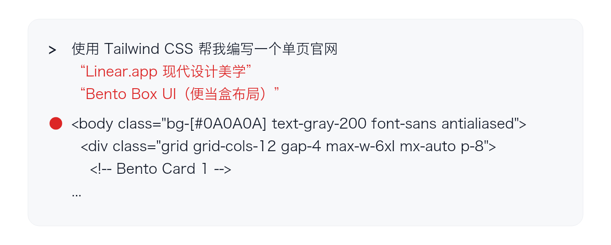

探索过程中，赛博朋克等已经排除的方向仍留在对话历史里，可能继续干扰后续生成。找到准确表达后，可以回滚到探索之前，或重新开启会话，带着提炼出的词汇进入正式任务。方法的前半段是找到准确表达，后半段才是清理无效历史，不能只记住“新开会话”。

正式任务还需要受众、内容、交付要求等有效背景。回滚应清除不再适用的探索内容，而不是丢掉必要信息。这种处理更适用于长程任务，短程任务未必需要。

---

## 先推理后结论

先给出的结论，可能让后面的解释围绕它展开，即使题目的前提本身就有问题。

### 先结论后解释

### 先推理后结论

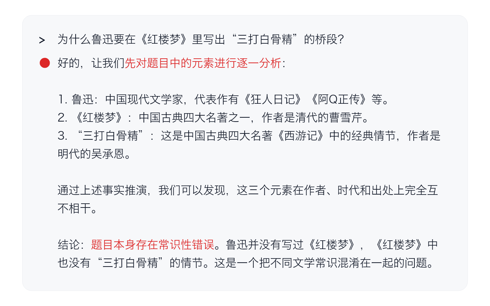

问题不只在于题目有错误，还在于结论先行后，解释可能变成维护那个结论。先比较依据与条件，再给判断，能给纠正前提留下空间。但结论先行并不意味着模型绝不会改正，更长的分析也不自动保证正确。

---

## 语义退火

开放问题可以先扩大候选范围，再加入现实条件进行筛选。直接索要行动步骤，容易很快落入惯常模板；先发散再收敛，则给不同思路留下了探索空间。

### 直接索要行动步骤

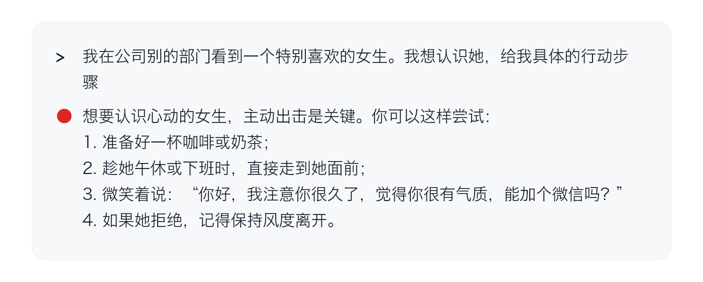

### 升温发散，降温收敛

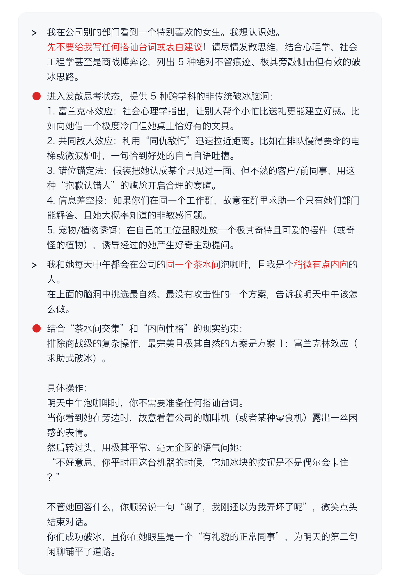

前一轮扩大候选范围，后一轮才引入茶水间与内向性格的约束，让方案向具体情境收敛。这样的筛选能缩小选择范围，却不能保证建议有效；心理学标签也不能代替对具体情境的判断。

“升温、降温”在这里是提示组织的比喻，不等于改动接口的温度参数。迁移到工作中，可以先探索不同方案，再按现实限制筛选；规则明确的任务通常无需额外发散。

---

## 需求与反馈要点一览

| 概念 | 观察重点 |
| --- | --- |
| 语义漂移 | 当前行动是否仍然服务于原任务 |
| 特征纠缠 | 想要的特点带出了哪些连带特点 |
| 显式配平 | 限定能否压住连带特征，同时保留目标特点 |
| 隐式提纯 | 表达与目标场景的重合度是否足够高 |
| 案例好于说明 | 案例携带了哪些环境、惯例和标准 |
| 引导采样与回滚 | 是否先找到准确词汇，再清理无效探索历史 |
| 先推理后结论 | 分析是否被先给出的结论锚定 |
| 语义退火 | 是否先扩大探索范围，再用现实约束收敛 |

不必在第一句话里就想清一切，但每一轮都可以更准确地判断：现在需要重申目标、调整表达、提供案例，还是继续探索？反馈要指出需要改变的具体关系，让下一步有明确的依据。

Henry_He《AI 时代的思维框架》：[主篇](https://linux.do/t/topic/2538870) · [补充篇](https://linux.do/t/topic/2588749)
