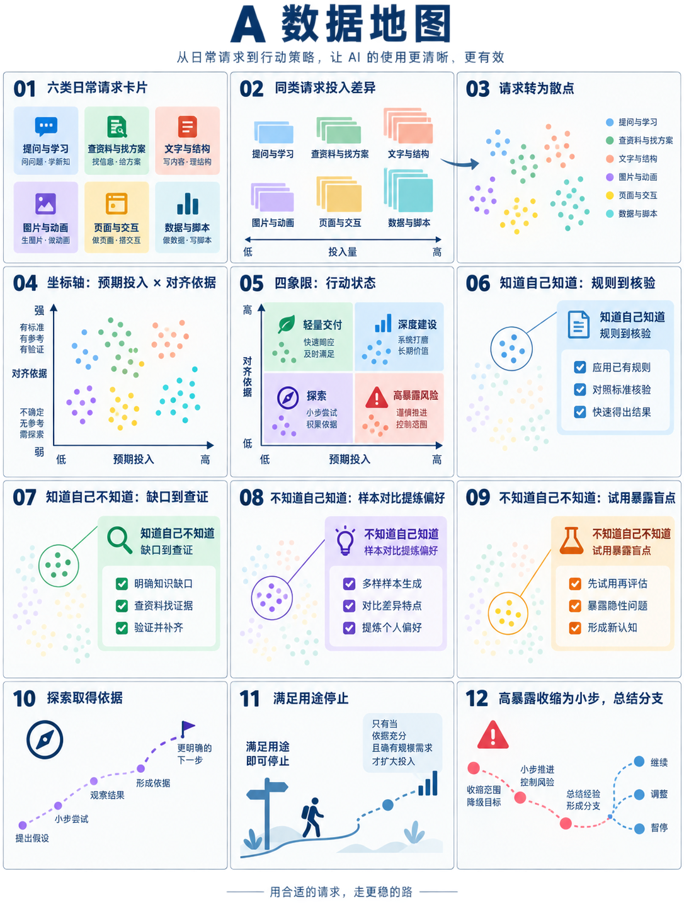
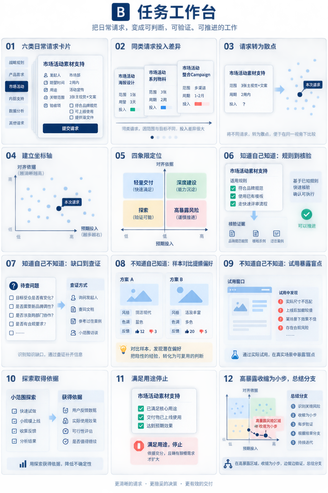
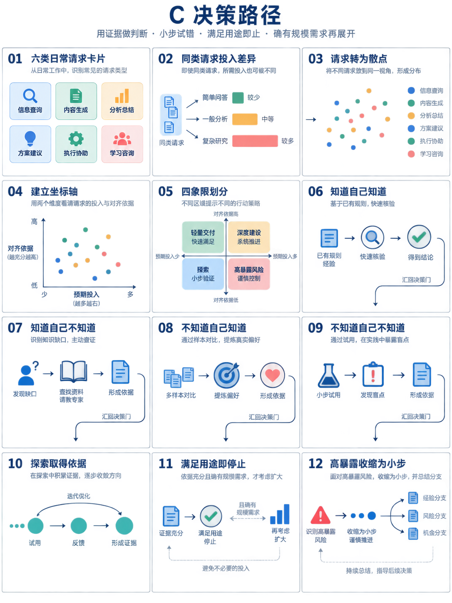

# 行动选择与投入控制：分镜方案

## 内容与实现依据

正文：`行动选择与投入控制.md`。交互：`交互/06-seven-slides.html`。

原 HTML 包含 45 项请求、六类意图、七页展示。第一页按类别排列；第二页转换为预期投入与对齐依据坐标；第三至六页保持预设点位并高亮对应案例；第七页按 2.4 秒间隔推进四项决策原则。点位移动采用 0.85 秒 CSS 过渡，标签遇到碰撞会隐藏，点击可查看完整依据。这里的评分是情境估计，并非测量值。

## 三个视觉方向

| 方向 | 视觉对象与动画 | 适用 |
|---|---|---|
| A 数据地图 | 请求卡缩成点；固定坐标；选中案例放大；旁侧呈现取证动作 | 最接近原 HTML，便于比较行动分布 |
| B 任务工作台 | 请求卡展开；证据条加入；样本并排比较；范围收缩；验收后停止 | 推荐用于演讲，具体动作更清楚 |
| C 决策路径 | 路径逐段出现；反馈节点点亮；四条取证支路汇入判断门 | 突出行动顺序与扩大投入的条件 |

生图用于比较构图与视觉方向。图中自动生成的文字和案例不作为定稿；实现采用正文术语与原 HTML 的请求数据，颜色统一对应行动状态。四种认知状态不绑定四个象限。

## 十二个关键帧

| 镜号 | 内容 | 可见变化 |
|---|---|---|
| 01 | 从具体请求开始 | 六类请求分组出现 |
| 02 | 同类请求也有差异 | 两条原文请求并排，突出范围与依据差异 |
| 03 | 从请求到行动评估 | 保留请求身份，卡片转换为点位或评估卡 |
| 04 | 先看依据，再看投入 | 横轴预期投入、纵轴对齐依据依次出现 |
| 05 | 四种行动状态 | 轻量交付、深度建设、探索、高暴露风险按正确位置出现 |
| 06 | 知道自己知道 | 已有规则显性化，产出逐项核验 |
| 07 | 知道自己不知道 | 标出明确缺口，查证后补入依据 |
| 08 | 不知道自己知道 | 对比样本，圈出差异，提炼可表达规则 |
| 09 | 不知道自己不知道 | 实际试用暴露问题，转成明确缺口 |
| 10 | 探索取得依据 | 小步试验到反馈，再到下一次判断 |
| 11 | 停止或扩大 | 满足用途停止；依据充分且确有规模需求才扩大 |
| 12 | 依据不足速收缩 | 大承诺拆为可独立核验的小动作，回到反馈节点 |

## 后续实施任务

1. 确认视觉方向，选取原 HTML 中的请求作为贯穿案例，保留原文与评分依据。
2. 将十二关键帧组织为演讲页内动画；关键帧数量不直接等于新增页数。
3. 以单一时间线驱动图形、文字、进度与播放状态；支持播放、停止、重置、拖动和倍速。
4. 接入当前 PPT 的标题、页脚与无闪烁切换；概要页默认展示最终结果。
5. 核验文字不遮挡、标签可读、前后跳转一致；所有评分与位置变化均标明情境性质。

## 设计图

