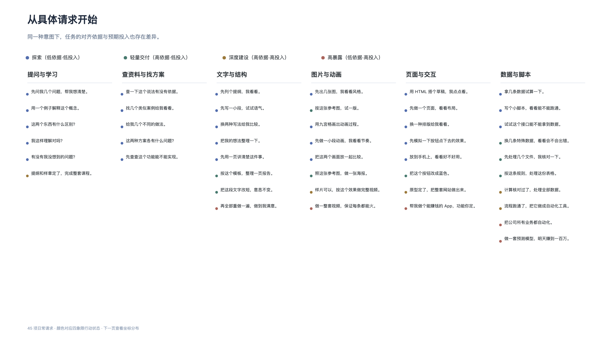
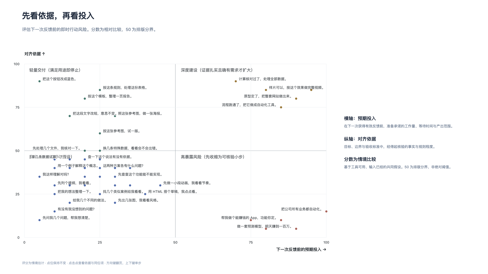
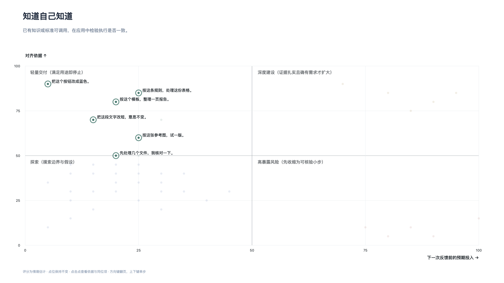
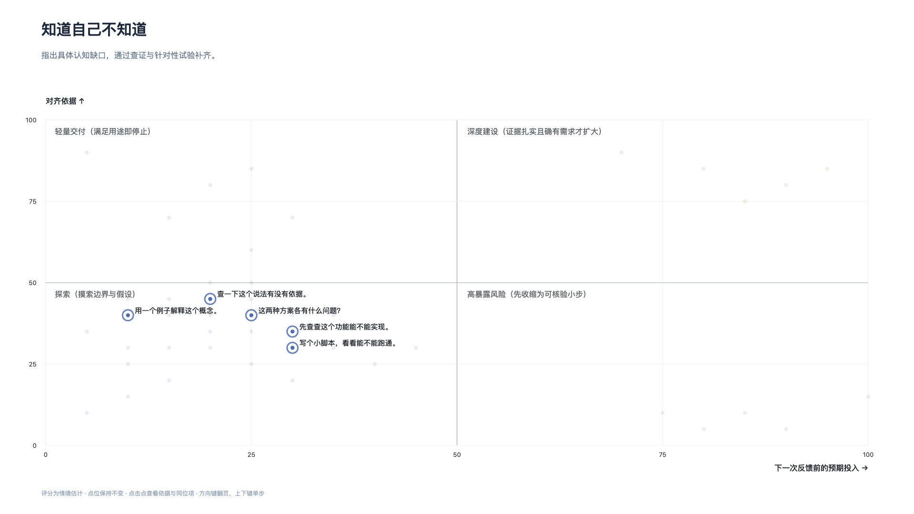
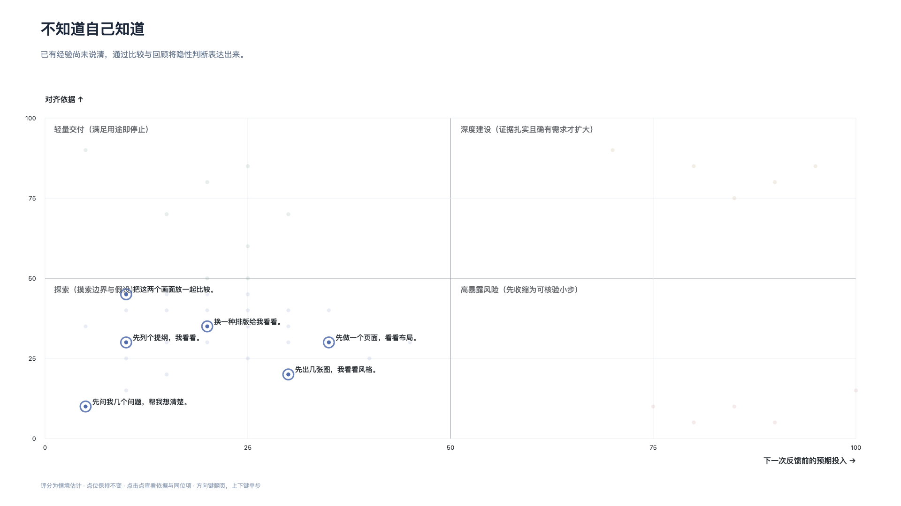
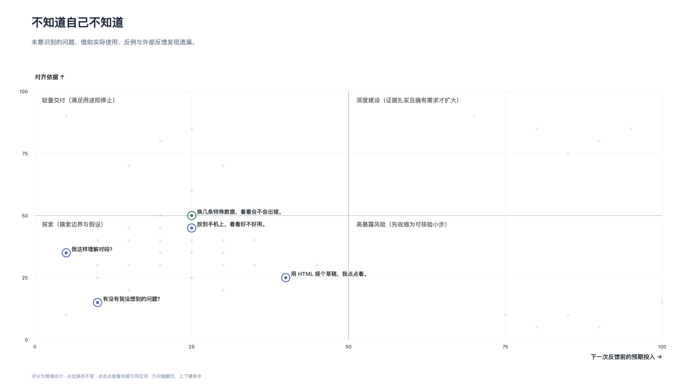
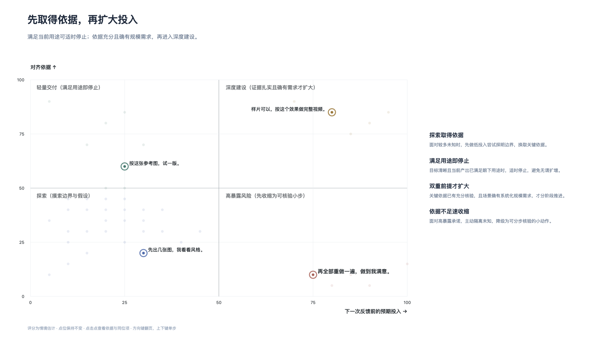

# 行动选择与投入控制

## 01 从具体请求开始

与 AI 协作是由一次次具体请求构成的。日常向模型提出的需求形态各异，从最初的灵感发散一直延伸到具体的系统实现。

*图 1：日常协作中的 45 项具体请求按六类意图排列，色彩对应四象限行动状态。*

这 45 项常见任务归入提问与学习、查资料与找方案、文字与结构、图片与动画、页面与交互、数据与脚本六类意图。任务所属的意图类别并不能决定背后的对齐依据与预期投入，即使同一类别下的表述看似相近，实际的验证难度与工作量也大相径庭。

任务的表面形式不能作为判断风险的依据。提示词哪怕写得详细，未经检验也不等于依据充分；需求哪怕听起来寻常，一次性投入过大同样会累积返工风险。控制协作成本的关键，在于每次行动前看清两件事：眼下掌握了多少经得起核验的对齐依据，以及下一次拿到有效反馈前准备承诺多大的预期投入。

## 02 先看依据，再看投入

评估单次交互的暴露风险，关键不在于任务最终的总量，而在于在下一次获得有效反馈之前，究竟承诺了多少资源与精力。

*图 2：以预期投入为横轴、对齐依据为纵轴的行动评估空间。50 分为排版基准分界。*

评估空间由两个维度界定：

- **横轴（预期投入）**：在下一次获得有效反馈前，准备承诺的工作量、等待时间与产出范围。
- **纵轴（对齐依据）**：目标、边界与验收标准中，包含了多少经得起核验的事实与外部规则。

两个维度将交互划分为四种行动状态：

- **探索（低依据·低投入）**：目标或规则尚不明确时，将行动限制在小规模尝试内，目的在于摸索边界与发现分歧。
- **轻量交付（高依据·低投入）**：目标清晰且规则明确，按既定标准快速完成并核验，达到眼下用途即可停止。
- **深度建设（高依据·高投入）**：核心依据扎实且确有规模需求，分阶段推进系统化构建，并在关键节点设置核验。
- **高暴露风险（低依据·高投入）**：在关键假设未经验证时，直接承诺长周期生成或批量重构，容易带来严重的返工损失。

图中的分数为情境比较，统一基于“输入已提供、工具可用”的共同假设。50 分仅是排版分界，并非绝对阈值。该工具评估的是即时行动的风险结构，任务在图上的高亮只表示当前适用，并不代表认知状态与行动象限一一对应。

行动象限衡量“投入多大、暴露多高”，接下来的四种认知状态则诊断“依据缺在何处、如何取证”。无论处于哪个象限，都需根据认知状态采取针对性的取证动作。

## 03 知道自己知道

当推进任务所需的知识、规则或判定标准已经在心中，且有现成依据可供调用时，处于“知道自己知道”的状态。

*图 3：显性知识状态下，将已有标准交代清楚，并在应用中检验执行是否一致。*

在已有明确标准的状态下，协作出现偏差多源于既有规则尚未转化为显性表达。将业务规则、格式模板与硬性约束说明清楚，并在具体产出中核验执行是否一致，就能建立起有效的对齐依据。

## 04 知道自己不知道

当推进任务所需的理解、方法、客观事实或评估标准尚不明确时，面临的是有明确边界的认知缺口。

*图 4：明确缺口状态下，界定认知缺口并通过查证或试验补齐。*

面对明确缺口时，应当围绕阻碍当前判断的关键未知项，通过针对性查证或最小试验把依据补齐。只有当未知项获得经得起核验的事实支撑与适用限制时，后续推进才有扎实的基础。

## 05 不知道自己知道

在处理文案语气、排版结构或视觉风格等任务时，人往往已有实践经验或直觉偏好，却难以凭空列出精确的参数与规则。

*图 5：隐性经验状态下，借助比较、回顾与试作将隐性判断表达出来。*

处于隐性经验状态时，直接要求产出终稿往往缺乏明确判定标准，更适合借助参考样本或对比不同选项呈现具体差异。在明确各个方案的取舍理由并转化为规则后，原本模糊的经验便能成为可靠的对齐依据。

## 06 不知道自己不知道

协作中最容易被忽视的隐患，是那些未曾预料到的缺陷、隐蔽假设或环境冲突，属于完全未知的盲点状态。

*图 6：未知盲点状态下，借助实际试用、反例与外部反馈发现遗漏。*

盲点状态无法单凭推想识别，需要将阶段性成果放入实际场景试用，或通过异常样本与外部反馈主动暴露问题。虽然外部反馈不能保证穷尽所有未知，但只要能暴露出可描述且可独立核验的新问题，盲点就能转化为可针对性处理的明确缺口。

## 07 先取得依据，再扩大投入

协作的推进节奏应当由验证结果与实际业务需求共同驱动，避免顺应生成惯性无谓膨胀。

*图 7：对齐状态下的决策分支：满足用途适时停止，具备双重前提再考虑扩大建设。*

在具体的行动决策中，遵循四项收敛与推进原则：

- **探索取得依据**：面对较多未知时，先做低投入尝试探明边界，换取关键依据。
- **满足用途即停止**：目标清晰且当前产出已满足眼下用途时，适时停止，避免无谓扩增。
- **双重前提才扩大**：关键依据已有充分核验，且场景确有系统化规模需求，才分阶段推进。
- **依据不足速收缩**：面对高暴露承诺，主动隔离未知，降级为可分步核验的小动作。
