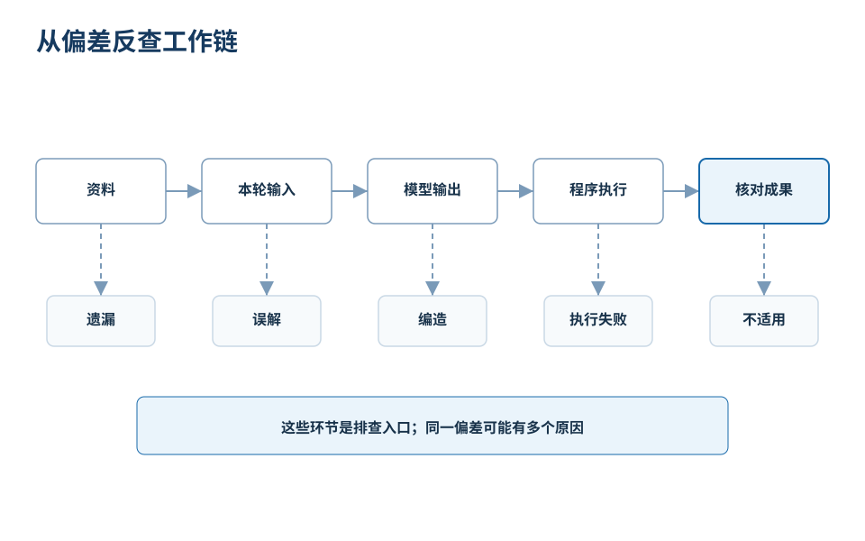
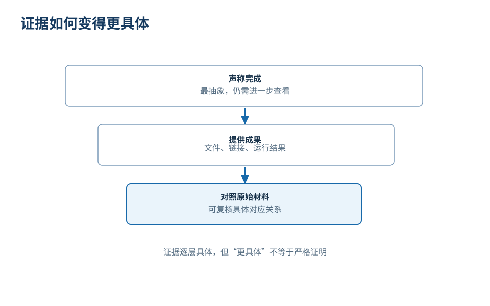

# 使用 AI 的核心问题

真正让人对 AI 失望的，往往不是它什么都不会，而是它交出了一份看起来已经完成、却还不能放心使用的结果。文字很顺，结构齐全，建议也像那么回事；直到你准备把报告发出去，才发现关键数字没有出处，某个结论读反了原材料，甚至答应保存的文件在磁盘上也根本找不到。

我们用一个贯穿本课程的教学场景来看看这件事：培训刚刚结束，你把收集到的活动反馈交给 AI，请它分析下一次应该优先改进什么。它很快写出一份完整的复盘，开头肯定成绩，中间归纳问题，最后提出三条改进建议。你原本以为接下来只需改几个错别字，读完却发现不得不重新翻遍原始材料，核对哪些话是真的、哪些建议成立。

省下来的起草时间，可能又花在了核对上：辨认一份流畅的回答里，究竟有多少部分值得相信。

**一份像样的回答，不等于一件事已经妥善完成。** 想改善与 AI 的协作，首先要看清它们之间到底差了什么。

## “不好用”是一种感受，还不是一个诊断

面对不满意的结果，最常见的反应是要求它“再专业一点”、“认真检查”、“重新写一版”。这些要求表达了不满的态度，却没有告诉系统偏差到底出在什么地方。下一轮生成可能会换一套更正式的措辞、拉长段落篇幅，但真正的问题依然留在原地。

比较下面两句反馈：
- “这份报告不可信。”
- “这三个数字在原始反馈中找不到对应记录。”

前者让对方猜测问题所在，后者给出了可以核查的对象。如果再说明改法，反馈就更有用了：“请把报告中这三个数字逐项对照原始反馈编号，列出归类依据；找不到记录支持的数字就删去，不要估算。”这样既指明了哪项结果有问题，也交代了对照什么材料、希望怎样改。

同样，一句含糊的“你没理解我”，可以改成更具体的要求：“本次分析用于下周的筹备会决策，请明确列出下一次培训应优先调整的两项措施，不需要展开总结本次活动的总体成绩。”

这并不是要求人类为每一次执行失败负责。材料已经给出，模型依然可能读漏；要求写得很明确，系统执行依然可能中断。把问题说具体，不是替系统找借口，而是确定下一步该查什么：这份报告究竟错在材料缺失、理解偏差、计算失误，还是底层交付出了问题？

## 同一份坏报告，可能坏在不同地方

假设报告中写着“两位参加者提出了意见”。如果原始问卷并没有收集身份信息，我们就无法得知这两条记录是否来自同一个人。这首先是统计口径的问题：记录条数不能直接等同于独立人数。仅靠调整提示词，无法补出没有收集的身份信息。

另一种情况是，报告里的每一个事实都准确无误，但通篇都在赞美活动的成功。你原本的目的是决定下次先改什么，它却写成了一份对外宣传通稿。这里缺少的不是事实，而是明确的决策用途。补充一句“供组织者选择两项改进措施，请说明依据与待确认条件”，比反复催促“分析得更深入”更能说明需求。

还有一种更容易被忽视的失败：屏幕上的文字已经符合要求，但要求保存的本地文件却没有生成。此时继续润色段落毫无意义，真正需要排查的是写盘操作是否执行、目标路径是否存在、程序是否具有写入权限。

*图 1：沿着工作路径寻找偏差，而不是把所有问题都归结为“AI 不聪明”。这些环节是排查入口，不是一张一一对应的故障表。*

图 1 的意义，在于改变我们排查问题的方向：
- 统计口径不清，就明确定义统计单位；
- 决策用途不明，就明确补充行动目标；
- 执行动作未发生，就去检查底层程序的真实操作。

“重写一遍”并不是唯一的处理办法。现实中的偏差有时会跨越多个环节：一份文件被忽略，可能是根本没有读入，可能是信息提取被截断，也可能是进入上下文后被其他内容稀释。看到症状后，顺着链路定位，远比急于给模型定性有效。

## “完成了”之后，还应该有什么

“我已经核对了全部数据。”这句话听起来很让人安心，但它只是一句语言上的声称。让一项声称变得可验证的，是它背后能否拿出扎实的凭据：报告文件、中间计算过程、原始记录的编号对应，以及对不确定信息的说明。

对比下面三种陈述方式：

> 设备问题较多。
>
> 有 2 条记录涉及声音问题。
>
> F01 提到后排听不清，F03 提到麦克风中途断音，因此将这 2 条归入声音问题。

第三种表述未必文采更好，却最适合团队协作与决策。读者可以独立核查原始记录、检验归类逻辑与计数结果；即便不同意归类，也能准确指出分歧发生在具体的哪一步。有了这些依据，我们才知道该接受什么、质疑什么。

*图 2：证据越具体，偏差越容易被发现。但文件能打开，不代表内容正确；部分样本通过，也不等于所有情况都可靠。*

需要注意的是，检查并非越多越好。给自己起草几个备选标题，通常不需要追究每一个字词的统计依据；而准备向管理层提交关乎资源分配的决策建议，就必须要求核心数字回到原始记录。核对的深度，应当与承担错误后果的代价相匹配。

与 AI 协作，需要的不是永无休止的怀疑，而是清楚地知道：这一次，我们准备相信它到哪一步，凭据是什么。
