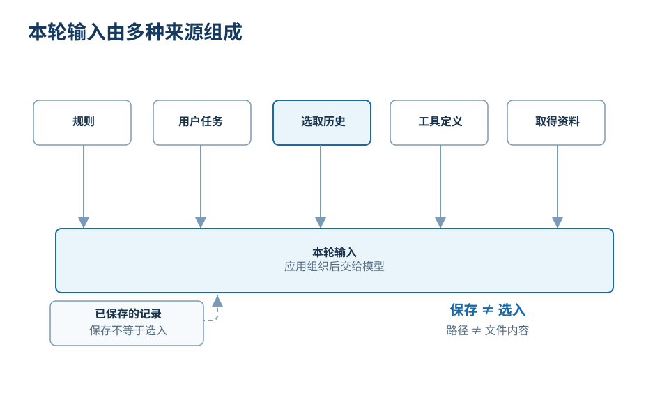
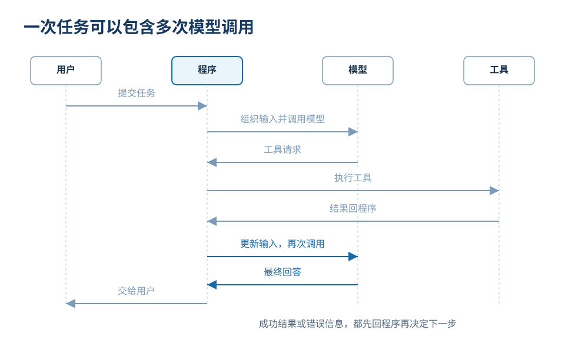

# AI 怎样接收信息并执行任务

你对助手说：“把这段本地录音整理成会议纪要。”过一会儿，它交回了一份纪要。表面上像是一句话让 AI 直接读取文件、听懂录音并写完结果；实际过程通常由模型、应用程序和工具共同完成。分清它们的职责，才能判断任务现在进行到哪一步。

以下使用一个虚构教学场景：录音路径是 `/audio/meeting.wav`，应用连接了转写工具。这里没有读取真实录音。能够直接接收音频的产品，也可能采用不同流程。

## 用户消息只是本轮输入的一部分

应用程序可以把多种信息组织后交给模型：系统或应用规则、用户刚发的消息、相关对话记录、已经取得的材料，以及可用工具的名称和参数说明。这些实际进入本次模型调用的信息，构成本轮上下文。

*图：应用程序从不同来源选择并组织本轮上下文；只有实际放入这次调用的信息，模型才能使用。文件路径不等于文件内容，保存的全部历史也不等于本轮全部输入。*

在第一次调用中，模型也许收到了“用中文整理会议纪要”的规则、用户要求、录音路径和转写工具说明。路径只是一个地址，此时录音里的话还没有进入模型。类似地，一个网页链接、数据库名称或文件名出现在提示中，也不表示其内容已经被读取。

上下文也不是越多越好。应用需要保留当前目标所需的信息，减少无关重复和已经失效的要求；若遗漏关键材料，模型无法凭提示词把事实补回来；若把互相冲突的旧要求都塞进输入，模型也可能选错方向。

## 模型输出可以给人，也可以给程序

如果只需要解释一般概念，模型可以直接生成文本。但“读取本地录音”需要外部能力。应用会向模型说明一个工具，例如：工具名是 `transcribe_audio`，必填参数是 `file_path`，还可选择语言与输出格式。公开的 MCP 规范也采用类似方式，用名称、说明和输入 Schema 描述工具，并由客户端发起调用、接收结果。[MCP 工具规范](https://modelcontextprotocol.io/specification/2025-06-18/server/tools)

模型此时可以输出一个结构化请求，例如选择 `transcribe_audio` 并填入 `/audio/meeting.wav`。这个请求也是模型输出，只是接收者是程序，不是最终用户。它表达“希望调用哪个工具、使用什么参数”，并不证明操作已经成功。

## 程序执行，结果再回到模型

应用程序接收工具请求后，检查参数、访问权限和运行条件，再调用真正的转写程序。程序读取录音并返回转写文字；若路径不存在、权限不足或工具失败，返回的则是错误信息。对常见的客户端工具循环，官方文档同样区分模型生成工具请求、应用执行、结果回传和模型继续生成几个环节。[工具使用流程](https://platform.claude.com/docs/en/agents-and-tools/tool-use/how-tool-use-works)

*图：模型先提出工具请求，应用或外部程序执行；程序可将成功结果或错误组织进后续调用。提出动作与动作已经完成是两个状态。*

假设转写成功，应用把“原请求、工具调用及转写结果”等当前所需信息组织起来，再调用模型。到这一步，模型才真正取得录音文字，并能据此生成会议纪要。用户虽然只提问一次，模型可能已经被调用两次或更多次。

若转写失败，正确的后续依据是错误结果。模型可以据此修改参数、换一种可用方法，或者说明需要用户处理什么；它不能把“已经发出请求”写成“已经完成转写”。工具返回也不自动等于可信事实，应用或后续步骤仍可能需要检查格式、来源和内容。

## 一次完整任务包含多种状态

这个过程可以按状态判断：

1. 用户提出目标：想得到会议纪要。
2. 应用组织输入：规则、消息、路径和工具说明进入本轮上下文。
3. 模型生成工具请求：它提出读取和转写，但尚未取得内容。
4. 程序执行工具：成功、失败或部分结果由实际执行决定。
5. 应用把结果放入下一轮输入：模型获得新证据。
6. 模型生成面向用户的纪要：应用把结果展示或保存。
7. 必要时再检查：纪要是否覆盖议题、决定、待办和负责人。

不同产品会隐藏其中一些往返，也可能由服务端自动执行工具，但判断方法不变：看模型这一轮实际收到了什么，输出交给谁，动作由哪个程序执行，结果是否已经回到后续输入。

模型擅长根据上下文解释、规划和生成；应用程序负责组织信息与控制流程；工具连接文件、数据库、浏览器或其他真实系统。把这三个角色分开，便能看出问题应在哪里修正：缺材料时补上下文，工具报错时处理执行条件，结果偏离时依据来源给出具体反馈。
