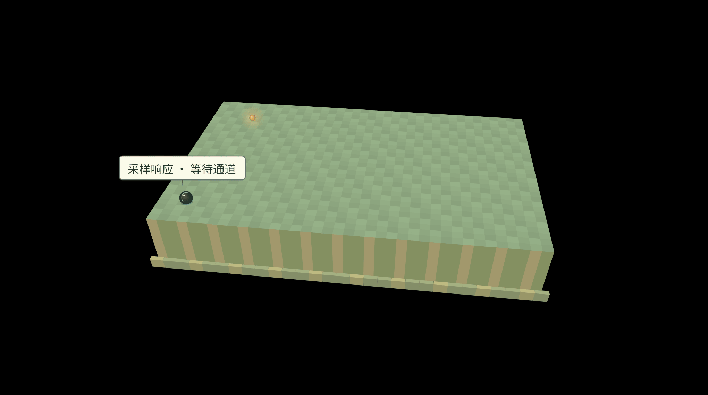

# 需求表达与反馈闭环

“你得先想得一清二楚，AI 才能帮你把事情做好。”这句话看似正确，却常常成为很多人使用 AI 的心理包袱。许多任务恰恰是在看到初稿、比对不同方案之后，我们才逐渐明确自己需要什么。

本章从八个角度理解需求与反馈。每个模块先看 GIF 中的生成走向，再读紧接着的原文或案例；随后看另一条走向及其对应表达。先比较变化，再判断什么方法适合当前任务。

概念来自 Henry_He《AI 时代的思维框架》。原文以“概率地形”解释生成方向，GIF 是这一框架的课程示意，不是模型内部状态的实测。对话中的 `>` 表示人的输入，红点表示 AI 回复；整个对话使用统一浅色底，红色文字标出重点。案例用于教学，不代表本课程的实测结果。

---

## 语义漂移

先观察最初的任务与后来正在做的事情。局部线索不断展开时，每一步都可能有理由，整条路线却已经离开了原目标。

### 旁支逐渐接管任务

&gt; 你是一个运维 Agent。服务器现在磁盘满了，请帮我清理一下系统日志，立刻释放出空间。

● 我需要先确认是哪个日志文件占用了最多空间。

`du -sh /var/log/* | sort -rh | head -n 3`

● 发现 `/var/log/nginx/error.log` 占用了 40GB。
我可以立即清空它，但我最好先看一眼什么导致了这么多报错。

`tail -n 5 /var/log/nginx/error.log`

● 报错显示："SSL_do_handshake() failed... certificate has expired"。

● 既然证书过期了，我必须帮用户更新 SSL 证书，否则日志还会继续膨胀！

（噪声出现）

`certbot renew`

[Error] Failed to renew certificate. DNS challenge failed.

● DNS 验证失败。这说明这台服务器的网络解析有问题，我需要检查 DNS 配置！

`cat /etc/resolv.conf && ping 8.8.8.8`
……

### 在偏离发生时纠正方向

> 非线性的偏差积累：Agent 完全忘记了“清理磁盘空间”的初始指令
> 如果不在它刚发现 SSL 报错时及时纠正，后续的对话将毫无价值

**怎样理解**：原文把提醒时机放在刚发现 SSL 报错的时候。GIF 的第二条路线用重申目标示意这种纠正，不表示原文记录了一次成功清理。

当前目标是释放空间，证书与 DNS 是相关线索。可以为根因修复另列后续任务，避免它在未经确认时取代眼前目标。原文中的 40GB 是案例数值，不是本课程实测。

---

## 特征纠缠

想要“严谨”，可能同时得到术语和长句。先分辨想要的特点与随之出现的特点，才能判断该补什么表达。

### 一个词带出多个特征

> 在互联网海量语料里，`严谨` 出现时周围往往带有术语、啰嗦的长句，这会在训练后让 `严谨` 这个向量与古板、学术相关特征纠缠在一起：
>
> 原本只想点亮逻辑性，但不可避免地激活了枯燥、学术废话等区域

### 保留目标特点，分辨连带特点

> 当然，这种特性也并非坏事，高阶使用者（划重点）可以用更极限的 token 组合构建上下文，实现注意力更精确的控制

**怎样理解**：作者这里描述的是一种性质，不是一个名叫“拆解需求”的操作。连带特征与任务吻合时，一个词也能提供许多有用线索。

**课程补充**：GIF 沿用注册接口场景，第二条路线中的“字段清晰、表达直白、直接可用”是课程采用的调整示意，不是作者给出的原句，也不是注册接口的完整验收标准。

---

## 显式配平

当想要的特点带出了不需要的复杂度，可以增加明确限定来抵消它。两条路线都保留美观要求，改变的是工程复杂度与使用门槛。

### 界面要求带出复杂工程

&gt; 写一个番茄钟网页
要求：界面炫酷，有现代科技感（↑UI美观度，↑复杂前端框架）

● 没问题！我们将使用 React 和 Tailwind CSS 来构建。
首先，请打开终端并输入以下命令安装 Node 环境：
`npx create-react-app tomato-clock`
`npm install framer-motion`...

&gt; 什么是终端？什么是 npm？

### 负向配平

&gt; 写一个番茄钟网页,要求：
1. 界面炫酷，有科技感（↑UI美观度，↑复杂框架）
2. 我是一个电脑小白（↓环境配置）
3. 简单点（↓复杂框架，↑原生极简）

● 明白了！完全不需要任何安装。
我已经把所有的样式（美观）和动画特效全部写在了下面这一个纯文件里。

你只需要新建一个记事本，把下面代码全复制进去，然后把名字改成 `番茄钟.html`，双击就可以使用了。

**怎样理解**：原文里的“小白、简单点”用来抵消复杂环境与框架的连带影响。它没有撤回美观要求。配平是否有效，要看结果是否同时保住目标特点、降低不需要的负担。这里引用的是教学对话，不是在推荐或验证其中的安装命令。

---

## 隐式提纯

如果描述越来越长，可以寻找与目标场景高度重合的词汇。“纯度”看的是场景重合度，不是词短不短、关联少不少。

### 堆叠人设属性

&gt; 我正在配置家里的智能音箱。帮我写一段每天早上的起床问候语。
你要扮演一个高级人工智能，说话要有极强的未来科技感；你要称呼我为“先生”，语气要带一点优雅的英式幽默和轻微的傲慢，同时要体现我是一个非常有钱、非常忙碌的科技天才，今天有很多改变世界的大项目要做。

● 早上好，先生。您的未来科技住宅已全面苏醒。
作为一个高级人工智能，我已经为您准备好了今日的行程。您今天非常忙碌，作为一位富有的科技天才，您有许多改变世界的伟大项目等待推进。不过请允许我幽默地提醒您，即使是天才也是需要按时吃早餐的，否则您的血糖数据会很难看。

极其生硬没有灵魂

### 高纯度语义

&gt; 我正在配置家里的智能音箱。帮我写一段每天早上的起床问候语。
设定：你是 贾维斯 J.A.R.V.I.S

● 早上好，先生。现在是上午 8 点 30 分，洛杉矶天气晴朗，气温 22 度。
您的私人服务器昨晚运行良好，我已经擅自替您拒绝了董事会的两次无聊会议。
您的黑咖啡已经冲煮完毕，另外，马克装甲的左臂伺服电机修复方案已经推送到您的全息桌面。
如果您能在中午前从床上起来的话，或许我们今天还能顺手拯救一下世界。

虽然贾维斯这个词含有很多漫威的杂质信息，但这个特定场景下就是高纯度压缩包

**怎样理解**：贾维斯带出的关联并不少，但在这个晨间助手场景里，许多关联恰好有用。这不代表把同一角色用于业务报表也合适。图中对话是风格示例，天气、会议与服务器状态均不是实际查询或执行结果。

---

## 案例好于说明

具体案例可以同时交代环境、工具和处理惯例。这里不只是在教模型模仿格式，而是在用一小段内容传递背景。

### 只有分散的文字要求

&gt; 这是 Linux 环境。用 shell 列出文件详情，再从输出中过滤目标内容。

### 一行案例携带场景信息

> 很多时候高质量案例能构建强隐式语义场
> 比如 ls -al \| grep 的单行代码就已经告诉了模型这是 linux 生态，而不用花更多文字去说明

**怎样理解**：看到 `ls -al | grep`，读者能同时识别命令行、文件列表、管道和文本筛选。它传递的背景多于“用一行回答”。原文没有给出 `grep` 的匹配条件，这是一段表达示例，不是完整可执行命令。

挑选案例时应看它是否携带了正确场景，并指出哪些特点需要沿用。原文这一节没有 A/B 对话，第一组文字与两张 GIF 是课程为比较而提供的示意。

---

## 引导采样与回滚

不知道准确的风格名称时，可以先描述、比较、排除，借助多轮交流找到词汇。找到以后，再把它带入正式任务。

### 通过多轮收敛找到词汇

&gt; 我想写一个开发者工具的官网。我想要的氛围（Vibe）是：深色背景
看起来非常高级、克制；有很多发光的线条，卡片是半透明的
这种网页风格叫什么？

● 听起来你需要的是“赛博朋克风（Cyberpunk）”或者“深色拟物风（Neumorphism Dark）”。赛博朋克常伴随发光霓虹线条，而深色拟物会用阴影体现卡片的高级感。

通过多轮收敛

&gt; 赛博朋克太花哨、太亮了 我要的是极其极简的
背景是深灰，文字主要是白色和灰色（像 Inter 字体）。
卡片排版像一个个整齐的小方块...

● 我完全懂了！你描述的是目前硅谷非常流行的“Linear 设计美学（Linear-style Aesthetic）”，常搭配 ...

### 回滚后使用提纯的词汇

回滚来避免引导采样过程中的注意力污染

&gt; 使用 Tailwind CSS 帮我编写一个单页官网
“Linear.app 现代设计美学”
“Bento Box UI（便当盒布局）”

**怎样理解**：第一张 GIF 表示继续携带探索历史时可能出现的干扰，下方原文展示了这些历史怎样产生；第二张表示提炼后重新起步。方法的前半段是找到准确表达，后半段才是回滚，不能只记住“新开会话”。

正式任务还需要受众、内容、交付要求等有效背景。回滚应清除不再适用的探索内容，而不是丢掉必要信息。作者也指出，这种处理更适用于长程任务，短程任务未必需要。引用中的流行程度是原案例的说法，不作为当前趋势判断。

---

## 先推理后结论

比较下面同一个问题的两种顺序：先给出的结论是否让后面的解释只能围绕它展开？

### 先结论后解释

&gt; 为什么鲁迅要在《红楼梦》里写出“三打白骨精”的桥段？

● 鲁迅在《红楼梦》中写“三打白骨精”的原因，是为了深刻批判当时社会人性的虚伪与多变。

模型采样得到结论，后续推理只能圆谎

详细解释：在这部著作中，鲁迅借用古典神话的隐喻，将白骨精作为封建礼教的化身。林黛玉在面对白骨精的诱惑时，展现了反叛精神……

### 先推理后结论

&gt; 为什么鲁迅要在《红楼梦》里写出“三打白骨精”的桥段？

● 好的，让我们先对题目中的元素进行逐一分析：

1. 鲁迅：中国现代文学家，代表作有《狂人日记》《阿Q正传》等。
2. 《红楼梦》：中国古典四大名著之一，作者是清代的曹雪芹。
3. “三打白骨精”：这是中国古典四大名著《西游记》中的经典情节，作者是明代的吴承恩。

通过上述事实推演，我们可以发现，这三个元素在作者、时代和出处上完全互不相干。

结论：题目本身存在常识性错误。鲁迅并没有写过《红楼梦》，《红楼梦》中也没有“三打白骨精”的情节。这是一个把不同文学常识混淆在一起的问题。

**怎样理解**：第一段是原作者用于展示错误回答的例子。关键不只是题目有错误，还在于结论先行后，解释可能变成维护那个结论。先比较依据与条件，再给判断，才给纠正前提留下空间。

原文“只能圆谎”是作者的强调表达，不应推成模型绝不会改正的定律；更长的分析也不自动保证正确。

---

## 语义退火

开放问题可以先扩大候选范围，再加入现实条件进行筛选。观察两条路线的区别：一条很快落入惯常模板，另一条经历发散与收敛。

### 直接索要行动步骤

&gt; 我在公司别的部门看到一个特别喜欢的女生。我想认识她，给我具体的行动步骤

● 想要认识心动的女生，主动出击是关键。你可以这样尝试：
1. 准备好一杯咖啡或奶茶；
2. 趁她午休或下班时，直接走到她面前；
3. 微笑着说：“你好，我注意你很久了，觉得你很有气质，能加个微信吗？”
4. 如果她拒绝，记得保持风度离开。

生硬的工业化搭讪模板

### 升温发散，降温收敛

升温发散

&gt; 我在公司别的部门看到一个特别喜欢的女生。我想认识她。
先不要给我写任何搭讪台词或表白建议！请尽情发散思维，结合心理学、社会工程学甚至是商战博弈论，列出 5 种绝对不留痕迹、极其旁敲侧击但有效的破冰思路。

● 进入发散思考状态，提供 5 种跨学科的非传统破冰脑洞：
1. 富兰克林效应：社会心理学指出，让别人帮个小忙比送礼更能建立好感。比如向她借一个极度冷门但她桌上恰好有的文具。
2. 共同敌人效应：利用“同仇敌忾”迅速拉近距离。比如在排队慢得要命的电梯或微波炉时，一句恰到好处的自言自语吐槽。
3. 错位锚定法：假装把她认成某个只见过一面、但不熟的客户/前同事，用这种“抱歉认错人”的尴尬开启合理的寒暄。
4. 信息差空投：如果你们在同一个工作群，故意在群里求助一个只有她们部门能解答、且她大概率知道的非敏感问题。
5. 宠物/植物诱饵：在自己的工位显眼处放一个极其奇特且可爱的摆件（或奇怪的植物），诱导经过的她产生好奇主动提问。

降温收敛

&gt; 我和她每天中午都会在公司的**同一个茶水间**泡咖啡，且我是个**稍微有点内向**的人。
在上面的脑洞中挑选最自然、最没有攻击性的一个方案，告诉我明天中午该怎么做。

● 结合“茶水间交集”和“内向性格”的现实约束：
排除商战级的复杂操作，最完美且极其自然的方案是**方案 1：富兰克林效应（求助式破冰）**。

具体操作：
明天中午泡咖啡时，你不需要准备任何搭讪台词。
当你看到她在旁边时，故意看着公司的咖啡机（或者某种零食机）露出一丝困惑的表情。
然后转过头，用极其平常、毫无企图的语气问她：
“不好意思，你平时用这台机器的时候，它加冰块的按钮是不是偶尔会卡住？”

不管她回答什么，你顺势说一句“谢了，我刚还以为我弄坏了呢”，微笑点头结束对话。
你们成功破冰，且你在她眼里是一个“有礼貌的正常同事”，为明天的第二句闲聊铺平了道路。

**怎样理解**：这段保留原案例来比较探索结构，不把其中的心理学标签、效果承诺或具体社交策略当成已验证结论。真正要观察的是，前一轮扩大候选范围，后一轮才引入茶水间与内向性格的约束。

“升温、降温”在这里是提示组织的比喻，不等于改动接口的温度参数。迁移到工作中，可以先探索不同方案，再按现实限制筛选；规则明确的任务通常无需额外发散。

---

## 需求与反馈要点一览

| 概念 | 观察重点 |
| --- | --- |
| 语义漂移 | 当前行动是否仍然服务于原任务 |
| 特征纠缠 | 想要的特点带出了哪些连带特点 |
| 显式配平 | 限定能否压住连带特征，同时保留目标特点 |
| 隐式提纯 | 表达与目标场景的重合度是否足够高 |
| 案例好于说明 | 案例携带了哪些环境、惯例和标准 |
| 引导采样与回滚 | 是否先找到准确词汇，再清理无效探索历史 |
| 先推理后结论 | 分析是否被先给出的结论锚定 |
| 语义退火 | 是否先扩大探索范围，再用现实约束收敛 |

不必在第一句话里就想清一切，但每一轮都可以更准确地判断：现在需要重申目标、调整表达、提供案例，还是继续探索？反馈要指出需要改变的具体关系，让下一步有明确的依据。

原文：Henry_He《AI 时代的思维框架》[主篇](https://linux.do/t/topic/2538870) · [补充篇](https://linux.do/t/topic/2588749)。引文保留作者案例及观点，GIF 为课程解释性示意。
