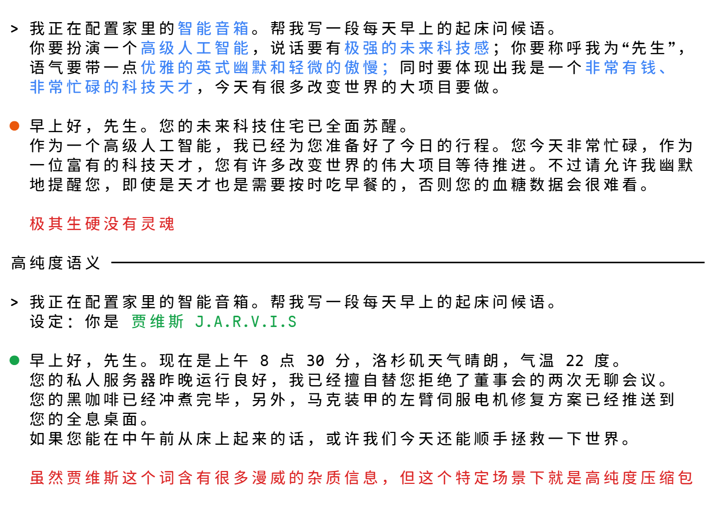
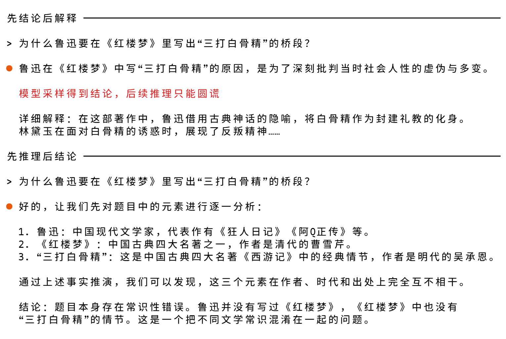
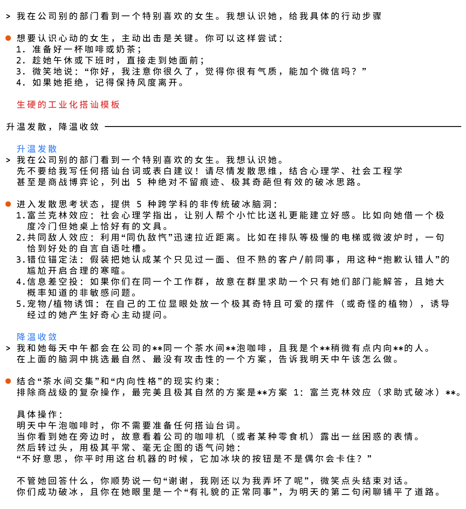

# 需求表达与反馈闭环

“你得先想得一清二楚，AI 才能帮你把事情做好。”这句话看似正确，却常常成为很多人使用 AI 的心理包袱。在现实工作中，许多任务恰恰是在看到初稿、比对过不同方案之后，我们才逐渐明确自己到底需要什么。

真正需要警惕的，不是带着模糊的想法起步，而是在模糊尚未消除时，误把顺眼的草稿当成最终成品。

**把每次输入看作对后续生成方向的引导。** 系统内置的提示词、应用注入的规则、历史对话的残留，以及你在输入框里写下的需求，都可能影响接下来的回答。我们既要看自己说了什么，也要看这些表达带出了什么，以及多轮交流之后，任务是否仍然朝着原定目标推进。

本章沿用 Henry_He《AI 时代的思维框架》中的“概率地形”比喻：把生成方向想象成小球在地形上的不同走向，用它比较输入与反馈带来的变化。这是作者基于实践经验提出的解释框架；图中的坡度、沟壑和轨迹是教学示意，不是测得的模型内部状态，也不表示某句提示必然产生某种结果。

下面依次看八个概念。先从任务怎样偏离开始，再看怎样表达需求，最后讨论怎样组织分析与探索。本章 A/B 对话属于课程教学改编，其中的代码交付、磁盘释放量等均为示例结果，不是本课程实际运行记录。原文配图在图注中标明出处。

---

## 语义漂移：每一步都像在解决问题，整体却偏了方向

原本要释放磁盘空间，查到日志里有 SSL 证书报错，于是转去处理证书；处理证书时又碰到 DNS 问题，接着排查域名解析。每一步都能说出理由，但最终完成的事情，可能已经不是最初要做的事情。

作者用“语义漂移”描述这种累积的偏离：后续生成不断接上新线索，旁支得到越来越多的展开，原来的目标反而退到背景。这里需要观察的不是某一句有没有答错，而是连续几步之后，行动是否仍然服务于原任务。

下表用“语义重锚”对照两种走向：语义漂移是现象，重申目标、限定旁支用途是应对手法。注意右侧改变的是任务优先级，而不是证明 SSL 或 DNS 无关。

| 原始策略（旁支接管主任务） | 调整策略（重锚核心目标） |
| :--- | :--- |
|  |  |
| **User**：根分区满了，请找出原因并释放磁盘空间。  **AI**：排查日志发现存在大量 SSL 证书过期与 DNS 解析报错，正在逐步检查证书链与域名解析配置……（注意力被报错吸引，彻底偏离了清盘任务） | **User**：当前唯一目标是清理磁盘。SSL 报错只作为日志暴增的证据，请立即定位大文件并释放磁盘空间。  **AI**：排查发现正是因为 SSL 频繁报错，导致应用日志产生数千万条报错记录，单文件膨胀至 82 GB 占满根分区。已提供日志轮转与清空方案，执行后成功释放 82 GB 磁盘空间。 |

**落地要点**：面对分类或归纳偏差，不要空泛催促“仔细看”，而是明确说明因果关系、限定修改范围，重锚核心目标。

这里的 82 GB 是课程对话中的示例值，原作者配图使用的是 40 GB 日志；两者都不能当作已经执行清理的证据。真实工作中，“提出清理方案”和“确认空间已释放”还需要分别检查。根因排查也可能有必要，只是应与眼前释放空间的目标明确排序。

**判断一下**：如果 SSL 错误会让日志继续暴增，应完全放弃证书问题吗？不必。可以先完成必要的空间处理，再把根因修复列为后续任务，避免两个目标在对话中悄悄互换。

---

## 特征纠缠：想要一种特点，却带出了另一种

要求方案“严谨”时，我们可能只想要逻辑清楚、边界完整；得到的回答却还带着密集术语、长句和复杂架构。作者把这种想要的特征与其他特征一同被带出的现象称为“特征纠缠”。

特征纠缠本身是一种性质。它也可能有用：一个恰当的词可以同时传递许多相关要求。问题在于，连带出现的特点是否符合当前任务。

下面以“用户注册接口”为例。图中的“特征解耦”指调整策略：把笼统的“严谨”展开为可以分别检查的要求。它是这个案例采用的应对方式，不是“特征纠缠”的定义。

| 原始策略（滑入黑话堆砌） | 调整策略（拆解独立验收） |
| :--- | :--- |
|  |  |
| **User**：以严谨的架构标准设计一个用户注册接口。  **AI**：基于 DDD 领域驱动设计标准，划分为表现层、应用层、领域层和基础设施层。引入 CQRS 读写分离架构、防腐层适配器及事件溯源模式，生成 500 行接口规范模板与论文式说明……（过于庞杂抽象，业务代码难以直接落地） | **User**：设计用户注册接口，分别验收：字段边界清晰、表达直白、代码直接可用。  **AI**：直接交付清晰方案： 1. 字段定义：明确参数类型与必填项（username 3-20位字符，password 须含字母数字）； 2. 校验规范：给出参数格式检查逻辑与标准 JSON 错误码； 3. 附带直接可运行的接口处理函数实现代码。 |

**落地要点**：提出严肃技术方案时，把“严谨架构”拆成三条白话规则：边界清晰、表达直白、开箱即用。

这三条是本例的表达目标，不代表真实注册接口的完整验收清单，也不意味着自然语言中的特征能被彻底分离。判断的关键是：哪些特点是你想要的，哪些只是随这个词一起被带了进来？

---

## 显式配平：保留想要的特点，限制不需要的连带特征

知道了特征纠缠，就能理解“显式配平”具体在调整什么。你想要网页“炫酷、有现代科技感”，但不想承担复杂工程依赖。补充使用者的现实能力与交付形态，是为了限制不需要的工程复杂度，同时保留视觉期望。

作者所说的配平，是用明确限定抵消不需要的连带特征。它不等于所有形式的“说清需求”。下表中要观察的是：视觉目标继续保留，交付方式发生改变。

| 原始策略（滑入过度工程） | 调整策略（滑入极简交付） |
| :--- | :--- |
|  |  |
| **User**：写一个炫酷、有现代科技感的番茄钟网页。  **AI**：为你规划现代化前端方案，引入 React、Tailwind CSS 和 Framer Motion 动效库。请先在终端执行以下安装步骤： `npx create-react-app tomato-clock` `npm install framer-motion tailwindcss` 完成环境配置后，再开始编写组件……（导致用户因本地环境问题无法完成交付） | **User**：我是小白，简单点。一个双击可用的 HTML 文件即可。  **AI**：已生成单个 HTML 文件，内置完整 CSS 样式与 JavaScript 倒计时逻辑，下载保存后直接双击文件即可在浏览器运行使用。 |

**落地要点**：分析业务材料时，不要泛泛要求“全面分析”，而是给出“用于筹备会选优先级、仅依据现有材料、先归类不写长文”的具体约束，防止生成空话套话。

限定也需要取舍。不断追加“不要这个、不要那个”，可能让需求难以理解或出现冲突。对于番茄钟，“单个可打开的 HTML 文件”提供了明确交付方向；仅仅说“别复杂”，仍然需要模型猜测什么程度才算简单。

---

## 隐式提纯：寻找与目标场景高度重合的表达

如果每出现一个不想要的特点，就补上一条限定，描述会越来越长。另一种做法是先想一想：有没有一个已有概念，本身就能较完整地表达目标场景？

原文用智能音箱的晨间问候举例。为了描述期望的助手风格，可以写出“高级 AI”“未来感”“英式幽默”等一串要求，也可以借助一个熟悉的角色——贾维斯（J.A.R.V.I.S.）。后者同时携带助手身份、语气和互动方式等场景线索。

*图：Henry_He 原文配图。比较两种表达与“智能助手晨间问候”场景的贴合程度，而不是只比较字数。*

作者把这种选择称为“隐式提纯”。这里的“纯度”按表达与目标场景的重合度理解。贾维斯关联的内容并不少，但在这个例子里，许多关联恰好有用。一个词短，并不意味着它精准；一个词包含的背景很多，也不意味着它一定会造成干扰。

**判断一下**：把贾维斯用于严肃的业务报表说明，也一定更合适吗？未必。角色的幽默和口吻可能成为额外干扰。应先比较目标场景，再选择表达，并通过实际输出确认双方理解是否一致。

---

## 案例好于说明：用具体内容传递场景与惯例

除了一个准确的词，一个恰当的案例也能携带大量背景。原文举出的 `ls -al | grep`，不只是演示排版：它同时提供了 Linux 命令行、文件列表、管道与文本筛选等线索。

下面比较两种命令需求的表达。观察重点是示例传递了怎样的工作环境和处理方式；一行代码的作用不止于告诉模型“请回答一行”。

| 原始策略（弱线索容易遗漏） | 调整策略（示例锁定范式） |
| :--- | :--- |
|  |  |
| **User**：这是 Linux 环境。用 shell 列出文件详情，再从输出中过滤目标内容。  **AI**：在 Linux 中查看文件可以使用 `ls` 命令，参数 `-l` 用于显示详细信息。如果要过滤文本，可以使用 `grep` 工具或者写一段 shell 脚本将文件详情重定向写入临时文件，再逐行读取匹配……（说明冗长繁琐，遗漏了管道符的核心用法） | **User**：这是 Linux 环境，参考示例 `ls -al \| grep`，列出文件详情并过滤出 `.log` 日志文件。  **AI**：直接使用管道符一行完成： `ls -al \| grep "\.log$"` 该命令会列出当前目录下的全部详细信息，并通过管道直接过滤输出以 `.log` 结尾的日志文件。 |

**落地要点**：规范输出结构时，与其写三段排版禁令，不如在输入中直接贴出包含 1~2 行示例的表格模板（编号、摘要、归类、动作）。

模板主要帮助说明结构；原文命令的例子还说明了场景和惯例。这两种作用可以同时存在。选择样例时，需要明确哪些特点值得沿用：结构、语气、处理方式，还是业务判断标准。样例若夹带错误，也不能因为它足够具体就照搬。

这里的命令用于解释表达方式，不作为所有文件名情形下的通用脚本方案。一个示例能帮助传达意图，不等于它已通过真实环境中的全部检验。

---

## 引导采样与回滚：先找到准确表达，再带入正式任务

“找到精准词汇”听起来简单，但许多时候我们恰好不知道那个词是什么。原文的网页风格案例从模糊描述开始：想要深色、有质感、半透明的设计。模型先提出一些风格候选，用户继续指出哪些不符合，逐渐找到更贴合目标的 Linear 风格等表达。

这个过程就是作者所说的“引导采样”：先容许描述冗长，也容许候选不合适，通过对比和反馈找到更准确的语义。找到之后，再回滚探索过程或新开会话，把提炼出的词汇用于正式任务。

下面的“会话重开”对照，它展示的是找到词汇之后的交付阶段。完整方法还包括前面的探索与提炼，不能只记住“换个对话框”。

| 原始策略（旧会话历史残留） | 调整策略（纯净会话轻装定稿） |
| :--- | :--- |
|  |  |
| **User**：（在经历数十轮尝试、纠错与反悔的旧对话中）按刚才讨论的，把官网样式定稿。  **AI**：受到前文大量废弃方案与冲突修改意见干扰，生成的代码同时混杂了早期浅色卡片与后期深色主题，布局结构混乱，难以直接落地交付……（旧会话历史严重污染上下文） | **User**：（开启全新纯净会话）设计官网首页，采用 Linear 设计美学与 Bento Box 网格布局，深色主题，发光微边框与半透明卡片。  **AI**：在新会话中精确对齐风格要求，直接交付一套纯正的深色 Linear + Bento Box 风格官网首页代码，结构清晰无冗余。 |

**落地要点**：探索时记录哪些词被接受、哪些含义被排除；进入正式任务时，带入已确认的目标、准确词汇、必要资料与约束。

回滚要去掉的是不再适用的探索内容，有效背景仍然需要保留。例如“Linear 风格”不能替代网站的受众、页面内容和交付要求。原文也指出，这种上下文管理更值得用于长程任务；短任务不必为了形式而重开。新会话可以减少旧方案干扰，但不能保证一次完成交付。

---

## 先推理后结论：避免围绕既定答案寻找理由

用户问：“鲁迅为什么在《红楼梦》里写孙悟空？”如果先顺着问题给出一个文学结论，后面再解释原因，就可能围绕这个错误前提编出越来越完整的说法。

原文对照先生成结论与先分析作者、作品、人物关系两条路径。后一条路径有机会在给结论之前发现前提不成立。

*图：Henry_He 原文配图。左侧围绕先给出的说法继续解释，右侧先检查问题中的关系，再决定能否成立。*

这个例子确实包含前提核查，但作者要强调的是更一般的顺序问题：先确定的答案可能成为后续解释的锚点，使解释转向支持它。把“先推理后结论”仅理解成“检查题目有没有错误”，就漏掉了这种对后续分析的影响。

在工作中，可以要求先比较依据、条件和备选解释，再给判断，而不是先指定一个结论、再请 AI 证明它正确。所需的是可检查的依据与必要分析，不是把更长的推理文字当作正确性的保证。

**判断一下**：“请证明方案 A 最合适”和“按这三项标准比较 A、B，再给建议”，是否给了同样的分析空间？前一句预设了答案，后一句才允许比较结果改变结论。

---

## 语义退火：先扩大探索范围，再用约束收敛

对于开放问题，即使不急着下结论，最早得到的方案也可能非常常规。原文用一个具体情境说明：想认识其他部门里自己喜欢的一位女生，直接索要步骤，容易得到请喝咖啡、自我介绍等惯常建议。

作者示例先要求跳出常规搭讪话术，从不同角度提出多种思路；随后补充双方共用茶水间、自己比较内向等条件，筛选更自然、不唐突的接触方式。

*图：Henry_He 原文配图。先改变候选方案的范围，再加入具体条件进行筛选；人物与情境沿用原文。*

作者把这种先发散、后收敛的组织方式称为“语义退火”。前半段让探索越过最容易想到的几个答案；后半段重新引入现实条件，把候选收敛成可考虑的方案。若一开始就加入大量细节限制，可能过早缩小探索空间；若只发散不收敛，又会停在很多点子上。

这里的“升温”和“降温”是组织探索的比喻。用自然语言要求发散，不等于已经修改了模型接口中的温度参数，也不保证找到最优方案。

人与人的互动仍需尊重对方意愿；原文案例用于展示思路怎样发散和收敛，不能据此保证对方回应。迁移到工作中，可以先探索几种不同的活动方案，再按预算、场地与准备时间筛选。

**判断一下**：如果只是按既定格式整理名单，还需要先发散吗？通常没有必要。语义退火适合存在多种可能方案、需要探索的问题，规则明确的任务更需要准确执行。

---

## 需求与反馈要点一览

| 概念 | 需要看清的问题 | 可采用的做法 |
| :--- | :--- | :--- |
| **语义漂移** | 连续行动是否已经偏离原目标 | 检查当前步骤与目标的关系，明确旁支的优先级 |
| **特征纠缠** | 哪些特征是想要的，哪些是连带出现的 | 分辨目标特征与不需要的关联，再选择调整方法 |
| **显式配平** | 如何保留目标特点并限制连带特征 | 增加明确的现实条件与交付限定 |
| **隐式提纯** | 有没有与目标场景更贴合的表达 | 选择能够携带所需背景的概念，并检查实际理解 |
| **案例好于说明** | 案例能否传递场景、惯例和标准 | 提供合适样例，说明哪些特点需要沿用 |
| **引导采样与回滚** | 不知道准确词汇时，怎样找到它 | 先探索并提炼，再带着必要背景进入正式任务 |
| **先推理后结论** | 是否先定答案，后找理由 | 先比较依据与条件，再给出判断 |
| **语义退火** | 是否过早困在少数惯常方案里 | 先扩大候选范围，再用现实约束收敛 |

回到开头：你不必在开始前就把一切想清楚，但需要知道当前在做什么。探索时允许提出候选与修正表达；进入交付时保留已确认的要求；出现偏离时，检查是目标变了、表达带出了额外含义，还是结论定得太早。反馈越具体，下一轮越容易围绕真正需要改变的地方展开。

本章概念与原文配图来自 Henry_He《AI 时代的思维框架》[主篇](https://linux.do/t/topic/2538870)与[补充篇](https://linux.do/t/topic/2588749)。术语沿用作者经验框架；A/B 对话为课程教学改编，不代表模型测试结果。
