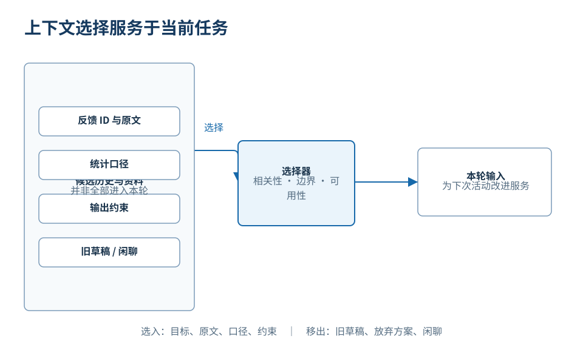
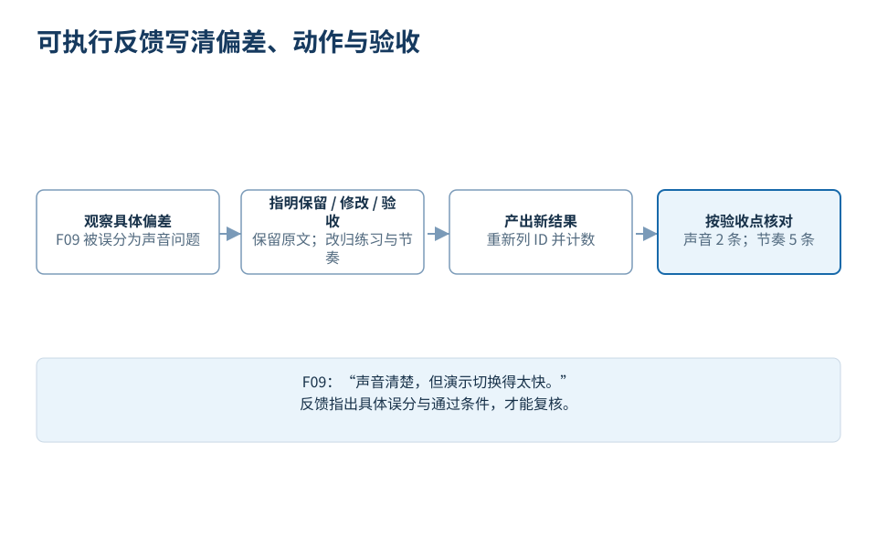

# 怎样表达需求、修正结果

“帮我分析一下这些活动反馈。”这句话看似清楚，却没有说明分析要支持什么决定。如果目的是汇报本次培训，重点可能是参与情况；如果目的是改进下一次培训，重点则是哪些问题值得优先处理、证据来自哪里，以及还有什么条件尚未确认。

下面仍使用这门课程的虚构培训反馈任务。完整的 12 条记录、分类计算、报告和验收过程见下一篇[《怎样用 AI 执行任务》](../05-执行任务/正文.md)。本篇只取三条代表记录，集中说明怎样表达目标、组织上下文和修正结果：

| ID | 原始反馈 |
| --- | --- |
| F01 | 后排听不清讲师的声音。 |
| F03 | 麦克风中途断了两次。 |
| F09 | 声音清楚，但演示切换得太快。 |

## 先把目标变成可以检查的任务

如果最终用途是改进下一次培训，任务说明就应围绕这个决定组织。它可以写成：

> 请仅依据提供的反馈，为下一次培训提出优先改进。先输出逐条分类表，保留 ID 和原文；统计单位是记录，不是人数，不推算满意度。没有负面声音反馈的记录，不应因为出现“声音”一词就计入声音问题。分类确认后再写报告，区分材料事实、解释和建议，并标出仍需确认的条件。

这段话说明了目标、来源、统计口径、中间成果和验收边界。它不靠“专业一点”“深入分析”等形容词让模型猜测，也没有规定模型内部必须怎样思考。若输出仍有偏差，我们还能指出究竟是分类错误、数字错误，还是建议越过了证据。

有些预期难以只用抽象规则说清，可以增加一个小样例。例如：“事实：对应 ID 与条数；解释：为什么值得关注；建议：下一步行动及待确认条件。”样例能够直接展示三类内容的关系，但还要说明只参考结构，事实必须来自当前材料，不能继承样例中的数字、人名或结论。

## 上下文要服务当前任务

用户提示词只是上下文的一部分。本轮还需要实际提供原始反馈、有效的分类口径、输出限制和已经确认的状态。如果只有“请根据附件分析”，但附件内容没有进入本轮输入，再明确的措辞也不能代替缺失事实。

*图：围绕“为下一次培训选择两项优先改进”保留有效信息。上下文质量取决于信息是否相关、清楚且彼此一致，不取决于材料数量。整理时仍要保留 ID、统计单位、来源和例外。*

旧草稿、已放弃方案、重复讨论或其他活动资料如果继续混入，可能增加冲突。长期协作中，应用还可能选择或概括历史，因此“以前说过”不等于“这次模型一定收到了”。整理时应减少无关重复，同时保留支持判断的 ID、单位、来源和例外。

压缩也不能破坏事实结构。“F01、F03 是负面的声音反馈”不能缩成“大家听不清”；F09 更不能因为出现“声音”就归入声音问题。模型此前生成的猜测，也不能因为进入旧摘要就升级为已确认事实。

## 用具体差异修正结果

假设第一版分类把 F09 放进“声音问题”，因为句子出现了“声音”。关键词命中了，含义却读反了：F09 对声音的评价是正面的，负面意见是演示切换过快。

有效反馈可以这样写：

> 保留 F01、F03 的声音分类。F09 的原文是“声音清楚，但演示切换得太快”，请将它从声音问题移到练习与节奏。随后重新列出相关 ID 并更新计数，其他原文保持不变。

*图：有效反馈说明哪些内容保留、哪里偏离、证据在哪、下一步怎样改以及如何验收。F09 的完整语义决定分类；分类修正后，相关计数也要重新核对。*

这段反馈包含保留项、偏差位置、来源证据、修改动作和验收要求。它缩小了修改范围，不会让已经正确的 F01、F03 一起被推翻。“不对，重写”或“再认真一点”缺少判断依据，模型可能改动更多文字，却没有修正真正的问题。

反馈发出后仍需看实际结果。要求“重新计数”并不等于数字已经更新；分类可能改对，报告里的旧数字却仍然保留。完整任务还应检查所有 ID 的覆盖、分类计数与建议边界，这些步骤在[下一篇完整演示](../05-执行任务/正文.md)中展开。

## 探索结束后，整理当前有效要求

有些任务开始时还没有唯一方向。探索阶段可以比较“增加练习”“调整讲解”“升级音频设备”等方案，也可以用几个样例逐渐确认偏好。但进入定稿阶段后，应说明哪些要求继续有效、哪些方案已经放弃、哪些条件仍待确认。否则相互冲突的历史内容可能一起影响新结果。

可以把当前状态写成：“目标仍是改进下一次培训；保留按主题分类和 ID 引用；F09 归入练习与节奏；设备根因、预算和实际课时仍待确认。”如果历史很长或方向多次改变，可以用这份经过核对的状态说明建立新任务。新对话可能减少部分旧历史的影响，但产品规则、项目资料或 Memory 仍可能继续生效，所以还要核对实际输入。

表达需求的关键，是让目标、依据、限制与验收条件可以被检查；给反馈的关键，是把预期和实际结果之间的差异指向具体证据。这样不能保证模型一次正确，却能让每次修改都有明确原因，也让团队知道哪些是记录中的事实、哪些是分析判断、哪些行动仍需人来决定。

