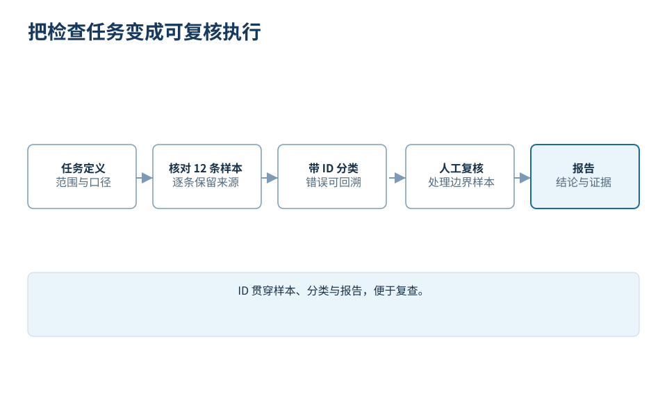
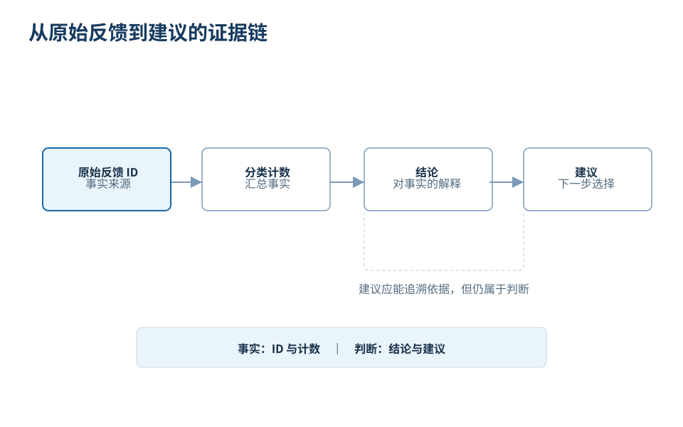

# 怎样用 AI 执行任务

假设你负责一场内部培训。活动结束后，你拿到一些反馈，希望在下次筹备会上提出两项优先改进。你可以直接要求 AI“写一份复盘”，但更有价值的过程是先看清：材料允许得出哪些结论，以及这些结论怎样支持行动。

本文的活动、记录、分类和报告都是为课程编写的虚构教学示例，不是对某个模型的运行实测。错误示例同样由作者构造。你可以用文中的原始材料独立复算，而无需相信一次演示的口头保证。

## 先把任务缩到一次具体决定

本轮目标是帮助组织者选择两项改进措施。交付是一页文字报告，包含主要问题、证据编号、建议和仍需确认的事项。它不需要覆盖活动所有优点，也不需要立即制作仪表盘。

输入只有下面 12 条反馈。每条记录有唯一 ID，没有参加者身份、总人数、满意度评分或活动预算。因此我们统计的是“反馈记录”，不能据此计算满意度，也不能把记录数量直接解释为独立人数。

| ID | 原始反馈 |
| --- | --- |
| F01 | 后排听不清讲师的声音。 |
| F02 | 实操时间太短，还没做完就结束了。 |
| F03 | 麦克风中途断了两次。 |
| F04 | 案例很贴近工作，希望增加练习。 |
| F05 | 开始前找教室花了十分钟。 |
| F06 | 讲得太快，操作步骤没跟上。 |
| F07 | 投影上的字太小，后排看不清。 |
| F08 | 发的资料很有用，希望提前一天收到。 |
| F09 | 声音清楚，但演示切换得太快。 |
| F10 | 希望保留答疑，今天的问题没来得及问。 |
| F11 | 练习有帮助，但希望给更多完成时间。 |
| F12 | 整体不错，没有其他建议。 |

原始文件可下载为 [CSV](../05-执行任务/案例/活动反馈.csv)。原文措辞应保留；修正错别字、删去重复或合并记录都会改变后续解释，需要另行说明。

## 给出要求，然后先看中间表

向 AI 发起任务时，可以这样表达：

> 请仅依据这 12 条反馈，为下一次培训提出两项优先改进。先输出逐条分类表，保留 ID 和原文，一条反馈可以有多个标签。统计单位是记录，不是人数；不要推算满意度。没有负面声音反馈的记录，不应因为出现“声音”一词就计入声音问题。先让我检查分类，再生成一页报告。报告区分材料事实、解释和建议，并标出尚未确认的条件。

这段说明把目的、材料、统计口径和中间交付都说清楚了。它不保证结果正确，但会让错误更容易被观察。与其先审查一篇润色完整的报告，先看 12 行分类表能直接暴露证据处理方式。

*图 1：本例选择先核对分类，因为结论依赖分类计数。其他任务可选择不同中间成果，不必照搬全部步骤。*

一个可复查的分类口径如下。“声音”只包含听不清或设备中断；“练习与节奏”包含练习时长、增练需求、讲解或切换速度；其他类别按具体问题命名。

| 类别 | 对应记录 | 条数 |
| --- | --- | ---: |
| 声音问题 | F01、F03 | 2 |
| 练习与节奏 | F02、F04、F06、F09、F11 | 5 |
| 场地指引 | F05 | 1 |
| 画面可读性 | F07 | 1 |
| 资料发放时间 | F08 | 1 |
| 答疑安排 | F10 | 1 |
| 无具体改进建议 | F12 | 1 |

本次分类中每条恰好落在一个主题里，所以条数合计 12。允许多标签时，这个合计未必等于输入记录数，应另查唯一 ID 的覆盖率。不要为了让合计好看，强行让本来有两个问题的反馈只保留一个。

## 判断节点一：关键词相同，就属于同一问题吗

假设中间表把 F09 计入“声音问题”，理由是出现了“声音”。先不要看后面的修改方式：你会接受这项分类吗？

F09 明确说声音清楚，负面意见针对演示切换过快。因此声音问题仍是 2 条，F09 应归入练习与节奏。这个判断来自完整语义，不来自关键词命中。

有效反馈可以写成：“保留 F01、F03 的声音分类；F09 的声音评价是正面的，将它移到练习与节奏。重新列出每类 ID 并计算条数，其他原文保持不变。”修正后需要再核对计数，不能因为修改意见已经发出，就假定所有相关数字自动更新。

这一步也暴露了统计工具的边界。脚本可以准确数出某个标签出现几次，却不能替我们证明标签合理。先检查分类依据，再用确定的计算核对汇总，会比让一个长段落同时承担所有判断更清楚。

## 判断节点二：五条反馈支持什么结论

“5 条记录涉及练习与节奏”是本分类下的可复算事实。“大多数参加者不满意”则需要另外的证据。我们没有参加者总数，也不知道是否一人提交多条；即使假设每条来自不同的人，5/12 也不到一半。

更稳妥的表述是：“在这 12 条反馈中，练习与节奏是记录最多的改进主题，共 5 条；其中既有节奏过快，也有希望增加练习的正面延伸建议。”这保留了统计结果，也没有把所有意见改写成不满。

*图 2：结论可回到记录核对，建议还需结合约束。出现频次不能直接替代影响程度、实施成本与可行性判断。*

## 从事实走到建议，要补一段理由

为什么选择两项改进，而不是把所有主题都列成待办？因为本轮会议要决定优先事项。我们可以提出“增加练习完成时间”和“课前检查音频覆盖”，但应讲清两者的依据不同。

练习与节奏有 5 条相关记录，值得优先检查讲授和操作时间的分配。声音问题只有 2 条，却可能直接影响听课；优先做麦克风和后排试听，是一个范围较小的行动建议。它的优先级并不是由条数自动算出来的，还包含了对使用影响与实施负担的判断。

预算、场地条件、实际课时都还未知。因此不应写“新增设备预算两万元”或“延长课程一小时”作为已经确定的方案。可以先建议：在不增加总时长的候选方案中，缩短一段讲解、增加一次完成练习的停顿；课前安排后排试听。实际调整多少，需要组织者进一步确认。

## 一份可以交付的一页报告

> **下一次培训的两项优先改进建议**
>
> 本报告依据 12 条虚构教学反馈，统计单位为记录，不能推断整体满意度或独立参加者人数。
>
> **一、优先调整练习与讲解节奏。** F02、F04、F06、F09、F11 共 5 条记录涉及练习时间、增练需求或演示速度，是本次分类中最多的改进主题。建议先拟一版不增加总时长的时间分配方案，保留关键讲解，为练习完成和步骤确认留出时间，再由讲师核对能否执行。
>
> **二、课前检查音频覆盖。** F01 提到后排听不清，F03 提到麦克风中断。建议在实际教室进行后排试听和设备检查。现有材料不足以判断根因或是否需要购买设备。
>
> F05、F07、F08、F10 分别涉及指引、投影可读性、资料发放和答疑，保留为后续检查项。F12 没有提出具体改进建议。上述两项优先级是基于本次记录与使用影响作出的建议，仍需结合课时、场地和组织者判断确认。

这份报告可以作为会议讨论材料，但还不是已经执行的改进。交付时同时保留原始 CSV、分类口径和报告，下一位读者才有机会追溯其中的数字。

## 验收以后，任务才真正收束

本例验收可以逐项完成：12 个 ID 是否全部出现且无新增；原文是否保持；F09 是否按语义分类；每个计数是否对应列出的 ID；报告有没有把记录说成人数；建议是否明确标为建议；未知的预算和根因是否仍然保留为未知。

如果这些条件已经满足，一页报告就可以结束本轮任务。继续增加封面、动态图表和自动化系统，未必帮助当前会议。若组织者接着追问“怎样在现有课时内增加练习”，那是一个有了更清楚输入的新任务：提供当前时间表，再设计和比较调整方案。

从提出要求到交付成果，关键变化是每一步都有可以检查的对象。这样遇到问题时，我们知道该改分类、改目标还是补资料，也知道什么时候已经获得足够好的结果。
