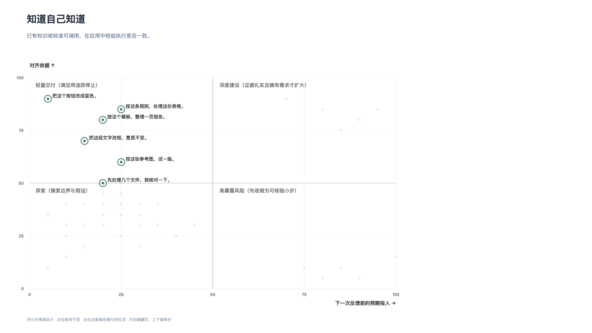
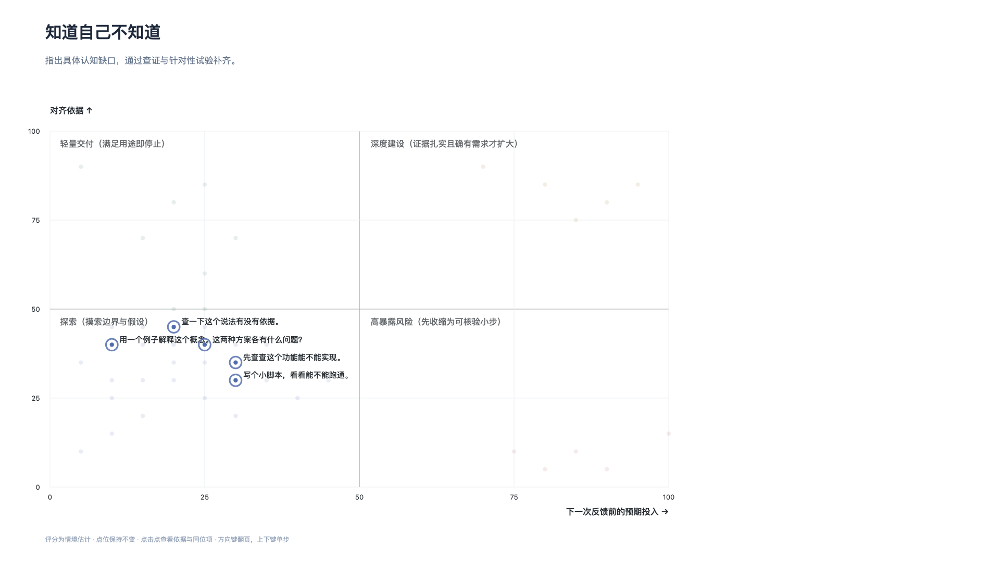
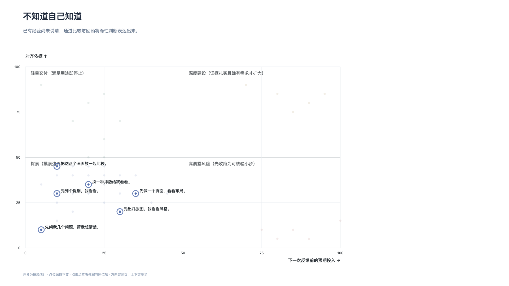

# 行动选择与投入控制

## 01 从具体请求开始

与 AI 协作并非抽象的理论流程，而是由一次次具体的请求构成。日常工作中向模型提出的需求形态各异，覆盖了从初步构思到系统实施的过程。

*图 1：日常协作中的 45 项具体请求按六类意图排列，色彩对应四象限行动状态。*

这 45 项常见任务归入提问与学习、查资料与找方案、文字与结构、图片与动画、页面与交互、数据与脚本六类意图。虽然同一类别下的语句看似相近，其背后的验证难度与工作量却大相径庭。同样涉及代码处理，“写个小脚本看看能不能跑通”仅需一次快速试验，而“把整套网站做出来”则包含前端、后端与多轮验收的系统承诺。

任务的表面分类不能作为判断风险的依据。即便提示词写得详细，若未经检验，也不等于依据充分；任务看似寻常，若一次性投入过大，同样会累积返工风险。要控制协作成本，需要深入考量每次行动所需的对齐依据与实际承诺的预期投入。

## 02 先看依据，再看投入

评估单次交互的暴露风险，关键不在于任务最终的总量，而在于在下一次获得有效反馈之前，究竟承诺了多少资源与精力。

*图 2：以预期投入为横轴、对齐依据为纵轴的行动评估空间。50 分为排版基准分界。*

评估空间由两个维度界定：

- **横轴（预期投入）**：在下一次获得有效反馈前，准备承诺的工作量、等待时间与产出范围。
- **纵轴（对齐依据）**：目标、边界与验收标准中，包含了多少经得起核验的事实与外部规则。

两个维度将交互划分为四种行动状态：

- **探索（低依据·低投入）**：目标或规则尚不明确时，将行动限制在小规模尝试内，目的在于摸索边界与发现分歧。
- **轻量交付（高依据·低投入）**：目标清晰且规则明确，按既定标准快速完成并核验，达到眼下用途即可停止。
- **深度建设（高依据·高投入）**：核心依据扎实且确有规模需求，分阶段推进系统化构建，并在关键节点设置核验。
- **高暴露风险（低依据·高投入）**：在关键假设未经验证时，直接承诺长周期生成或批量重构，容易带来严重的返工损失。

图中的分数为情境比较，统一基于“输入已提供、工具可用”的共同假设。50 分仅是排版分界，并非绝对阈值。该工具评估的是即时行动的风险结构，任务在图上的高亮只表示当前适用，并不代表认知状态与行动象限一一对应。

行动象限衡量“投入多大、暴露多高”，接下来的四种认知状态则诊断“依据缺在何处、如何取证”。无论处于哪个象限，都需根据认知状态采取针对性的取证动作。

## 03 知道自己知道

当所需的知识、规则或判定标准已在心中，且有现成依据可供调用时，处于“知道自己知道”的显性认知状态。

*图 3：显性知识状态下，将已有标准交代清楚，并在应用中检验执行是否一致。*

- **当前状态**：已有明确的知识、规则或判定标准可供直接调用。
- **动作目的**：将判断依据交代清楚，并在具体任务中检验执行。
- **判断依据**：双方能按同一套标准进行解释、执行与结果核对。

在此状态下，协作偏差多源于心中标准未曾转化为显性表达。把业务规则、格式模板或明确约束说明清楚，并在具体产出中核验执行的一致性，即可建立可靠的依据闭环。

## 04 知道自己不知道

当推进所需的理解、方法或客观事实尚不明确时，处于“知道自己不知道”的明确缺口状态。

*图 4：明确缺口状态下，界定认知缺口并通过查证或试验补齐。*

- **当前状态**：能指出具体的认知缺口，包括理解、方法、事实或评估标准。
- **动作目的**：通过学习、查证或针对性试验补齐缺口。
- **判断依据**：能够回答原先提出的问题，并说明所获结论的依据与适用限制。

面对明确缺口，不必急于全面铺开，而是围绕阻碍当前判断的核心未知项发起最小验证，获取真实反馈后再决定后续走向。

## 05 不知道自己知道

在面对文案语气、排版结构或视觉风格等任务时，人往往难以凭空列出精确的参数与规则，处于“不知道自己知道”的隐性经验状态。

*图 5：隐性经验状态下，借助比较、回顾与试作将隐性判断表达出来。*

- **当前状态**：已有实践经验或内在直觉，但尚未意识到或未能直接说清。
- **动作目的**：通过比较、回顾或试作，将隐性判断表达出来。
- **判断依据**：能指出方案差异与取舍理由，也可能在过程中形成新判断。

要求直接交付最终成品容易陷入抽象拉扯。借助具象切片或不同写法的并置对比，往往能更快看清偏好的真实理由，进而转化为明确要求。

## 06 不知道自己不知道

协作中最容易被忽视的是未曾预料到的缺陷、隐蔽假设或环境冲突，属于“不知道自己不知道”的未知盲点状态。

*图 6：未知盲点状态下，借助实际试用、反例与外部反馈发现遗漏。*

- **当前状态**：未意识到某些潜在问题、边界条件或隐含假设。
- **动作目的**：通过实际试用、反例测试或外部反馈发现遗漏。
- **判断依据**：出现可描述、可独立核验的新问题，但不保证穷尽未知。

盲区无法单凭推想穷尽。将原型置入真实环境使用，输入极端样本或主动征求反例反馈，能让原本未意识到的问题显现出来。

## 07 先取得依据，再扩大投入

协作的推进节奏应当由验证结果与实际业务需求共同驱动，避免顺应生成惯性无谓膨胀。

*图 7：对齐状态下的决策分支：满足用途适时停止，具备双重前提再考虑扩大建设。*

在具体的行动决策中，遵循四项收敛与推进原则：

- **探索取得依据**：面对较多未知时，先做低投入尝试探明边界，换取关键依据。
- **满足用途即停止**：目标清晰且当前产出已满足眼下用途时，适时停止，避免无谓扩增。
- **双重前提才扩大**：关键依据已有充分核验，且场景确有系统化规模需求，才分阶段推进。
- **依据不足速收缩**：面对高暴露承诺，主动隔离未知，降级为可分步核验的小动作。
