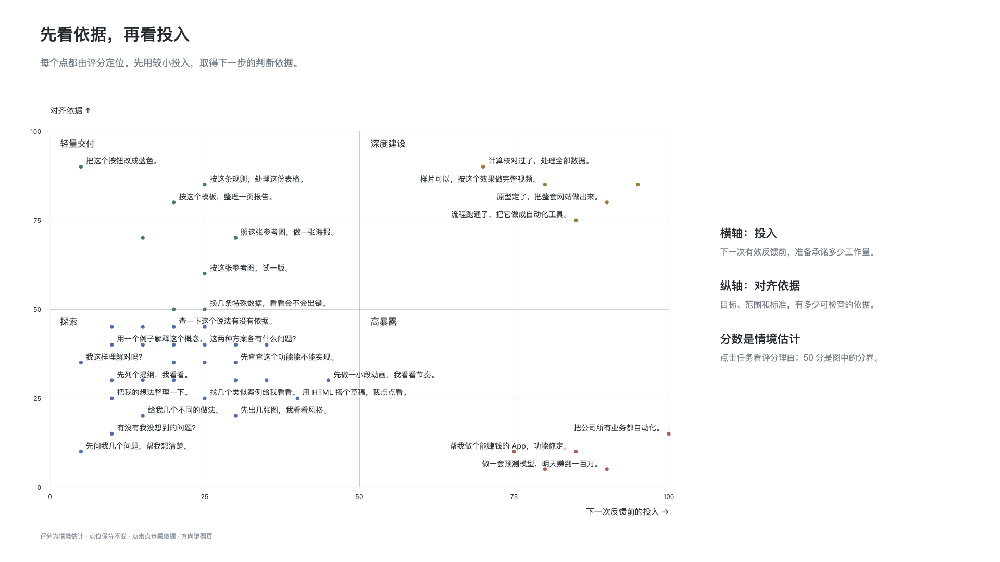
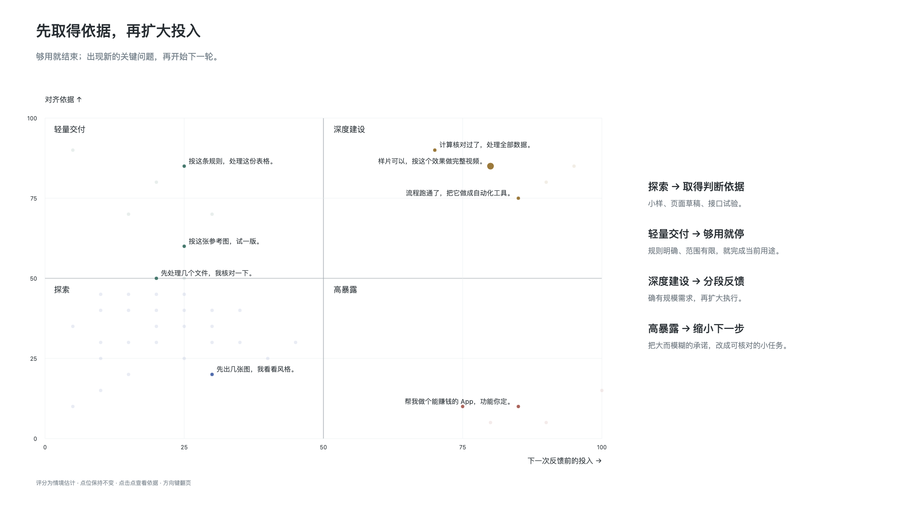

# 行动选择与投入控制

## 问题：生成膨胀与反馈断裂

与语言模型协作时，生成内容的门槛极低。长篇文本、方案框架或成套代码可以轻易铺开，但生成量的扩增并不代表工作在有效推进。

协作的真实瓶颈不在于生成速度，而在于核验成本。未经检验的输出越多，后续排查逻辑与评估可行性的精力消耗越大；若初始方向偏离，延展的内容反倒会累积成沉重的返工负担。

评估一次交互的风险，关键不在于任务最终的总量，而在于**在下一次获得有效反馈之前，承诺投入了多少资源与精力**。有效反馈须能支持或改变下一步判断。只要下一处检验尚未完成，超出当前验证范围的承诺，就会放大潜在的调整代价。

这里的对齐依据，指的是双方对目标、范围、边界和验收标准的可检验共识，以及经得起核验的事实、外部规则或经过审阅的原型，而非模型顺从的语气、单方面描绘的细节或字数膨胀。共识不保证事实正确，缺乏核验的细节再具体，也无法构成可靠的依据。

## 维度：对齐依据与预期投入

评估下一步行动的风险，可以借助两个维度：

- **纵轴（对齐依据）**：从薄弱到扎实。指当前对目标、边界与验收标准的理解中，包含了多少经得起核验的事实与规则。
- **横轴（预期投入）**：从有限尝试到深度承诺。指在下一次获得有效反馈之前，承诺投入的工作量、等待时间、复杂度与产出范围。

*图 1：四象限用于评估下一次反馈前的即时行动风险，并非对任务或人员的静态定性。图中的数值与分界线仅提供相对情境示意，不作为量表或阈值。*

这一工具关注的是单次行动的投入与验证结构，而非给任务贴固定标签。交互落在何处，取决于当下依据是否充分，以及在下一次检验前承诺了多大的产出范围。

## 状态：行动类型与认知诊断

基于依据与投入的高低组合，可以区分出四种常见的行动状态：

- **探索（低依据，低投入）**：目标模糊、规则未知时，将投入限制在小规模尝试内。主要目的是摸索边界、发现分歧，而非直接交付成品。
- **轻量交付（高依据，低投入）**：目标清晰、规则明确且范围封闭时，按既定要求快速完成与核对，满足眼前用途即可收工，不额外延伸复杂度。
- **深度建设（高依据，高投入）**：关键前提已有充分证据，且确有系统化推进的需求。较大投入是合理且需要的，但因调整代价更高，仍需设置阶段性核验点，避免偏差长期累积。
- **高暴露风险（低依据，高投入）**：在关键假设未经验证时，就直接承诺长周期生成、批量处理或全量重构。前提一旦有误，将带来沉重的审核与返工负担。应对方式是拆分任务，降级为补充依据的低投入动作。

当对齐依据不足时，需要辨清阻碍属于哪种认知状态，从而采取对应的取证动作。认知状态与行动状态回答不同问题，不存在机械的一对一对应：

- **显性知识（已知已知）**：规则已在心中，只是未曾向模型明说。障碍常来自误以为背景是不言自明的常识。此时最有效的做法是主动写出尚未交代的规则与约束样例，而非让模型盲目重试。
- **明确缺口（已知未知）**：缺少关键的外部事实或客观数据。面对已知缺口，不能依赖模型推测事实，应转向外部查证；若当前无法获取，需明确记录假设并收窄推导范围，防止无界限外推。
- **隐性偏好（未知已知）**：需求抽象，人往往难以凭空列出详尽标准。可以通过生成少量对比草案或局部切片，借助具象差异唤醒内在偏好，逐步将模糊感受转化为明确标准。比较也可能形成新的判断，并非已有答案的简单提取。
- **盲点意外（未知未知）**：未曾料想的漏洞或极端情况。盲区无法靠主观想象穷尽，更可行的做法是设计暴露机制，例如放入实际使用场景或考察边界数据，及早发现异常。

行动状态衡量投入多大与暴露高低；认知状态诊断依据缺在何处与如何取证。无论处于哪个行动象限，推进中遇到的卡点都可能对应不同的认知状态。先辨清缺口，选能补依据的动作，限定反馈前投入，再据结果继续、调整或停止；这些动作可以往返，不是固定阶段。

## 行动判断：证据属性与有限尝试

在依据与投入之间做判断时，需要把握几条关键原则：

- **依据不等于确信**：依据来自客观事实与核验，不等于主观上的把握度。生成篇幅的增加或措辞的流畅，都不代表证据更扎实。有时细致的检验暴露出了潜在矛盾，主观确信度反而会暂时下降；这并非退步，而是提前发现了偏差，避免盲目推进。
- **局部验证具有边界**：局部核验依据都有其生效范围。在简化条件或局部样本上成立的结论，不能直接假设在更广泛的复杂环境下依然有效。外推结论时，必须重新审视新环境的约束。
- **最小有效行动以支撑决策为度**：有限尝试不追求投入越少越好，也不承诺绝对确定性，而是指**足以支持当下做出下一步判断的有限行动**。投入过小无法提供判断依据，依据不足时扩大投入，会增加返工暴露。行动规模应以换取当下所需的有效信息为准。
- **成本与后果分别评估**：人机协作中，操作成本与行动后果是两码事。在对话中生成草案或推演逻辑，操作消耗极低；然而，一旦将未经充分核验的推论用于实际决策或业务落地，其纠错后果与修正代价可能极高。低操作成本不能掩盖高行动后果，评估投入时必须将两者拆开审视。

## 停止条件：用途收敛与需求推进

协作的推进节奏，由验证结果和实际需求决定，而不是顺应模型的生成惯性：

- **以满足用途为收敛基准**：任务是否收敛，核心参照在于产出是否已满足当前的既定用途。生成容易继续，不等于需求需要增加；若无实际需求，追逐“更完善”只会徒增维护负担。通过核验且达到用途标准后，及时收敛是更稳妥的做法。
- **扩大投入需要双重前提**：从探索或轻量交付走向深度建设，需要同时具备两项条件：一是关键前提已有充分可靠的核验依据，二是当前场景确有系统化构建的实际需求。缺乏需求而仅因生成便利就扩大体量，属于无意义的系统膨胀。
- **依据暂缺时的范围隔离**：若推进所需的核心事实暂时无法查清，不应由模型推想补全前提，而应明确未决边界，收缩当前承诺的范围，交付可独立检验的阶段性成果。

*图 2：依据当前对齐状态调整行动策略，满足用途时及时收敛，证据充分且确有需求时有序推进。*

推进逻辑由此闭环：以对齐依据约束单次投入，用有限尝试换取反馈；达到用途即行停止，依据充分且确有需求时再行展开。
