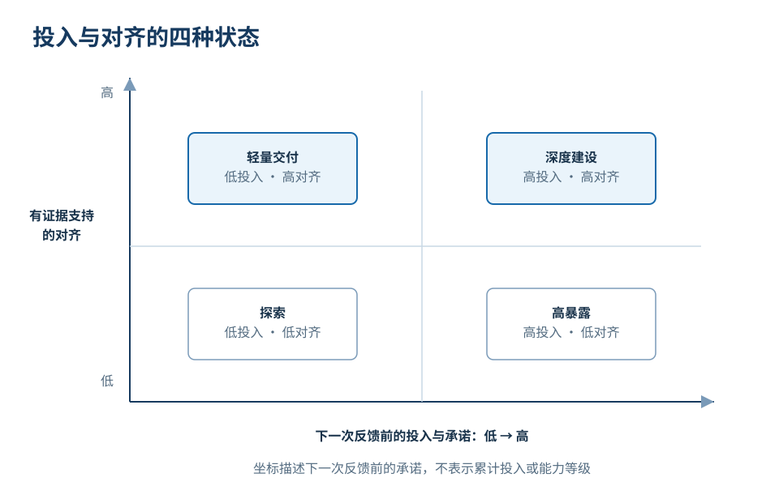
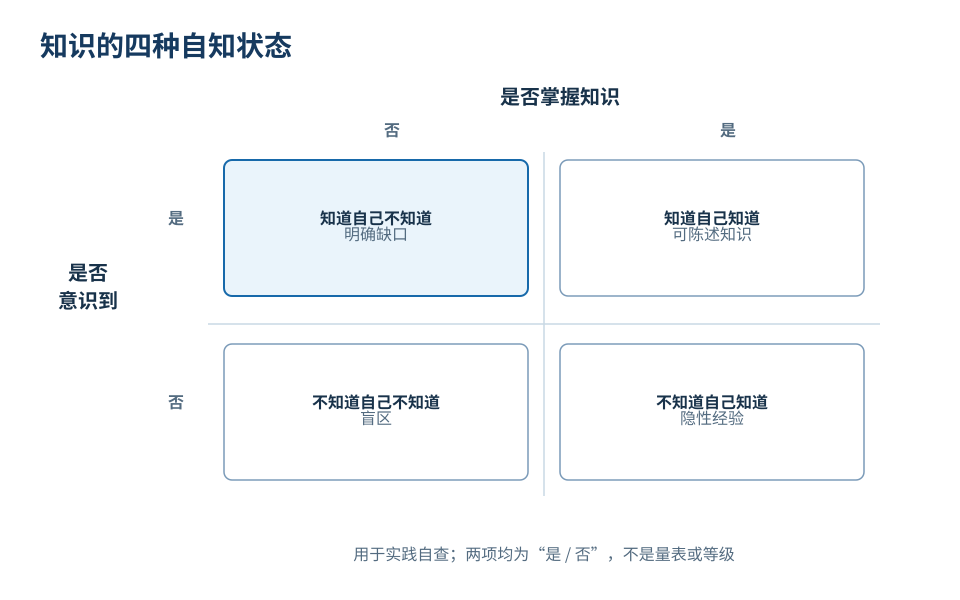
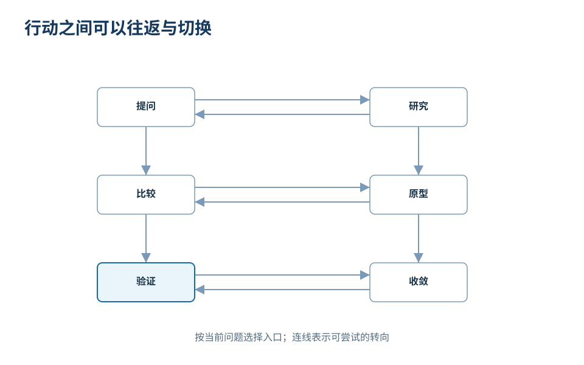

# 行动选择与投入控制

AI 已经连续运行了两个小时。屏幕上的文字越来越充实，代码结构越来越复杂，备选方案也从最初的三个增加到了十个。但当你停下来审视进度时，却可能依然答不上来：**眼前生成的这一切，到底是不是自己真正需要的？**

这是与 AI 协作时容易遇到的情况：发起新一轮生成很方便，模型也常会继续扩展内容；但在另一端，阅读、比对、纠错和承担责任的心智成本，会随着文字与复杂度的增长而上升。

与 AI 协作的瓶颈，通常不是“它能生成多快”，而是“我们能多快确认方向是否正确”。因此，一个值得先想的问题是：**在下一次能够实质性检验成果之前，我准备投入多少精力与资源？**

## 投入之前，先看对齐的证据有多扎实

在投入之前，可以借助一张“对齐—投入”地图，评估当前的协作状态：

- **横轴（预期投入）**：从此刻开始，到下一次获得有效反馈之前，你准备承诺的工作量——包括等待时长、审核精力或系统复杂度。
- **纵轴（对齐依据）**：双方对目标、范围、边界与验收标准的共识，有多少可检验的事实凭据。

*图 1：地图是评估下一阶段工作的实践工具，不是对整个项目的定论。位置取决于当前掌握的证据与即将承诺的投入。*

这张地图区分出四种工作状态：

1. **探索（低对齐，低投入）**：共识尚未完全建立，先限制尝试的规模。问一个概念、快速草拟两页大纲、用一个小样本测试格式，都可以作为起点。探索的目的不是一步到位交付成品，而是用较小的投入发现未知与分歧。
2. **轻量交付（高对齐，低投入）**：目标已经非常明确，任务边界小且封闭。例如按照已经核准的分类口径，整理出一页清晰的筹备会报告。达到用途要求后就可以结束，不必额外扩充范围。
3. **深度建设（高对齐，高投入）**：核心方向已经通过样本验证，此时可以投入更多资源去搭建系统、处理边界情况或改善可维护性。投入加大后，仍需要持续核对结果：对齐只是当前阶段的判断，后续变化仍可能带出新的偏差，投入增加，也可能提高返工代价。
4. **高暴露风险（低对齐，高投入）**：在缺乏关键验证凭据的情况下，就安排大规模的长时间生成或重构。底层假设一旦有偏差，已完成的成果可能需要大量返工。

避免高暴露风险，可以主动缩短反馈周期：把大而模糊的任务拆成几小步，每一步先取得足以判断方向的证据。也要分清操作成本与行动后果：起草报告花费不多，不代表未经核对就把它发给决策者的风险也低。

## 同样是“不知道”，排查动作截然不同

在推进任务时，阻碍我们判断的往往不是知识的绝对多寡，而是我们并不清楚自己当前处于哪一种认知状态中。

*图 2：围绕当前遇到的具体障碍进行认知自查。明确当前缺少的究竟是规则、事实、偏好还是未知盲点。*

- **知道自己知道，但没有把规则讲出来**：熟悉业务的人可能省略“显而易见”的前提。例如你知道反馈分类允许多标签，却只让 AI“统计数量”。它按单标签统计交出结果后，你才发现口径不符。此时最有效的动作不是继续生成，而是把脑海中的业务规则与边界样例显式写进上下文。
- **知道自己不知道，必须围绕缺口取证**：你不清楚教室现场的音响布线，单凭推理无法得出结论。此时应当暂停让 AI 猜测故障原因，转而通过查验设备清单或现场试听来补充真实事实。明确的事实补齐之后，模型才能发挥分析作用。
- **不知道自己知道，需要借助具体实物唤醒判断**：当你无法抽象地描述出“理想报告”时，让模型基于同一份数据生成两份结构截然不同的初稿（例如按主题展开 vs 按行动决策展开）。具体的对比有助于辨认自己的偏好和使用要求。
- **不知道自己不知道，必须保留应对意外的通道**：从未办过大型线下培训的人，可能根本想不到后排视线遮挡的问题。此时即便向 AI 索取“风险清单”，在没有现场材料时，它给出的通用建议也未必覆盖实际问题。现场观察、让使用者试用、检查失败用例，都有助于发现遗漏。

这些状态并非对个人的能力定性，而是针对眼前具体问题的动态诊断。搞清楚当前卡在哪一个象限，才能把动作落在真正缺少的环节上。

## 什么时候继续，什么时候停止

四象限地图用于判断当前该投入多少，还需要配套判断任务何时算完成。以第 05 篇的活动反馈报告为例：拿到逐条分类表后，不必直接采信，也不必推翻重做，可以先抽样核对——挑几条有代表性的记录，包括肯定声音、批评切换速度的 F09 这种容易归错的记录，对照原始反馈检查分类和依据。抽样没有发现问题，再把核对扩展到全部 12 条；发现某条归错，就先修正口径，再重新检查相关记录。

核对过程中如果发现缺少现场信息，比如音响故障的原因，就定向取证：查设备清单、安排试听，而不是让模型继续推测。等报告满足筹备会的使用要求，两项建议有依据、未知条件已经标明，任务就可以停止；不必把它扩建成一套持续运行的反馈分析系统。

继续投入的理由是出现了新的关键判断需求，停止的理由是当前成果已经够用。两个判断都依据证据，而不是依据生成量的多少。

*图 3：协作过程并非单向流水线，而是在原型比对、事实取证与收敛之间往返。*

面对还不明确的需求，可以制作原型来帮助判断。原型不是每个任务的必要步骤，但在需求难以凭空描述时很有用：
- 一张页面草图，足以帮我们确认信息的层级与动线，但不必过早接入复杂的后端逻辑；
- 一个接口的连通测试，足以证明外部工具是否能够返回数据，但不必提前写完所有异常捕获；
- 一组核心用例的分类表，足以验证提示词口径是否合理，但不必急于批量跑完一万条数据。

每一步投入，应先为当前最缺依据的判断补充证据，不必提前解决所有可能出现的问题。
