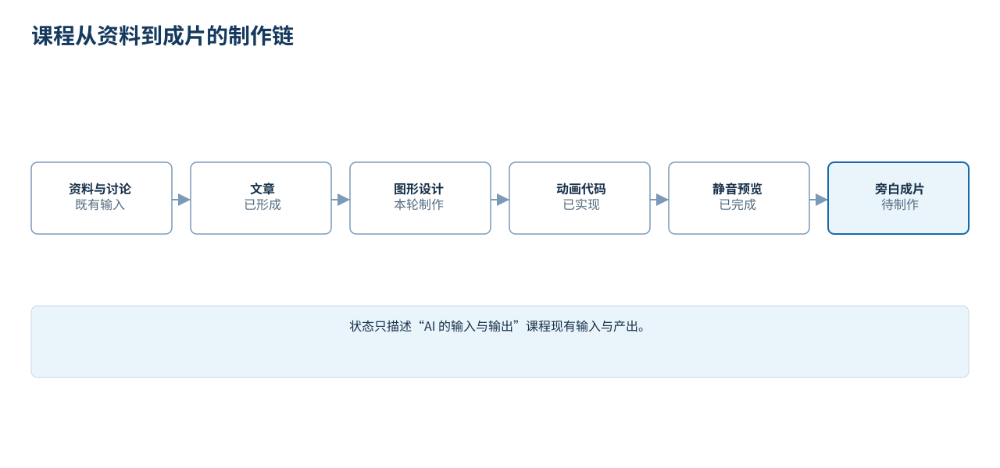
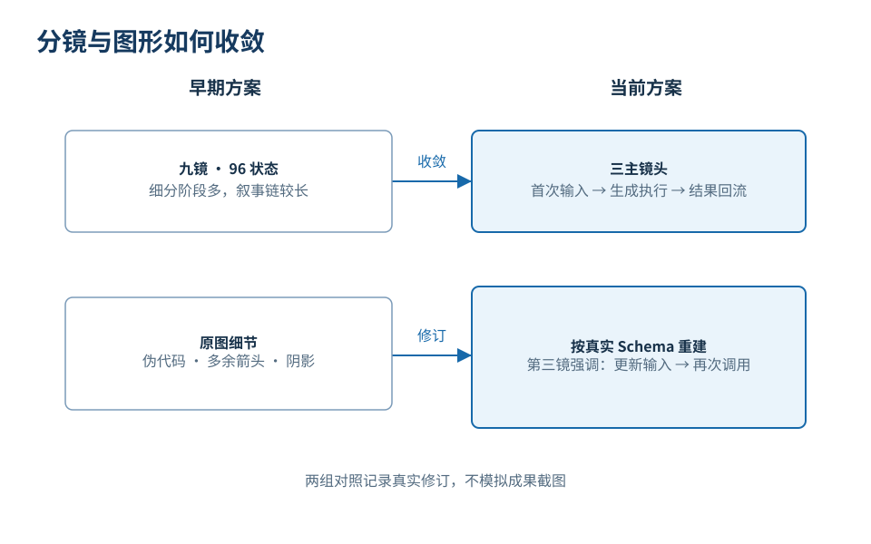

# 课程制作与人机取舍

制作一门解释 AI 运行机制与协作方法的课程，也需要不断确认需求、比较方案和核对成果。

资料可以继续搜集，文稿可以让 AI 起草和扩写，配图与动画也可以反复调整。比增加产出更费心的，是判断：**哪些内容把概念讲清了，哪些只是让成果看起来更丰富？**

这门七篇图文课程的目标是：读者读完之后，能解释模型、应用与工具各自在做什么，并在日常协作中知道该检查哪一步。围绕这个目标，资料、文字和图形需要分别取舍。

本文以相邻课程“AI 的输入与输出”的动画制作为例。这门图文课程复用了它的机制说明与图示。该动画工程已完成三个主镜头的代码、480p 静音预览、完整解码和关键帧及连续帧抽样核对；旁白与有声片尚未完成，也没有运行真实转写。这些完成状态属于相邻课程，不代表这门七篇图文课程已经制作了有声视频。

## 资料先分清用途，再组织成文

课程涉及几类材料：3Blue1Brown 关于大语言模型的图文讲解、工具调用接口定义，以及需求与投入的协作框架。

这些材料有不同用途：
- 理论材料用于解释下一词元预测、训练与注意力等机制；
- 工具接口定义用于核对工具名称、参数及调用要求；
- 协作框架用于帮助判断实际工作中的下一步动作。

如果不分清材料的性质，就容易混用它们：把参考样例里的假设字段当成真实系统的必然要求，或者借用技术原理的权威性把个人的经验判断包装成绝对真理。

动笔之前，要先明确事实与观点的边界。第 02 篇解释模型机制，需要对照来源；第 03 篇的录音转写与第 05 篇的 12 条反馈是教学场景，要让读者能分清示例与实际执行，并核对示例中的推导。

## 一句“AI 自动完成”，藏掉了太多关键工作

在设计关于输入输出机制的内容时，最容易犯的错误是将整个过程简化为一个“黑箱”：左边输入录音文件，右边直接吐出会议纪要，中间画一个带有高科技光晕的图标，标注为“AI 自动分析”。

这种图文省略了执行过程：一旦真实世界里的任务中断，读者依然不知道到底应该检查网络连接、文件权限、工具参数，还是模型提示词。

在这个由应用程序调用外部转写工具的例子里，需要讲清四件事：
1. 谁负责把需求、指令、环境信息与工具定义组织成上下文？（应用程序）
2. 谁负责决定发起转写请求？（语言模型）
3. 谁真正打开音频文件执行密集运算？（外部转写程序）
4. 执行结果通过什么路径回流？（应用程序组织的二次上下文）

*图 1：文字用于解释因果关系，静态图展示结构，动画展示状态怎样变化。不同载体应依据同一套事实与接口定义。*

先在文字中分清角色，再检查配图的数据流向和动画的动作顺序。如果概念本身有误，增加动效也不能补救。

## 三个主镜头，各自解释什么

镜头数量要服从解释任务。目前的动画按三个主镜头组织，每一镜承担不同职责：
1. **首次输入**：清晰呈现用户、系统指令、环境路径与工具定义的四合一装配；
2. **生成与执行**：展示模型如何生成工具请求，以及程序如何接管并触发外部工具；
3. **结果回流与二次调用**：展示工具结果如何与原有上下文重组，支撑最终答案的生成。

*图 2：九镜与三镜的组织对照。镜头少不自动代表解释更好，仍要看每一镜是否有明确职责，前后是否接得上。*

当前安排中，第三镜只承接已经返回的工具结果，不重复第二镜的读取与执行；两次调用对照放在第三镜最后，不再新增一个镜头。这样划分时，仍要保留“模型生成请求，程序安排执行”和“结果进入下一次输入”这两处关系。

## 画面能够渲染出来，不代表解释已经成立

代码能够渲染出视频，只说明工程产出了文件。完整解码可以检查文件能否正常读取，画面是否把机制讲清，还要另行核对。

制作计划中有几项具体的修订要求：
- 两次调用中的模型保持原位置，表达这是同一个模型被再次调用；
- 工具结果先回到程序接收位置，再与请求配对、组成新输入，不能直接跳到模型；
- 参数各自分槽显示，复杂内容留出阅读时间，避免几个字段挤在一起。

这些也是看样片时的检查要点：对象的位置是否连续，结果有没有沿正确路径返回，参数能否辨认。静态帧适合检查某个时刻的结构，连续播放则用于检查状态转换是否清楚。

AI 可以协助起草文字、编写代码和反复调整图形；人负责确认解释目标、核对事实边界，并判断样片是否讲清。若画面把工具请求画成已经完成的动作，就应先改表达关系，而不是继续增加动画效果。
