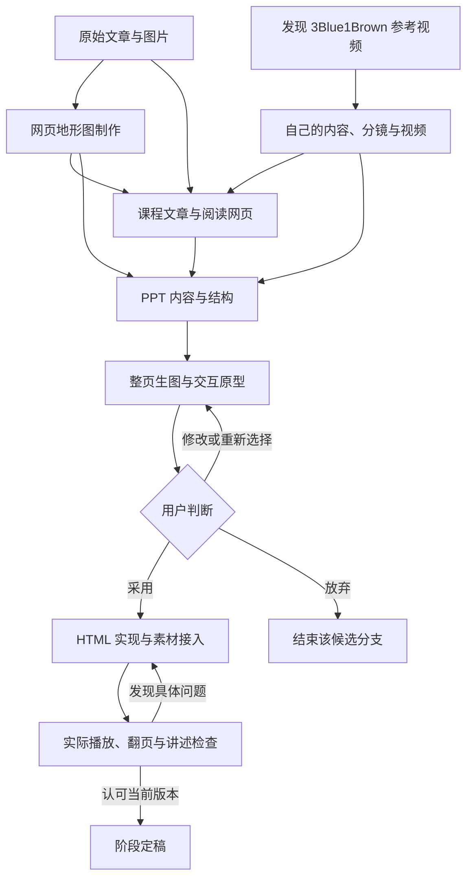

# PPT 与视频构建指南

这套 44 页课件从保存两篇文章开始。接下来，我们沿着实际制作顺序，看看原始材料怎样变成视频、交互和幻灯片，以及每次遇到问题时，用户怎样决定下一步。

这次制作有四条主线：**网页地形图制作、视频制作、课程网页制作、PPT 制作**。它们在时间上交叠，也会把已经做出的内容交给下一条线继续使用。文章先用总时间线定位，再沿四条主线展开。地形图的早期探索简要交代，重点放在视频与 PPT 的构建、选择和返修。

本文面向会与 AI 对话、但不需要懂动画代码和 HTML 的学员。每个阶段都可以沿着同一个顺序阅读：当时想完成什么，生成了什么，用户怎样判断，决定下一步做什么。文中的现场教学安排和方法归纳，是根据制作记录整理的建议；引用的制作对话保留原始出处。日期采用北京时间，成品状态以 2026 年 9 月 22 日采集记录为准。

## 总时间线：四条主线怎样汇合

| 时间 | 制作动作 | 用户的关键决定 | 向后交付什么 |
|---|---|---|---|
| 9 月 1 日 | 保存原始文章与图片 | 原文完整采集，合并整理 | 共同的概念、案例和图像来源 |
| 9 月 2–8 日 | 网页地形图实验 | 纠正因果，保留对比，必要时回退 | 可继续使用的地形交互材料 |
| 9 月 14 日 | 确定课程目标 | 面向已经使用 AI、但不理解机制的人 | 视频、交互、讲述页的分工 |
| 9 月 15–16 日 | 以 3Blue1Brown 为参考制作视频 | 写清内容，比较图形，确认分镜，再制作成片 | 两条视频工作线的素材与成片 |
| 9 月 16–17 日 | 整理课程文章与阅读网页 | 七篇编排、三栏阅读、保留原始案例 | 课程内容与可查阅的网页 |
| 9 月 17–18 日 | 整理投入框架与任务演示 | 任务具体化，先评分再映射坐标 | 45 项请求与交互演示依据 |
| 9 月 18 日 | 多轮 PPT 试作与视觉探索 | 否定错误受众和文字堆积，要求整页生图 | 候选画面、弃稿记录、媒体分工 |
| 9 月 18 日 | 拆分网页与 PPT | 单 HTML 加载 Markdown，保留网页 UI，PPT 独立管理 | 阅读入口与演讲入口分开 |
| 9 月 20 日 | 导入十页底稿 | 选定页面，提取全局参数 | 主 PPT 的视觉与结构基准 |
| 9 月 20 日 | 接入视频和八组地形 | 统一播放方式，每组 A/B/对照三页，修正时序 | 35 页阶段版本 |
| 9 月 20–21 日 | 制作并接入投入章节 | 先看三组分镜，再试原型；手动翻页，保留图形过渡 | 42 页，补开场后 43 页 |
| 9 月 21 日 | 补演讲衔接、选择过渡页画面 | 新方案不好可以选回旧图，再落实 HTML | 44 页阶段版本 |

这些阶段并非每一步都从零开始：PPT 接入已有视频，地形从独立网页进入演讲页面，课程文章则继续提供内容核对依据。页数只描述主 PPT；候选稿和独立原型的页数不能混算。

## 共同起点：材料和课程目标

9 月 1 日，第一步是把《AI 时代的思维框架》的原文和图片完整保存到本地，再合并整理。后续课程中的概念、案例和地形演示，都可以回到这份材料核对。现场教学从这里开始：展示原始文章、保存下来的图片，以及当时“原封不动的采集到本地”的请求，让学员看清制作课件之前，手里有哪些材料。[原始对话 · M001–M008](对话数据/Codex/01a05afd-65ce-7d03-95dc-908e3902d2eb.md)

9 月 14 日，正式课程从一个具体问题开始：学员已经在使用 AI 对话、WorkBuddy、Codex 做网页或分析数据，却仍把模型当成黑盒。结果不对时，不知道应该修改表达、补充信息，还是调整工作方式。课程要帮助这些人理解运行机制，并据此判断下一步怎样使用 AI。[课程目标对话 · M001–M031](对话数据/Codex/01a09ee5-23f4-7243-a80c-434b2ca57d58.md)

这个目标决定了后面的制作分工：需要连续解释的机制交给视频，需要观察条件变化的内容交给交互演示，介绍、过渡和收束则由幻灯片承接。交付形式确定为 HTML PPT；视频只在需要播放的页面出现，介绍页与视频页分开。[媒体安排对话 · M045–M057](对话数据/Codex/01a09ee5-23f4-7243-a80c-434b2ca57d58.md)

**现场教学：** 先展示当时的受众描述，再让学员看这三种材料的分工。构建自己的课程时，也先写清听众现在会什么、遇到什么问题、听完后应该能做什么，再决定哪些部分需要视频或交互。这是从本次过程提炼的构建方法。

## 主线一：网页地形图制作

### 9 月 2–8 日：从文章中的概念做出可观察的变化

地形图的早期任务，是把文章里的表达与生成过程做成可观察的网页演示。用户很快指出因果问题：“不是小球导致深沟的存在，而是语义影响深沟。”修改要求因此具体到顺序：先出现文字，再改变地形，随后让路径变化；还要回到原文，补齐技巧使用前后的对照。[因果与对比 · M033、M045、M204–M247](对话数据/Codex/01a06001-ef4f-71d1-821e-9ee52c2faff3.md)

之后尝试模块拆分、不同图形表达、Three.js 改造与体素沙盘。改动破坏原有设计时，用户要求回退；技术改造没有达到预期时，允许放弃。这里简要保留这些分支，重点是它们给后续留下了什么：原文案例、可运行演示，以及检查表达是否正确的依据。[模块与回退](对话数据/Codex/01a06154-2da5-7be0-9b6f-a444b3000c1e.md) · [技术取舍](对话数据/Codex/01a07a7d-3269-75e2-b844-f6e50ab4a292.md) · [体素尝试](对话数据/Codex/01a07e7a-3064-7aa1-9661-e0660622fb55.md)

### 交给网页和 PPT 时，保留什么

课程网页需要完整案例帮助阅读；PPT 需要讲者可以播放、停止、重置的演示。两者共享原始内容，呈现方式分别调整。地形是教学示意，并非模型真实潜空间的测量结果；八组原始教学对话也应与本次制作过程中的聊天记录区分。

这条线交出的[地形网页](../04-需求表达与反馈闭环/交互/思维地形.html)，后来在 PPT 中扩展为每组三页的讲述结构。接入时还出现一次独立 A/B 对话与动画前史不一致的问题，具体修正在第四条主线中展开。早期做出可运行素材，并不意味着进入课件时可以省去内容与时序检查。

## 主线二：视频制作

### 9 月 15 日：发现 3Blue1Brown 的视频，以它为参考制作自己的视频

视频制作的主线从一个具体参照展开：发现 3Blue1Brown 的视频后，用户希望以它为参考，制作自己的课程视频。原本抽象的“用动画讲清楚”，由此有了可以观看、讨论和比较的作品。接下来需要确定：参考作品里哪些表达值得学习，自己的视频要讲什么，以及怎样把内容变成连续画面。

在本次回顾中，讲者这样交代动机（标点整理）：“我发现了 3blue 的视频，以它作为参考开始制作我自己的视频。”现场可据此展示参考视频与自己的视频材料，带学员看中间经历的内容准备、图形选择、分镜确认和代码制作。参考作品提供方向，具体内容与镜头仍要逐步构建。

在当时的任务记录中，这个选择还分出两条工作线：一条研究 3Blue1Brown 视频的源码和素材，重建模型能力相关的片段；另一条准备自己的“AI 的输入和输出”内容，通过文章、生图与分镜制作视频。两条工作在时间上交叠；第二条并不是等第一条完全做完才开始。[参考选择 · M150–M168](对话数据/Codex/01a09ee5-23f4-7243-a80c-434b2ca57d58.md) · [参考视频研究](对话数据/Codex/01a0a377-3142-77c3-9dff-5e4d808b69ea.md) · [自己的视频内容准备](对话数据/Codex/01a0a41b-40fc-7620-a4cc-d037fd5f98f4.md)

#### 保留的过程分支：早期试作与参考视频重建

更早的 Remotion 试作曾收到“本次完成的动画想表达什么？我似乎一点都看不出来”的反馈，旧方案后来退出。它说明此前已有探索；课程讲述在这里简要交代，随后转入选定参考后的构建过程。[早期试作反馈 · M103–M168](对话数据/Codex/01a09ee5-23f4-7243-a80c-434b2ca57d58.md)

参考视频的研究与重建则留下了另一组具体决定：范围截到 6:59，先用 480p，不要求配音，中文字幕独立管理；38 段导出内容按实际时间线检查衔接。用户还纠正了预测词“夜空”提前出现在输入中的问题。这条分支可用于说明如何限定制作范围、检查内容准确性；它的参数不应套用为自己所有视频的通用规格。[重建与返修 · M091–M145](对话数据/Codex/01a0a377-3142-77c3-9dff-5e4d808b69ea.md)

### 9 月 15–16 日：制作自己的视频，从内容到分镜，再到成片

有了参考方向，自己的视频选定了“AI 的输入和输出”这一主题。用户要求先找资料、写文章，再生成关键帧。要展示的输入包含系统指令、环境信息，以及工具的结构化定义（schema）：程序通过这些信息告诉模型有哪些工具、调用需要什么参数。这里先把机制写清楚，后面才能判断画面有没有遗漏。[内容准备 · M001–M011](对话数据/Codex/01a0a41b-40fc-7620-a4cc-d037fd5f98f4.md)

案例逐步从会议纪要缩小到处理一个本地录音文件。这个案例帮助具体展示模型、程序和工具怎样配合；当生成内容偏向“如何做会议纪要”时，用户将重点拉回调用机制。第一次调用不能凭空出现历史消息，工具定义要真实，图形要承担主要解释工作。[案例与机制纠偏 · M055–M098](对话数据/Codex/01a0a41b-40fc-7620-a4cc-d037fd5f98f4.md)

#### 从一张静态图，改为一个镜头的连续分镜

早期生成的图过于抽象，或者只展示一个静止状态。用户因此要求：一个镜头用 9–12 格展示内部演化。每个格子都要让人看出相对于前一格发生了什么。这样，尚未开始编写动画代码，就可以一起检查信息出现的顺序、对象的去留和过程是否完整。[分镜要求 · M029–M053](对话数据/Codex/01a0a41b-40fc-7620-a4cc-d037fd5f98f4.md)

随后将提示词整理为“一镜一个 JSON”，生成多个图形方向，再展开黑底、16:9 的十二格分镜。用户先确认“这三个都 ok，我要的就是这样的图形化形式”，之后明确保留 C。背景、比例、方向图数量不符合要求的版本继续修改；确认的画面成为后续制作参照。[方向比较 · M005–M033](对话数据/Codex/01a0a7f4-a837-7293-a6f9-1d3bbe048171.md) · [保留 C](对话数据/Codex/01a0a81e-f913-7d71-8b30-83c8fe648726.md)

#### 用三镜检查完整调用过程

| 镜头 | 必须看见的变化 | 用户据此检查什么 |
|---|---|---|
| 第一镜：首次输入 | 系统指令、环境信息、用户请求、工具定义展开并组成输入 | 信息是否完整；是否混入尚未发生的历史 |
| 第二镜：工具调用 | 模型生成工具请求，程序识别请求并执行工具 | 是否把“生成请求”和“实际执行”混成一步 |
| 第三镜：再次输入 | 工具调用与结果加入上下文，组成第二次输入，再得到回复 | 第二次输入是否真的发生变化；结果怎样回到模型 |

这些关系经历多轮补充：展开程序识别与执行，增加完整交互图，要求第二次输入包含新增内容，最后删去重复镜头。[三镜调整 · M038–M080](对话数据/Codex/01a0a7f4-a837-7293-a6f9-1d3bbe048171.md)

这段过程可以转成现场构建指南：先写清要解释的机制；选择能承载机制的具体案例；通过候选图确定图形表达；将每个镜头展开为连续分镜；逐格检查前后关系；确认后再交给代码制作。课堂上先展示分镜，让学员找出“第二次输入多了什么”，再播放对应视频。这样能直接承接 PPT 中关于一次调用和工具结果回流的讲解。

#### 分镜通过后，成片仍要按时间点返修

选定图片和镜头材料后，制作进入 ManimGL 代码与 480p 预览。用户在成片中继续指出模块消失、外框丢失、1:06 后缺少变化，以及 0:28、1:28 的输入组合不完整。修改因此落实到具体时刻和对象：把首次输入连成完整串，第二次调用重新组合输入，再调整字体、线条与动作时序。[代码制作与返修 · M001–M053](对话数据/Codex/01a0a87b-54cf-7e90-8fe2-f550ac2f1076.md)

| 发现问题的位置 | 回到哪一步 | 需要重新判断的内容 |
|---|---|---|
| 文章或案例讲偏 | 回到机制与案例范围 | 这个视频到底要解释什么 |
| 候选图表达不清 | 回到图形方向比较 | 哪种画面能让关系被看见 |
| 分镜缺少步骤或凭空增加信息 | 回到镜头顺序 | 前一状态如何变成后一状态 |
| 视频丢对象、缺变化、组合不完整 | 回到对应时间点的实现 | 选定的分镜有没有被正确做出来 |

这四条是依据本次记录整理的返修分支。分镜通过说明方向有了依据；视频仍需播放检查。后面讲投入控制时，可以用它说明怎样在进入下一阶段前取得反馈；讲案例好于说明时，可以展示选定画面如何成为后续实现的具体参照。

### 现场查看分镜与成片

按[首次输入分镜](../03-信息输入与工具执行/AI的输入与输出/素材/图片/视觉基准/镜头01_首次输入_十二格_清理版.png)、[模型输出工具请求分镜](../03-信息输入与工具执行/AI的输入与输出/素材/图片/镜头02_模型输出请求_十二格.png)、[结果回流分镜](../03-信息输入与工具执行/AI的输入与输出/素材/图片/镜头03_结果回流与两次调用_十二格.png)的顺序看图，再播放[自己的输入输出视频](../PPT/assets/video_io.mp4)。先让学员判断分镜有没有讲完整，再用成片检查这些变化是否真的发生。参考视频重建的[模型能力视频](../PPT/assets/video_llm.mp4)单独展示，避免把两条工作线混为同一成片。

## 主线三：网页制作

### 9 月 16–17 日：组织文章，建立阅读入口

视频制作推进的同时，课程整理为七篇材料，并配套阅读网页。第四篇保留八组原始教学对话，用户要求沿用原文案例，展示使用技巧前后的差别。第六篇围绕行动选择与投入展开：先展示具体任务清单，再把任务放入坐标，继续讨论四种知识状态，最后收束到决策。[七篇课程 · M027–M031、M070–M111](对话数据/Codex/01a0a8a9-6d2f-7e40-8ff1-30cbfe57415b.md) · [投入章节 · M005–M080](对话数据/Codex/01a0ade0-eab8-7110-8845-248a5932fe8b.md)

这里发生了一次数据层面的纠偏：45 个任务点的位置看起来像随机分布，用户要求先根据对齐依据和投入评分，再映射到坐标。图形中的位置从此需要有解释依据，后续排版也不能为了避让文字而随意挪动任务点。[任务评分 · M073–M151](对话数据/Codex/01a0ade0-eab8-7110-8845-248a5932fe8b.md)

这一阶段为 PPT 准备了三类主体材料：视频解释机制，原始对话与地形展示技巧差异，任务与坐标辅助讨论投入选择。内容此后仍有删减：9 月 18 日删除了 01、05、07 的正文，保留写作目的；02 改用 3Blue1Brown 原文并要求一比一翻译。现场介绍材料时，应按实际采用的内容讲，不能把早期七篇都当成最终正文。[内容删减](对话数据/Codex/01a0b2f7-f4a8-7253-9dce-e4610f4f006b.md) · [后续内容调整 · M059–M078](对话数据/Codex/01a0b362-6510-7212-b628-bb9e584521ae.md)

### 三栏阅读结构：让正文有一个稳定入口

用户已经给出网页参考，要求保留左侧文章目录、中间正文和右侧本篇目录，去掉 Blog 等无关入口。这次参考帮助明确了阅读结构：先找到文章，再沿正文阅读，必要时通过本篇目录定位。图文文章使用 Markdown 保存，网页负责呈现。[网页结构请求 · M027–M031](对话数据/Codex/01a0a8a9-6d2f-7e40-8ff1-30cbfe57415b.md)

第四篇的案例展示继续打磨：GIF 与原文成对，角色、底色和重点可区分；用户反复要求保留原文案例，不私自换写。文章正文和可运行的演示共同服务理解，不能因为换一种网页布局就改变案例内容。[案例呈现 · M070–M111](对话数据/Codex/01a0a8a9-6d2f-7e40-8ff1-30cbfe57415b.md)

### 9 月 18 日：正文删减后，网页与 PPT 分开管理

正文删减使原有全站构建遇到缺失文章。用户要求先盘点资产，再改为一个 HTML 框架加载每篇 Markdown；网页与 PPT 材料拆开，PPT 单独放在课程根目录中，并通过链接引用资料。[拆分请求 · M059–M066](对话数据/Codex/01a0b362-6510-7212-b628-bb9e584521ae.md)

调整过程中，助手还改了网页外观，用户立即指出：“单html不许改UI设计！！！”随后恢复原有配色、字体、三栏布局、目录、搜索和图片放大，只调整内容加载方式。这个分支说明，底层实现的修改范围需要与页面设计的修改范围分清。[保留 UI · M067–M069](对话数据/Codex/01a0b362-6510-7212-b628-bb9e584521ae.md)

第二篇的内容也单独校正：改用指定的 3Blue1Brown 原文，并进一步要求一比一中文翻译，保留图片、段落顺序和原文数值。文章来源是否正确、翻译是否忠实、页面是否好用，是三个分别检查的问题。[正文纠正 · M059–M078](对话数据/Codex/01a0b362-6510-7212-b628-bb9e584521ae.md)

| 网页制作时检查什么 | 本次对应的决定 | 给后续 PPT 的依据 |
|---|---|---|
| 内容来自哪里 | 指定原文，保留教学对话 | 可以回查讲解与案例 |
| 页面承担什么用途 | 目录、完整正文和阅读定位 | 从完整材料中选取演讲内容 |
| 内容删减后怎么办 | 盘点现存文章，不恢复已删正文 | 不沿用过期目录 |
| 改实现是否要改外观 | 恢复既有 UI，只换加载方式 | 明确本次改动边界 |
| 阅读和演讲如何维护 | 网页、PPT 分开存放 | 各自调整布局与导航 |

[课程网页](../网页/index.html)负责完整阅读，PPT 负责现场讲述。它们都使用 HTML，但正文长度、导航方式、控件密度和推进节奏各有要求。后面的 PPT 试作，正是在把材料从阅读用途改成演讲用途时暴露了问题。

## 主线四：PPT 制作

### 9 月 18 日：材料齐了，课件试作仍然偏离预期

Antigravity 的试作先审核文章、视频和资料，再搭建 HTML PPT 草稿。用户希望先看到承载这些素材的课件结构，但输出里出现了不合适的网页、过小的文字、讲师材料和额外组件。用户连续纠正：“材料你都找歪了！看看我的 7篇文章”；“这是课件，不是讲师看的内容！”[草稿纠偏 · step 101、242](对话数据/Antigravity/主会话-可读对话.md)

用户随后把对应关系说得更明确：02、03 用动画，04 用 HTML 对话地形，06 用四象限；地形需要保留可运行的 HTML，不能替换成 GIF。草稿阶段还要求先用方块展示结构。这些都是对当时输出的具体纠正，不能把“先用方块”理解成最终页面不许放文字。[素材与结构要求 · step 125、234、250–262](对话数据/Antigravity/主会话-可读对话.md)

这个分支没有通过用户判断。用户要求丢弃当次规范，最后仍指出“你没有理解我的核心思想”。完整时间线需要保留这个出口：试作经过纠正后仍不合适，就终止沿用该方案。[弃稿 · step 338–372](对话数据/Antigravity/主会话-可读对话.md)

同日下午，本地 HTML 任务也经历了另一轮试作：助手报告完成 30 页，随后合并重复页面、删除页眉与辅助说明，用户仍指出页面只是堆放大量文字，四象限原网页的导航也被带进课件。能运行，并未解决现场观众是否看得懂、讲者是否讲得顺的问题。[本地试作 · M012–M041](对话数据/Codex/01a0b362-6510-7212-b628-bb9e584521ae.md)

**现场教学：** 把“已有材料”和“输出的课件”放在一起看，让学员判断偏差发生在哪：选错材料、用错呈现形式，还是放错了受众需要的信息。这样能把反馈落到具体对象，再决定补充上下文、修改局部或放弃方案。

### 9 月 18 日：用整页生图确定 PPT 的画面

接下来，用户明确指出：“我并不是希望你重新重绘 HTML，而是通过生图模型来生成每页 PPT 的内容。”这次生图承担整页内容组织：标题、图形、重点和页面关系都需要先被看见，再由用户判断。[整页生图要求 · M045](对话数据/Codex/01a0b362-6510-7212-b628-bb9e584521ae.md)

并行的视觉讨论也逐渐把偏好变成可以观察的要求：页面是 PPT 结构；标题不要过大，留白不要过多；视频占据主要区域，时间轴与视频同宽。用户通过候选画面逐步指出这些关系。早期尝试过暖白、墨绿等方向，后来的 HTML 采用了深蓝白底；试过的风格与最终采用的风格应分别记录。[视觉讨论](对话数据/ChatGPT/6aac99f3-1414-83ea-8d01-6b616ef22e78.md) · [课程视觉稿](对话数据/ChatGPT/6aacc930-519c-83ea-8228-2d885286f2ef.md)

| 内容 | 当时明确的制作方向 | 需要保留的能力 |
|---|---|---|
| 普通讲述页 | 整页生图，比较页面内容与构图 | 让观众直接看见重点 |
| 任务散点图 | 继续优化 HTML | 数据位置与交互 |
| 视频页 | 接入视频 | 播放与定位 |
| 对话地形 | 保留运行能力 | 对话、地形和路径变化 |

当时形成九张普通页生图、七页散点图、两页视频和八页地形的整改计划。它是这一轮的方案，后来主 PPT 又经过替换与扩展。[媒体分工 · M047–M049](对话数据/Codex/01a0b362-6510-7212-b628-bb9e584521ae.md)

这一步与视频分镜形成了前后呼应：视频先通过分镜看清连续变化，PPT 先通过整页生图看清页面表达。构建指南可以在此让学员比较两类图片分别帮助做什么决定。图片确认视觉方向后，需要播放、交互和编辑的内容继续进入相应实现。

### 9 月 20 日：选定十页底稿，开始统一 HTML 实现

用户提供 `AI协作_HTML补齐模块版.zip`，明确只保留第 1–10 页，暂存后面的页面，并移走本地旧稿。当前主 PPT 从这份选定底稿继续发展。现有记录能够确认导入和取舍，但不能完整还原压缩包在外部生成的每一步。[底稿选择 · M001–M004](对话数据/Codex/01a0bc49-6328-7882-abff-5887d5db5079.md)

选定底稿后，用户要求提取标题与布局规范，保存为 `design.md`。助手起初写成逐页说明，用户纠正为全局通用参数：“参数全部写进去，不写文字”。由此固定画布 1672×941、左右安全边距 72px、标题 55px、正文 27px、主色 `#08244c`，为后续新增页提供一致的实现依据。[规范纠正 · M005–M039](对话数据/Codex/01a0bc49-6328-7882-abff-5887d5db5079.md) · [设计参数](../PPT/design.md)

这里又出现一个实现分支：删除 HTML 中的页码后，画面仍有残留，因为页码已经写进背景图。用户反馈“还是有啊，没弄干净”，推动修改回到图像本身，最终重做无文字背景，保留上层可编辑内容。[背景残留 · M040–M046](对话数据/Codex/01a0bc49-6328-7882-abff-5887d5db5079.md)

**现场教学：** 从选定底稿中展示一个页面，再展示对应设计参数，说明怎样把视觉选择交接给实现。随后用背景页码的例子检查交付：画面中的文字究竟存在于图片还是 HTML？要求能编辑的内容，是否真的独立存在？这会直接影响后续改字、换图和新增页面。

### 9 月 20 日：把视频接成现场可以定位讲解的页面

已有成片进入 PPT 时，又要根据讲述需要调整。第一个视频安排在能力来源之后，保留标题；随后加入随播放变化的左侧机制图、短说明和底部章节时间轴，再以相同方式接入第二个视频。主 PPT 从十页增加到十一页。[视频接入 · M023–M057](对话数据/Codex/01a0bc49-6328-7882-abff-5887d5db5079.md)

这里的需求有过变化：早期要求纯视频、去掉左侧文字，后面选择加入同步机制图。每次选择都基于当时看到的页面。现场教学可以把成片与播放页分别展示：成片检查连续表达，播放页还要检查讲者能否停下来解释、能否跳到指定段落、旁边的图解是否对应正在播放的内容。两条视频制作工作线在此汇入 PPT，当前对应第 5、7 页。

### 9 月 20 日：八组地形从独立网页进入 24 页课件

用户要求真实可运行、可停止和可重置的地形，左侧保留完整原始对话。先接入一组后，总页数增加到十二页；随后明确每组采用三页：A 对话与地形、B 对话与地形、A/B 双图对照与定义。八组形成 24 页，主 PPT 达到 35 页。[三页结构 · M058–M068](对话数据/Codex/01a0bc49-6328-7882-abff-5887d5db5079.md)

| 每组页面 | 观众先看什么 | 讲者借此完成什么 |
|---|---|---|
| A 页 | 原始表达及其变化过程 | 找到问题发生的位置 |
| B 页 | 调整后的表达及其变化过程 | 观察另一种表达带来的差异 |
| 对照页 | 两组结果、定义和建议 | 将观察归纳为可使用的方法 |

接入后，用户发现文字和动画不一致，要求先研究原网页。问题在于原引擎让 A/B 共用前史，随后再加入策略；原文中的许多 B 案例却是独立对话，条件从开场就存在。即使每句话都按时出现，仍可能演出错误因果。助手此前报告“同步已验证”，后来也承认这个判断不准确。[时序问题 · M069–M081](对话数据/Codex/01a0bc49-6328-7882-abff-5887d5db5079.md)

修改回到事件本身：为八组 A/B 分别编排文字、地形和路径变化，共用对应时间线；加载完成后再启动，返回页面时从头开始；双图页默认停在结果，按需重播；预加载减少切页闪烁。[独立事件与播放修正 · M082–M095](对话数据/Codex/01a0bc49-6328-7882-abff-5887d5db5079.md) · [事件脚本](../PPT/assets/terrain-stories.js)

这是第一条主线与第四条主线之间最重要的交接：独立网页的运行能力可以复用，教学时序仍要按具体案例重新核对。现场可以先展示一条 B 对话的开头，让学员判断条件是起初就存在，还是中途追加，再检查动画是否表达了同一件事。

### 9 月 20 日：投入章节先看三组分镜，再做交互原型

投入框架也来自用户自己的协作感受：一个任务花了两三个小时，结果可能质量不差，却不是自己要的。此前的讨论由此转向对齐，以及下一次有效反馈之前应投入多少；用户提出用 HTML 原型和九宫格、十二宫格参考图提前判断方向。这里的框架和实际制作互相联系，章节本身也采用了先看分镜、再做原型的方式。[投入框架讨论 · M013–M021、M033–M083](对话数据/ChatGPT/6aa907a6-6f9c-83ea-b174-5c4cc344e262.md)

投入章节接入前，用户要求三个方向各出一张 3×4 分镜。于是有了 A 数据地图、B 任务工作台、C 决策路径。接着要求结合真实请求、任务名称和已有 HTML 制作原型。图片帮助判断叙事与画面，原型继续验证翻页、图形移动和操作方式。[方向与原型 · M096–M108](对话数据/Codex/01a0bc49-6328-7882-abff-5887d5db5079.md) · [三方向分镜](../06-行动选择与投入控制/行动选择与投入控制-分镜方案.md)

第一版交互原型没有通过。用户要求去掉标签栏与详情区，使用全宽地图，又要求自己一页页翻。助手把图形过渡一并删掉，用户随即补充：“html的动画切换要保留！”两轮反馈合在一起才明确了实际需求：讲者手动决定何时进入下一页，图形仍在切换过程中连续移动。[原型返修 · M109–M124](对话数据/Codex/01a0bc49-6328-7882-abff-5887d5db5079.md)

投入章节内部经历七页逻辑、十一页原型、九页、八页等调整；接入主 PPT 时统一标题、配色、字号、坐标和切换方式。合并后主 PPT 达到 42 页，再加上选定的投入开场图，达到 43 页。独立原型的页数用于比较章节方案，主 PPT 页数用于记录整体版本，两者分别看。[合并与开场图 · M125–M149](对话数据/Codex/01a0bc49-6328-7882-abff-5887d5db5079.md)

**现场教学：** 同时展示[方向图](生图与分镜证据.md)与[交互原型](../06-行动选择与投入控制/交互/投入决策-交互原型.html)，说明分镜中能判断布局与顺序，原型中才能进一步判断操作节奏。把“自己翻页”和“保留过渡”两句原话并排读，观察一个笼统的动画要求怎样被拆成两个可以分别控制的行为。

### 9 月 20–21 日：散点位置有依据，显示方式继续调整

45 个任务放入坐标之后，长句标签彼此遮挡。制作先后尝试增加高度、左右交错、分栏、双列、短引线，并使用本地 ECharts。用户随后允许隐藏部分标签，同时要求缩放；参考气泡图又帮助明确总览应保留所有点，使用短标签，完整原文按需查看。[标签试作 · M143–M164](对话数据/Codex/01a0bc49-6328-7882-abff-5887d5db5079.md) · [标签与参考图 · M004–M036](对话数据/Codex/01a0c158-8585-71e2-a817-a58f4996ef74.md)

逐页检查还发现圆点贴边、标签碰到象限名称、缩放裁切等问题。修改要同时考虑圆点半径、图表边界和文字空间。这个分支的判断标准是：保留任务评分所决定的位置，再改变标签的呈现方式；总览、缩放和详情承担不同阅读任务。

用户同时要求新增页面也能编辑。历史回复明确，页面内编辑并不自动写回文件。因此检查可编辑交付时，还需要说明修改能否保存、刷新后是否保留。不能用“可以点击改字”代替完整的保存能力说明。[编辑要求与实现范围 · M009–M013](对话数据/Codex/01a0c158-8585-71e2-a817-a58f4996ef74.md)

### 9 月 21 日：从单页效果回到整场讲述

页面基本成形后，用户提出：“当前整个PPT的演讲逻辑还差几块！”需要衔接的问题包括：学完表达方法，为什么接下来要讨论投入；任务坐标怎样联系人的知识状态；怎样检查结果；最后由人负责什么判断。讨论中，贯穿案例也从另设的假想任务，改为这套 PPT 的真实制作过程。[整场逻辑 · M037–M045](对话数据/Codex/01a0c158-8585-71e2-a817-a58f4996ef74.md)

明确落地的是新增知识四象限过渡页：同一任务，人的理解和验收能力不同，下一步可能不同。这一页加入后形成 44 页版本。八组技巧补入“如何优化”的提示，同时修正第 6 页居中和第 8 页括号等细节。[过渡页与修正 · M046–M049](对话数据/Codex/01a0c158-8585-71e2-a817-a58f4996ef74.md)

### 生图到 HTML 定稿：最后采用哪张，由用户选择决定

新增过渡页经历了多轮生图。用户要求减少副词、副标题；四列新版收到“更丑了兄弟”的反馈；随后重新盘点文字，并检查概念关系。审查指出知识状态不能直接等同熟练等级，“你懂多少”也不足以完整表达这页内容。[视觉与概念审查 · M050–M068](对话数据/Codex/01a0c158-8585-71e2-a817-a58f4996ef74.md)

更多方案生成后，用户最终说：“还是用这个吧！”并选回一张参考图。实现因此以用户选择为准，重建第 37 页的左右布局、图标、文案和编辑能力。最终页面保留左侧四象限、右侧三档任务说明，以及“四象限不是四个等级”的限定。中间讨论过的删减方案没有自动成为最终采用版。[最终选择与落实 · M069–M074](对话数据/Codex/01a0c158-8585-71e2-a817-a58f4996ef74.md)

现场对照[用户选定的生图](证据/关键画面/37页-用户选定生图.png)与[当时 HTML 的渲染图](证据/关键画面/37页-HTML历史渲染.png)，先看布局、重点与文案是否对应，再打开实际页面检查编辑能力。渲染图保留主要关系，但并非像素完全一致；它是历史截图，不能替代当前运行检查。

这段定稿把用户最认可的过程完整连起来：生图让选择具体可见，比较帮助表达偏好，选定画面成为实现依据，HTML 再赋予它演讲所需的功能。新生成的版本可以被否定，早先的方案也可以重新成为最终选择。

## 四条主线怎样交接

| 交接 | 带过去的成果 | 接收方还需要做什么 | 本次暴露的异常 |
|---|---|---|---|
| 原始文章 → 地形图与课程正文 | 概念、原文案例、图片 | 确定怎样解释、怎样演示 | 误写案例、把因果演反 |
| 3Blue1Brown 参考 → 自己的视频 | 可以比较的图形表达方向 | 写自己的内容、选择案例、设计镜头 | 画面过于抽象，案例偏离讲解主题 |
| 分镜 → 视频代码 | 选定对象、镜头内变化与顺序 | 实现连续动作并播放检查 | 对象消失、两次输入不完整 |
| 课程文章 → 阅读网页 | Markdown、图文与素材引用 | 加载、目录、阅读定位 | 改加载方式却连带改变 UI |
| 课程网页与素材 → PPT | 正文依据、视频、地形、任务数据 | 重新组织演讲顺序和页面信息量 | 长文章堆满页面、导航生硬嵌入 |
| 生图 → HTML | 用户选定的布局与内容关系 | 重建页面、统一参数、保留所需功能 | 背景残字、编辑能力不完整 |
| 独立交互 → 主 PPT | 可运行组件与数据 | 统一导航、时序、风格和讲者控制 | A/B 前史错配、取消自动播放时误删过渡 |

每次交接都应留下明确的采用对象：哪篇文章、哪张图、哪份原型或哪一版页面。接收方据此继续实现，检查也围绕这个对象展开。一次“看起来不错”的反馈，如果没有指向具体版本，后续很容易沿着另一份候选继续。

## 把制作过程接回 PPT 中的技巧

下面是现场教学的对应方式。它根据真实制作过程归纳，不表示每次历史操作都由用户主动命名为某一种技巧。地形页中的 A/B 是原始教学示例，制作记录是课件如何做出来的实例，两类证据分别展示。

| 当前 PPT 页码与内容 | 用哪段制作过程承接 | 现场可以让学员判断什么 |
|---|---|---|
| 5、7：模型能力与输入输出 | 3Blue1Brown 参考、三镜分镜、自己的成片 | 工具请求与工具执行是否分清；第二次输入新增了什么 |
| 10–12：语义漂移 | 视频案例逐渐变成会议纪要教程，再拉回调用机制 | 哪一步开始偏离本来要讲的主题 |
| 13–15：特征纠缠 | 改单 HTML 加载方式时连带改 UI；取消自动播放时连带删过渡 | 哪两件事被错误地一起改变，应该怎样分别约束 |
| 16–18：显式配平 | 要求自己翻页，同时明确保留图形切换 | 怎样把两个同时成立的要求说清楚 |
| 19–21：隐式提纯 | 对比最初“简约、高级”等风格词与后来的具体页面要求 | 哪些词仍然含糊；怎样通过场景与参考缩小解释范围。这是对照讨论，并不把每次生图都认定为该技巧的成功应用 |
| 22–24：案例好于说明 | 发现 3Blue1Brown、选择分镜 C、选定第 37 页图片 | 参考提供了哪些可直接比较的细节；哪些内容仍需自己确定 |
| 25–27：引导采样与回滚 | 多方向比较后继续制作，新版不合适又选回旧图 | 该探索下一版，还是回到已有依据的版本 |
| 28–30：先推理后结论 | “同步已验证”后发现错配，再逐条核对原文和事件 | 在声称同步正确之前，需要拿出什么检查依据 |
| 31–33：语义退火 | 多方向图形探索 → 选定画面 → 固定参数 → 实现 | 何时允许多方案，何时需要收紧已确认的选择 |
| 34–36、42–43：投入选择 | 先分镜、先原型、先低清预览，再进入完整制作 | 下一次反馈之前，做多大范围已经足够 |
| 37–41：知识状态 | 看过候选图才说清偏好；试用后发现时序或编辑问题 | 哪些判断原先就能做，哪些需要样稿或外部检查才发现 |
| 44：人的判断 | 放弃试作、选择参考、确认图稿、检查机制与成品 | 哪些取舍需要人根据目的和使用情境负责 |

八种技巧在原 PPT 中有各自的定义和案例，现场先沿对应三页讲清概念，再用制作历史补一个实际判断。不要仅凭一个相似动作，就把某项任务成败完全归因于某种技巧。

## 学员可以照着走的构建步骤

以下步骤是从四条制作主线提炼的操作指南。它保留返修入口，具体先后可根据手头已有素材调整。

| 步骤 | 用户交给 AI 的具体材料或要求 | 本步应看到的结果 | 不满意时回到哪里 |
|---|---|---|---|
| 1. 明确课程 | 听众现状、课程目的、希望学会的判断 | 内容范围与媒体分工 | 回到受众和目标 |
| 2. 准备依据 | 原文、案例、参考视频或页面 | 能回查的材料目录 | 核对来源与采用版本 |
| 3. 做独立内容 | 需要讲清的机制、真实案例、原始对话 | 文章、演示逻辑或镜头说明 | 修正主题和因果 |
| 4. 比较视觉方向 | 参考作品、图形要求、几个候选方向 | 可以并排比较的画面 | 更换表达或补具体要求 |
| 5. 检查过程 | 连续分镜、交互步骤、信息先后 | 每一步新增、保留、变化的内容清楚 | 调整镜头或状态顺序 |
| 6. 实现小范围 | 选定图、确认的分镜、有限范围 | 低清视频、单页 HTML 或可操作原型 | 按对象和时间点返修 |
| 7. 组织阅读网页 | 文章及素材路径、目录、已认可 UI | 可阅读、可定位的内容入口 | 检查加载、内容与设计范围 |
| 8. 组织 PPT | 演讲顺序、选定底稿、全局参数 | 各页承担明确讲述任务 | 调整页面内容与章节衔接 |
| 9. 汇入视频和交互 | 对应素材、播放控制、同步要求 | 可在讲述中停、跳转、重播的页面 | 检查交接、导航与事件时序 |
| 10. 实际演讲与检查 | 完整播放、翻页、编辑和概念核对 | 问题清单与明确采用版本 | 区分改内容、改画面、改功能或重新选择 |

这张表可作为课堂练习的记录表：每组学员选择一个小主题，填写当前做到哪一步、拿到了什么依据、下一次需要判断什么。要求应指向可检查的结果，例如选定图、连续分镜或能操作的页面，再决定是否扩大制作范围。

## 现场如何走完这条故事线

现场以总时间线开场，让学员知道四条主线怎样汇合。随后简要展示地形图的原始材料与运行结果，重点进入视频：先看 3Blue1Brown 参考，再看自己的内容、候选方向、三镜分镜与成片，观察每次决定怎样影响下一步。

视频讲完，打开课程网页，说明完整内容怎样供阅读与查阅。再进入 PPT 制作：展示材料、用户否定试作的原话、整页生图要求、选定底稿和 HTML 参数；接着用地形时序、手动翻页与动画过渡两个返修节点，说明素材进入课件后还需要重新检查。

最后对照第 37 页选定图片和 HTML 实现，回看“还是用这个吧”的选择。让学员给自己的任务写下三个答案：现在有哪些依据，下一步最小可检查结果是什么，出现什么情况就需要返修或停止。此时再回到 PPT 的投入决策与人的判断，课程技巧就有了整段实际制作经历作为支撑。

## 本文采用的版本与对话入口

本文写到 9 月 21 日形成的 44 页阶段版本，文件状态来自 9 月 22 日的采集核对。“定稿”指当时被选中并落实的版本。已有历史检查和修正记录，但本次文章整理没有重新播放整套 PPT 或逐帧验收视频。

仍需如实保留的边界有三项：外部十页底稿的完整生成过程尚未取得；部分历史图片附件已不可得；文章与 PPT 中的投入坐标轴及部分区域名称存在口径差异，授课前应按实际采用画面核对。43 页格式盘点也不能直接当作新增第 37 页之后的整套验收结论。详见[来源与完整性](来源与完整性.md)。

| 查什么 | 入口 |
|---|---|
| 现场使用的主 PPT 与页码 | [主 PPT](../PPT/AI协作-动态幻灯片.html) · [44 页与素材对应](页面与素材对应.md) |
| 全部已整理的阶段故事 | [制作复盘](PPT课程制作复盘.md) |
| 关键用户决策与原话定位 | [70 个关键动作](关键动作与对话定位.md) · [逐轮请求与后续回复](对话数据/逐轮请求与后续回复.md) |
| Codex、Antigravity 与 ChatGPT 对话来源 | [Codex 任务索引](对话数据/Codex/任务索引.md) · [Antigravity 来源索引](对话数据/Antigravity/来源索引.md) · [全部来源说明](来源与完整性.md) |
| 生图、分镜与 HTML 对照 | [关键画面](生图与分镜证据.md) · [生图调用记录](对话数据/生图调用记录.md) |
| 讲者本次对故事重心的补充 | [本次整理对话](对话数据/本次整理对话.md) · [本次写作确认](对话数据/本次写作确认.md) |
