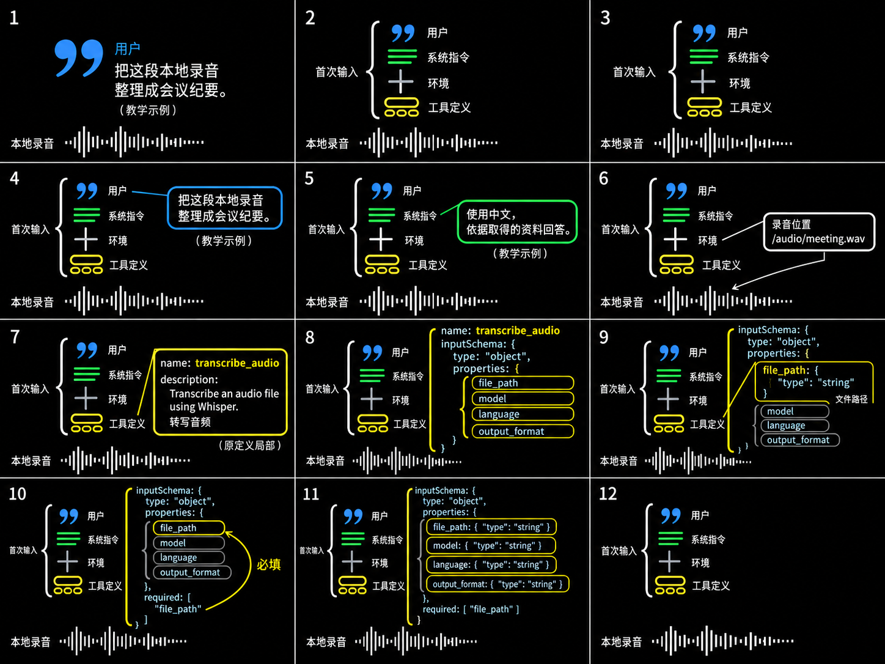
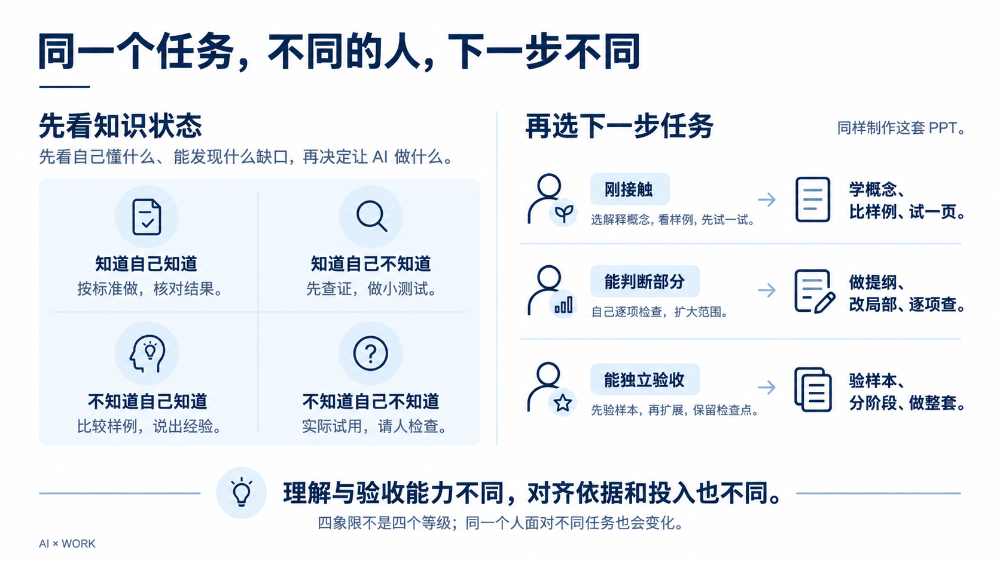
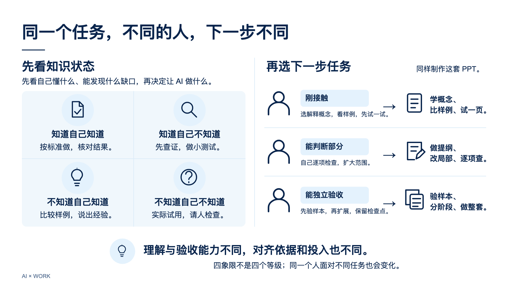

# PPT 与视频构建指南

制作这套 PPT 时，我陆续让 AI 查资料、整理文章、生成图片、制作视频，再把选定的成果放进课件。过程中，我经常需要决定：现在应该继续做，还是先看一份样稿？结果不对，是要求没说清楚，还是 AI 没有照着做？已有的部分哪些值得保留，哪些应该放弃？

回看这段过程，最值得分享的是这些决定怎样变成下一条发给 AI 的要求。下面就从几个具体转折开始，看我如何借助参考、比较候选和反馈修改，一步步把课件做出来。

这套 PPT 用网页形式播放，里面既有普通讲述页，也有视频和可以操作的演示。制作时，我通过 Codex 等 AI 助手整理材料、提出修改，让生图工具生成可比较的画面，再让 AI 编写实现所需的代码。读这段经历不需要懂代码；需要关注的是，每次我交给 AI 什么，又依据什么决定下一步。

截至这次复盘，课件已经形成 44 页：两段视频解释模型原理与输入输出，八组对话配合可操作的地形演示，另一组页面用任务清单和图表讨论投入判断。这些内容来自不同阶段，经过挑选、重做和整合，才进入同一套 PPT。[页面与素材对应](页面与素材对应.md)

最初，我先让 AI 把参考文章和图片原样保存到本地。后来讨论课程时，本地已经有文字材料和演示；AI 又从头问受众和目标，我提醒它：“部分内容已经本地讨论过了。”它需要先接上已有材料，再讨论哪些还缺、哪些值得继续做。[原始材料采集 · M001–M010](对话数据/Codex/01a05afd-65ce-7d03-95dc-908e3902d2eb.md) · [接续已有讨论 · M001–M008](对话数据/Codex/01a0a8a9-6d2f-7e40-8ff1-30cbfe57415b.md)

课程面向已经使用 AI、但遇到问题时不清楚怎样排查的人。我逐步确定讲师演示、邀请学员判断的形式，要求保存讨论决策，按模块整理七篇图文文章，再配套阅读网页。这样，长文章负责展开解释，视频和交互负责展示过程，PPT 则需要把它们组织成现场能讲的顺序。后面还有文章删减与替换，最初的七篇并没有原封不动地全部搬进课件。[课程目标与组织 · M007–M057](对话数据/Codex/01a09ee5-23f4-7243-a80c-434b2ca57d58.md) · [保存决策与七篇文章 · M019–M031](对话数据/Codex/01a0a8a9-6d2f-7e40-8ff1-30cbfe57415b.md)

这给开始类似任务的人一个具体做法：先把现有材料交给 AI，让它说明哪些可以沿用、分别用于哪里，再补缺少的内容。已有的视频、文章和讨论结论如果没有进入这次任务，AI 很容易重新生成一套，之前的判断也就没有接上。

准备课程视频时，我并不是马上就找到了合适的做法。早期已经让 AI 做过一版动画，看完后我却问：“本次完成的动画想表达什么？我似乎一点都看不出来。”它能播放，但节奏慢，三分钟表达的内容少，阶段标题也需要重新考虑。后来我要求归档旧视频，转向 3Blue1Brown 的作品。[首版反馈与转向 · M106–M168](对话数据/Codex/01a09ee5-23f4-7243-a80c-434b2ca57d58.md)

找到参考后，我希望借鉴它的图形表达制作自己的视频。于是，我把参考交给 AI，继续讨论要研究哪些内容、制作多大范围、先看什么结果。[参考选择与范围讨论](对话数据/Codex/01a0a377-3142-77c3-9dff-5e4d808b69ea.md)

对我来说，参考让“想用动画讲清楚”有了具体的讨论对象。之后仍需要逐步判断：哪些表达值得借鉴，哪些内容需要换成自己的，以及生成的结果是否达到了想要的效果。

对第一段视频，我要求找到对应源码和素材，按原片时间线组织片段，范围收紧到 6:59，先制作 480p 版本，字幕另外保存。较低清晰度的版本已经足以检查顺序、内容和变化，发现问题后可以先改这些。检查中，我还指出“夜空”本来应该是待预测的词，却已经提前出现在输入里：画面做出来了，解释仍可能是错的。[范围与内容检查 · M091–M145](对话数据/Codex/01a0a377-3142-77c3-9dff-5e4d808b69ea.md)

另一段是自己的“AI 的输入和输出”视频。我先要求 AI 找资料、写文章，再用生图工具生成关键画面。这样，内容有没有讲清楚、画面能不能表达出来，可以分别检查。[内容准备 · M001–M011](对话数据/Codex/01a0a41b-40fc-7620-a4cc-d037fd5f98f4.md)

这段内容借用了处理录音的案例，但 AI 一度把重点展开成了如何制作会议纪要。我再次限定：案例只负责把输入输出的过程串起来，主要解释的是信息怎样进入模型、工具怎样执行、结果怎样回来。看到具体稿件后，我才更容易指出哪些细节帮助理解、哪些已经带偏主题。让 AI 使用案例时，还要持续检查它是否仍在回答原来的问题。[案例与主题的纠偏 · M065–M098](对话数据/Codex/01a0a41b-40fc-7620-a4cc-d037fd5f98f4.md)

看过早期结果后，我发现还需要把“先给我看什么”说得更具体。一张静态图只能让我看见某个状态，我还想知道画面怎样一步步变化。因此，我要求一张图片里用 9–12 格展示一个镜头的演进。这就是这里所说的连续分镜：把一段将要发生的动画展开成相邻画面，先检查顺序，再制作视频。[连续分镜要求 · M029–M033](对话数据/Codex/01a0a41b-40fc-7620-a4cc-d037fd5f98f4.md)

这一步决定了下一次反馈的条件。让 AI 直接做完视频，我要等成片后才能检查；先把变化画出来，我就能指出哪里漏了一步、哪个对象不该消失。格子的数量可以调整，关键是交出的结果足以支持这次判断。

在确定视频的图形表达时，我让 AI 给出不同方向。看到候选画面后，我先确认“这三个都 ok，我要的就是这样的图形化形式”，之后明确保留 C，继续展开。[方向比较](对话数据/Codex/01a0a7f4-a837-7293-a6f9-1d3bbe048171.md) · [保留 C](对话数据/Codex/01a0a81e-f913-7d71-8b30-83c8fe648726.md)

这中间还有几轮重要的反馈。最初，我强调黑底、希望接近参考作品的图形表达，并要求“随机几个方向，我看看效果”。助手给出的三个方向分别侧重括号聚合、信息流动和局部展开。看到它们后，我进一步说清楚：从输入一句话开始，展开这次输入包含的内容，再逐项介绍；其中的工具定义，也就是程序提供给 AI 的工具名称和使用说明，要看得更清楚。

后面还发生了缺少第三张图、背景不对、单格比例不对等问题。我指出“第二张内容更好”，助手据此继续调整 C；最后，我要求清除涂抹，把选定图作为后续基准。我最终采用的是经过这些反馈调整后的画面。[候选与调整 · M017–M037](对话数据/Codex/01a0a7f4-a837-7293-a6f9-1d3bbe048171.md)

这张现存基准图可以从左到右、从上到下阅读：先出现用户请求，再展开输入中的组成部分，随后放大局部内容，最后回到整体。比较相邻格子，就能检查“这一步增加了什么、前面的关系还在不在”。图中文字属于视频的教学示例，不是制作课件时的聊天截图。

比较给了我一种表达要求的方法：面对具体画面，我可以指出采用哪一种，再让 AI 沿着选定方向做下去。选中的结果，也就成为后续修改时可以反复对照的依据。

所以，候选方案最好围绕同一段内容展开。这样比较时，我更容易分清自己喜欢的是表达方式，还是某一版恰好写了不同的内容。选定之后，还要明确指出采用哪张图、保留哪些部分，后续工作才有稳定的参照。

方向选定后，我继续检查后续镜头有没有把过程讲完整。有一次，表现“结果回到下一次输入”的分镜中，连续两格本应展示输入发生变化，画面却几乎没有区别。我直接指出第 9、10 格的问题，要求后一次输入显示新增的内容。这里说的是后续镜头，不是上面首次输入图的第 9、10 格。[具体反馈 · M060](对话数据/Codex/01a0a7f4-a837-7293-a6f9-1d3bbe048171.md)

这个镜头想表达的是：AI 发出工具请求，程序执行后得到结果，再把这些新增信息带回后一次输入。既然已经取得新信息，后一次输入就应该与第一次不同。我的反馈因而可以落到可观察的变化上：指出哪两格，说明这里为什么应该变化，再要求把新增内容表现出来。

这类反馈包含两个部分：问题具体在哪里，以及改完后应该看见什么。AI 因而有了明确的修改目标，我也可以拿新结果回来检查，看这次要求是否真正落实。

画面经过比较和修改后，我要求把选定图片、各个镜头的生图提示词和相关材料保存好，再交给后续任务开始代码开发和视频制作。[材料交接 · M080](对话数据/Codex/01a0a7f4-a837-7293-a6f9-1d3bbe048171.md)

这一步把前面讨论的结果变成了下一步可以直接使用的材料。继续交给 AI 做时，我可以指明：依据这些已经选定的画面实现。后续检查也有了参照，可以逐项看画面中的内容有没有被做出来。

此前我还要求“一个镜头一个 JSON，整理好提示词”。JSON 在这里是保存镜头要求的一种文件格式，读者不需要学会编写它。这个动作的用途，是让每个镜头的要求能单独找到、单独继续制作。换一个任务接着做时，要交接的不只是目标，还包括采用的图片、对应要求以及尚待完成的部分。[镜头材料整理 · M005–M010、M080](对话数据/Codex/01a0a7f4-a837-7293-a6f9-1d3bbe048171.md)

制作视频后，同样的方法换成了时间定位。我指出 1:06 后许多变化缺失，又在 0:28、1:28 附近要求把输入信息完整组合起来。图上可以圈选或报格子编号，视频里可以报时间点，PPT 里可以报页码；这些定位方式都在缩小 AI 需要处理的范围。[成片反馈 · M022、M044](对话数据/Codex/01a0a87b-54cf-7e90-8fe2-f550ac2f1076.md)

助手此前已经报告过渲染与检查结果，但实际播放时，我仍能看见模块消失、外框丢失、该发生的变化没有出现。文件能生成、能播放，只证明制作走通了一部分。分镜里同一对象是否一直能认出来，第二次输入是否真的增加了信息，还要沿着视频看。回到这些具体时刻检查，才能知道修改有没有解决问题。[连续性返修 · M011–M053](对话数据/Codex/01a0a87b-54cf-7e90-8fe2-f550ac2f1076.md)

这些材料开始组合成 PPT 时，又出现了另一种偏差。在一次 Antigravity 试作中，我需要先看课件结构，助手却选错材料，还把页面做成了讲师阅读的内容。我反复纠正：“看看我的 7 篇文章”“这是课件，不是讲师看的内容”，并明确指定两段视频、对话地形和四象限分别对应哪些章节。这次试作最后没有得到我的认可。[草稿与素材纠偏 · step 101、242、254、372](对话数据/Antigravity/主会话-可读对话.md)

这时需要先核对的是用途和材料。若用错文章，或把给学员看的演示做成了给讲师看的说明，继续改字号、配色也无法补上这个差距。交给 AI 组合材料时，可以先让它列出“这一部分用哪个文件、让观众看到什么”，及时发现它是否选错对象。

制作 PPT 页面时，我也调整过 AI 的交付方式。早期页面堆了很多文字，我要求通过生图重新探索整页表达，并明确说：“通过生图模型来生成每页 PPT 的内容。”这里希望先看到的是完整页面，而不只是装饰图片；需要实际操作的散点图页面，则继续修改 HTML。[整页生图与例外 · M041–M047](对话数据/Codex/01a0b362-6510-7212-b628-bb9e584521ae.md)

这使不同阶段各自有可判断的结果：比较页面表达时先看图，检查播放与操作时看能运行的页面。向 AI 提要求时，说明这轮先交图片、文字方案还是可操作的样稿，会直接影响我们下一次能够检查什么。

看图时，笼统的“简约”“高级”也逐渐变成了具体关系。在另一组视觉讨论里，我提出标题上移、只占一行、删去视频左侧文字、时间轴与视频等宽；后来又调整取舍，要求删除时间轴。参考和候选帮助我发现自己在意什么，看到新结果后，要求仍可以改变。[视觉反馈 · M005–M015](对话数据/ChatGPT/6aac99f3-1414-83ea-8d01-6b616ef22e78.md)

有些方案则没有继续使用。我曾在预览后拒绝一份 PPT 改造，也撤销过另一套已经报告完成的幻灯片。9 月 20 日，我重新选定一份附件中的第 1–10 页作为底稿，其余页暂存，本地旧稿退出。接下来的制作，围绕这十页继续展开。[预览后拒绝 · M001–M014](对话数据/Codex/01a0b2e6-970a-7791-8623-307e485679e2.md) · [撤销试作 · M010–M015](对话数据/Codex/01a0b339-ea7f-7f31-b8f6-662a3edc3059.md) · [采用新底稿 · M001–M004](对话数据/Codex/01a0bc49-6328-7882-abff-5887d5db5079.md)

选定底稿后，我没有马上要求 AI 把剩余页面全部补完，而是先检查已有页面的标题和布局，要求把统一标准写进设计文件。助手最初写成逐页分析，我进一步纠正：需要全局通用参数。画布、标题位置、字号、颜色和间距，都应成为后续页面可以沿用的依据。[提取共用规范 · M005–M011](对话数据/Codex/01a0bc49-6328-7882-abff-5887d5db5079.md)

接着我追问：“网页处理了吗？”助手承认只更新了规范，还没有改页面。我才继续要求应用这些参数。这一步提醒我，讨论出规则、保存规则、让产物符合规则，是三件需要分别确认的事。给 AI 一份规范之后，还要检查实际结果有没有采用它。[规范落地 · M012–M019](对话数据/Codex/01a0bc49-6328-7882-abff-5887d5db5079.md)

到了把视频放进 PPT 的阶段，我先看一个视频页的效果。确认后，我让 AI 把另一个视频页也加进去，并明确要求“一样的布局和逻辑”。[复用已确认页面 · M054](对话数据/Codex/01a0bc49-6328-7882-abff-5887d5db5079.md)

已经做对的一页，就这样成为下一页的具体参照。推进整套课件时，可以先做一处、看清效果，再要求 AI 沿用确认的方式扩展。后续有新的要求，也能指出哪些沿用、哪些需要单独调整。

第一个视频页在调整中加入了随播放变化的图解和章节进度条，第二个视频页可以沿用这套播放方式，但具体图解、内容和时间点仍需对应自己的视频。把“相同部分”和“需要替换的部分”指出来，比只说“再做一页”更容易让 AI 延续已经确认的结果。[视频页调整与接入 · M029–M057](对话数据/Codex/01a0bc49-6328-7882-abff-5887d5db5079.md)

对话与地形也按同样方式逐步接入。我先要求可运行、能停止和重置的演示，并保留原始教学对话。随后确定每组三页：先展示 A，再展示 B，最后把两个结果放在一起比较。八组案例由此展开为 24 页，成为整套 PPT 的主要演示部分。这里复用的是已经说清的讲述顺序，各组原文和演示内容仍需分别核对。[案例扩展 · M058–M068](对话数据/Codex/01a0bc49-6328-7882-abff-5887d5db5079.md)

扩展以后，我发现有些动画与原文对不上。助手起初解释为播放速度和均匀加载的问题，我要求先完整研究原网页，再判断原因。进一步核对后才发现：有些 A、B 原本是两段独立对话，却被动画套成“先经历同样的问题，再中途补充条件”。即使原文一字没少，表达的先后关系也已经改变。[回到原材料复核 · M069–M081](对话数据/Codex/01a0bc49-6328-7882-abff-5887d5db5079.md)

于是，后续修改转为分别编排 A、B 的事件，让文字出现和画面变化对应同一段过程。这次没有继续笼统地催促“再同步一点”，而是先查清楚究竟哪里没有对应上。复用已有成果时，也需要检查原来的假设是否仍适用于新内容。[按核对结果修改 · M082–M086](对话数据/Codex/01a0bc49-6328-7882-abff-5887d5db5079.md)

投入判断这一章，则先有任务清单和图表，再进入整套 PPT。图表比较两件事：我们对要求已有多少可确认的依据，以及下一次反馈前准备投入多少工作。早期我发现散点位置与任务描述不一致，要求先给这两个维度评分，再调整位置。助手承认此前只是散点示意。这里需要补的是每个位置的理由，不能只让图看起来分布自然；评分也只是对应情境下的估计，不是客观测量。[检查图表依据 · M073–M076](对话数据/Codex/01a0ade0-eab8-7110-8845-248a5932fe8b.md)

准备接入时，我再次要求三套十二格方向图，再结合现有任务名称做可操作的原型。图片让我比较表达方式，原型让我实际检查点击、翻页和内容展开。首版原型仍不合适，我否定后，助手才删除挤占空间的标签栏和详情面板，改成更适合逐页讲述的形式。[方向图与原型 · M096–M111](对话数据/Codex/01a0bc49-6328-7882-abff-5887d5db5079.md)

这张 A 方向候选先把分类请求变成散点，再进入坐标与后续行动。它让我能在实现前看到一整段内容的展开方式。图中的文字、点位和十二格数量属于候选表达，不代表最终页面已经逐项采用；原型仍要使用核对过的任务内容。

制作课件中的交互章节时，我要求改成自己一页页翻。调整后，原有的图形过渡也消失了，我又补充要求：页面之间的动画切换要保留。[修改与保留 · M112、M116](对话数据/Codex/01a0bc49-6328-7882-abff-5887d5db5079.md)

这次往返让我发现，一条修改要求可能影响到原本满意的部分。因此，要求 AI 调整时，可以把两件事一起说清楚：这一轮改变什么，哪些已有表现继续保留。这里要改变的是翻页的控制方式，保留的是翻页时的图形过渡。

如果把两轮反馈合成一条更完整的要求，可以写成：“由我手动决定什么时候翻页；翻页时仍保留图形过渡。请调整触发方式，并检查切换效果是否还在。”这是根据本次经历整理的示例，不是当时的一句完整原话。它把两个需要同时成立的条件放在一起，也给修改后的检查留下了明确目标。

局部原型调整后，我才要求把它合并到主 PPT，并继续补开场和衔接。整套课件的扩展可以从几个阶段看清楚：

| 阶段 | 课件如何增加 |
|---|---|
| 选定十页底稿 | 确定继续制作的版本，提取共用规范 |
| 加入第二段视频 | 两段视频分别承担对应讲解，增至 11 页 |
| 展开八组案例 | 按 A、B、对照三页组织每组，增至 35 页 |
| 合并投入章节 | 用八页原型替换原来的一页引入，增至 42 页 |
| 补开场与知识过渡 | 分两次补充，形成复盘时的 44 页 |

这些数字对应已采用底稿的扩展，不包含此前被放弃的独立候选。它们说明，整套课件是在确认一部分、接入一部分之后逐渐形成的。[页数变化证据](页面与素材对应.md)

合并之后，还要检查新旧部分是否一致。我提出“后面加的页面也要像之前一样可编辑”，又要求逐页盘点格式问题。检查中，初始画面、缩放后的图表、翻页过渡会暴露不同问题；只看默认画面不能覆盖实际使用。助手列出问题清单之后，哪些已经修复、哪些只是提出建议，也需要分开看。[使用与格式检查 · M009–M025](对话数据/Codex/01a0c158-8585-71e2-a817-a58f4996ef74.md)

各部分陆续接入 PPT 后，我又提出：“当前整个 PPT 的演讲逻辑还差几块，梳理下。”这一次，我让 AI 从整场讲述的顺序检查，找出缺少的铺垫、转折和衔接。[整体检查 · M037–M039](对话数据/Codex/01a0c158-8585-71e2-a817-a58f4996ef74.md)

随后，我具体指出第 36、37 页之间需要补一张过渡页。任务推进到这里，检查的范围也扩大了：前面看一张图、一个镜头是否符合要求，现在看这些部分连起来是否讲得通。让 AI 检查时，也要随之明确检查的范围和标准。[衔接调整 · M046](对话数据/Codex/01a0c158-8585-71e2-a817-a58f4996ef74.md)

这张过渡页后来又经历了多轮生图。我要求减少副词和副标题，看过新版后仍不满意，最后重新拿出一张参考图，说“还是用这个吧”。随后，助手按照这张图重建第 37 页，并报告保留了左右布局、图标、文案和文字编辑能力。[选择与实现 · M050–M074](对话数据/Codex/01a0c158-8585-71e2-a817-a58f4996ef74.md)

上图是当时选定的画面。它让“采用哪个版本”有了明确对象，之后 AI 可以依据同一张图继续实现。

这张图是 9 月 21 日留下的 HTML 渲染截图。可以对照左右关系、标题和主体文案，看选定内容怎样进入实际页面；图标等细节并非完全一致。截图能帮助检查外观，文字能否编辑、页面能否正常操作，还需要打开页面实际检查。

这段经历把前面的几种做法串在一起：先通过图像比较明确选择，再把选定图交给 AI 实现，最后根据实际产物检查。新生成的版本不合适，可以停止沿它继续修改，重新指定已有方案。重要的是让下一步始终围绕自己已经确认的选择展开。

这些经验也需要留给下一次任务。我曾要求把视频制作需求整理进 Skills，也就是 AI 后续可以读取的工作说明；随后又限定，只保留图形表达等可复用原则，不把十二格之类的当前规格固定下来。后来还要求精简文章、动画和视频三个 Skill，删去重复流程。保存经验的目的，是让下一次少走已经走过的弯路，同时给新任务保留调整空间。[经验提炼 · M001–M006](对话数据/Codex/01a0a81e-f913-7d71-8b30-83c8fe648726.md) · [精简工作说明 · M001–M005](对话数据/Codex/01a0b437-49d6-7700-8a1e-c8b1cb24b15f.md)

如果你也准备让 AI 帮忙制作 PPT，可以先选其中一小部分开始。把已有材料和一个具体参考交给它，说明希望得到什么结果，先做出一份你能检查的样稿。

把这次经历转成自己的起步要求，可以这样写：

> 我要给已经会与 AI 对话的人做一次分享，先做其中一页，讲清一个具体做法。请根据我提供的材料和参考图，给出两个表达方向，使用同一份内容，方便比较。先交页面图，我选定后再继续制作。

看过之后，选出值得保留的部分，指出需要改变的位置和预期效果。确认这一部分后，把选定结果作为后续依据，再逐步扩展。等各部分组合起来，再从整场讲述的角度检查。你不必一开始就知道每一页最终长什么样，但每次看过结果，都可以让下一条要求更明确。
