# 通用视觉表达组件库

本组件库从正常制作路径中的关系提炼结构，用中性内容演示，不复述课程制作经历。规划为 **22 类组合组件＋4 个布局变体＋12 个基础零件**。组件库文件包含 22 类组合实例和 2 张变体组合板（每板 2 个布局）；基础零件可从展示画布中复制。

## 使用方式

打开 `通用表达组件-实例画布.excalidraw` 查看全部示例。`通用表达组件-扩展库.excalidrawlib` 为独立组件库文件；每项只包含图形实例，不带展示外框与说明。也可以直接从画布复制一个分组。文字、图形、箭头均为原生元素。

先判断自己要表达什么关系，再选组件。复制实例后替换名称、图片、说明或数量，保留关系结构。移动子元素时需检查连线端点；当前连线使用固定坐标，未做对象绑定。

## 如何选型

| 想讲清楚什么 | 组件 |
|---|---|
| 有哪些输入？怎么分组？下一步能拿到什么？ | C01 材料集合 |
| 一次协作里，谁判断、谁执行、留下什么？ | C02 用户 / AI / 产出阶段卡 |
| 抽象含义，分别用什么视觉变量来表达？ | C03 概念 → 图形映射 |
| 读者该看哪里？点哪里？哪一个细节需要放大解释？ | C04 界面标注与局部放大 |
| 一个整体由哪些部分组成？每一层承担什么作用？ | C05 整体拆解与分层 |
| 同一份规则，如何支持多个独立的实例？ | C06 共用规则与一对多复用 |
| 同一对象，改动之前与之后有什么可见区别？ | C07 前后对照 |
| 同一个对象，怎样经过几个状态发生变化？ | C08 连续状态 / 分镜 |
| 多件事何时开始、持续多久、哪里同时发生？ | C09 分层时间轨道 |
| 同一个目标有几种表达？比较后采用哪一个？ | C10 候选方案比较与选择 |
| 几个同级对象，各有什么特点、用途或观点？ | C11 并列四格 / 案例墙 |
| 哪些工作并行推进？交接什么？在哪里形成共同结果？ | C12 多路汇合 / 分流 |
| 先确认什么，才能继续批量应用或正式接入？ | C13 样例 → 确认 → 扩展 |
| 看过结果后，依据什么调整，再回到哪里检查？ | C14 正常反馈与迭代 |
| 同一步里，画面、解释和操作应该怎样对应？ | C15 多轨同步对照 |
| 最后交什么？哪些文件互相依赖？从哪里开始使用？ | C16 交付包 / 组成与入口 |
| 整体有几条路线？当前展开的是哪一段？ | C17 全局路线与当前位置 |
| 整体怎样分成章节，再分成更小的内容？ | C18 层级树 / 内容骨架 |
| 不同条件成立时，分别进入哪条路径？ | C19 条件分支 |
| 两个维度同时考虑时，各对象处于什么位置？ | C20 二维矩阵 / 位置与依据 |
| 一个判断，具体依据哪份材料的哪个细节？ | C21 证据 → 观察 → 结论 |
| 经过多轮变化，什么被保留，最终采用哪版？ | C22 版本演进与采用 |
| 候选数量和主次关系变化时，怎样调整排法？ | C23 变体示例 / 候选比较 |
| 案例数量与重要程度变化时，怎样安排画面？ | C24 变体示例 / 并列案例 |

## 每类组件的详细实例

### C01 材料集合

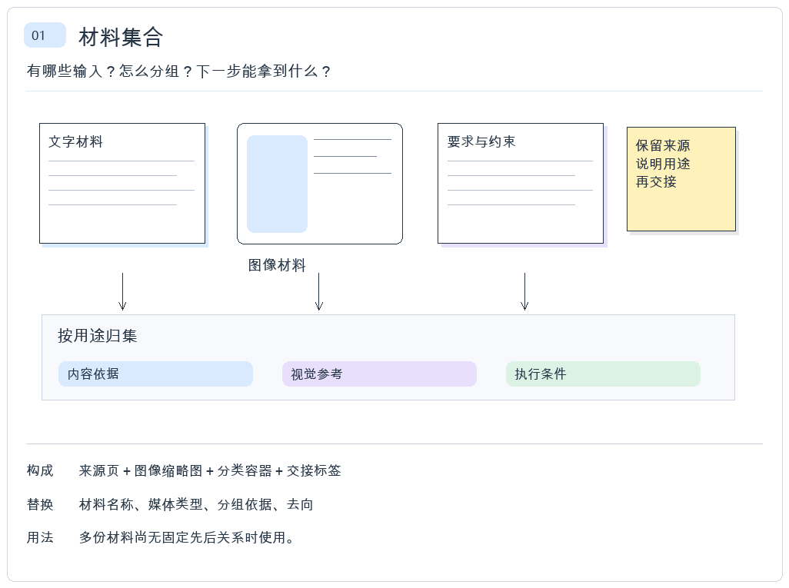

- 要回答：有哪些输入？怎么分组？下一步能拿到什么？
- 结构：来源页＋图像缩略图＋分类容器＋交接标签。
- 可替换内容：材料名称、媒体类型、分组依据、去向。
- 使用时机：多份材料尚无固定先后关系时使用。
- 边界：不要给并列材料加顺序编号。

### C02 用户 / AI / 产出阶段卡

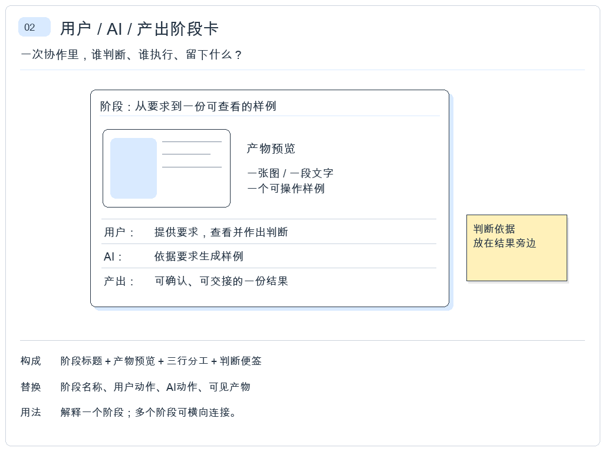

- 要回答：一次协作里，谁判断、谁执行、留下什么？
- 结构：阶段标题＋产物预览＋三行分工＋判断便签。
- 可替换内容：阶段名称、用户动作、AI动作、可见产物。
- 使用时机：解释一个阶段；多个阶段可横向连接。
- 边界：只在涉及分工时使用，不强制套用所有组件。

### C03 概念 → 图形映射

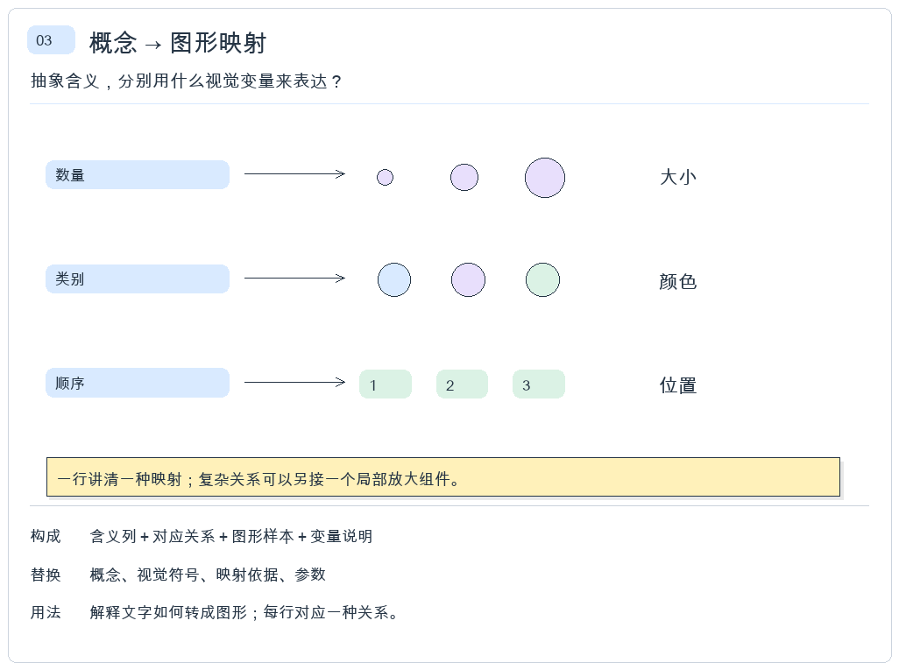

- 要回答：抽象含义，分别用什么视觉变量来表达？
- 结构：含义列＋对应关系＋图形样本＋变量说明。
- 可替换内容：概念、视觉符号、映射依据、参数。
- 使用时机：解释文字如何转成图形；每行对应一种关系。
- 边界：不要凭图形好看就建立未经说明的对应。

### C04 界面标注与局部放大

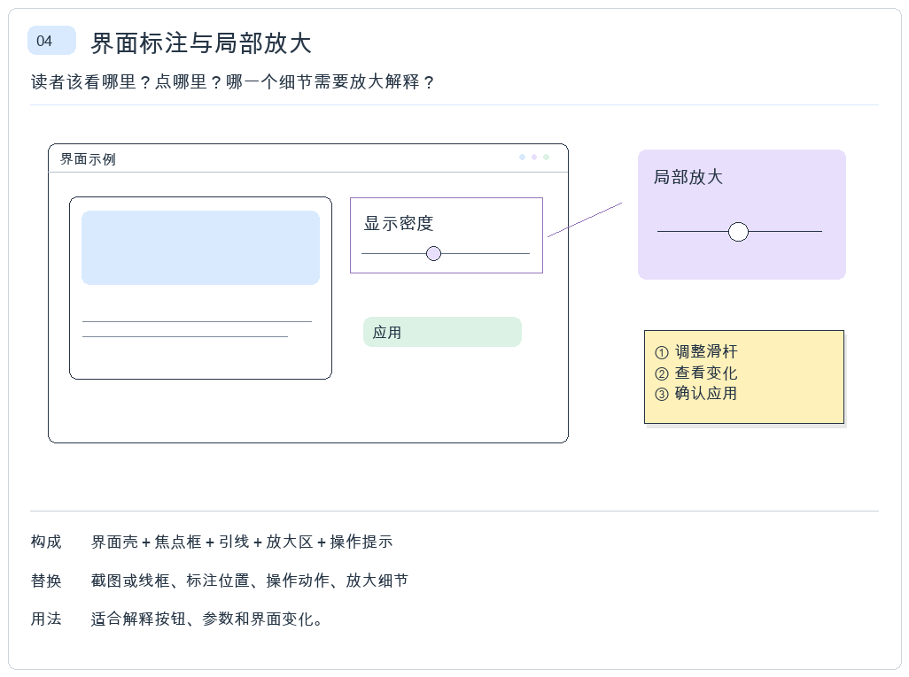

- 要回答：读者该看哪里？点哪里？哪一个细节需要放大解释？
- 结构：界面壳＋焦点框＋引线＋放大区＋操作提示。
- 可替换内容：截图或线框、标注位置、操作动作、放大细节。
- 使用时机：适合解释按钮、参数和界面变化。
- 边界：标注具体位置，避免便签遮住被解释的对象。

### C05 整体拆解与分层

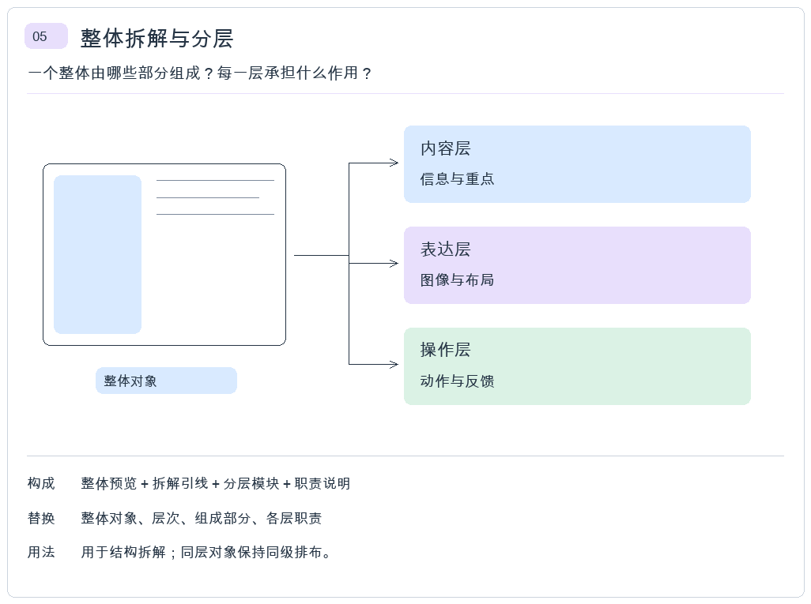

- 要回答：一个整体由哪些部分组成？每一层承担什么作用？
- 结构：整体预览＋拆解引线＋分层模块＋职责说明。
- 可替换内容：整体对象、层次、组成部分、各层职责。
- 使用时机：用于结构拆解；同层对象保持同级排布。
- 边界：层次表示组成关系，不代表执行顺序。

### C06 共用规则与一对多复用

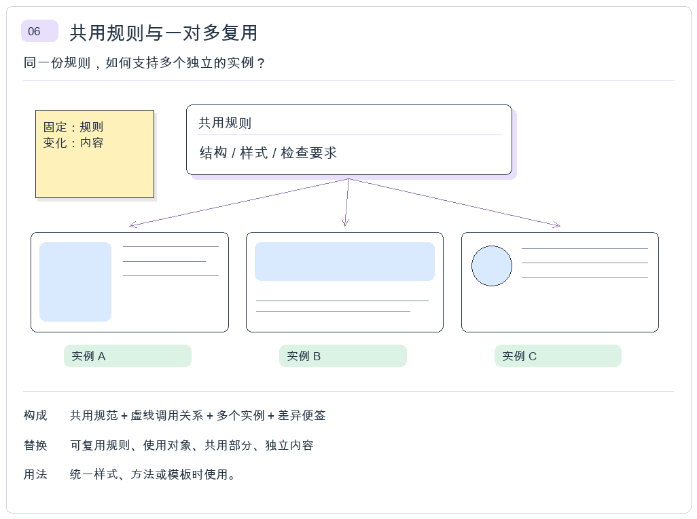

- 要回答：同一份规则，如何支持多个独立的实例？
- 结构：共用规范＋虚线调用关系＋多个实例＋差异便签。
- 可替换内容：可复用规则、使用对象、共用部分、独立内容。
- 使用时机：统一样式、方法或模板时使用。
- 边界：复用的是规则；每份实例的内容仍单独填写。

### C07 前后对照

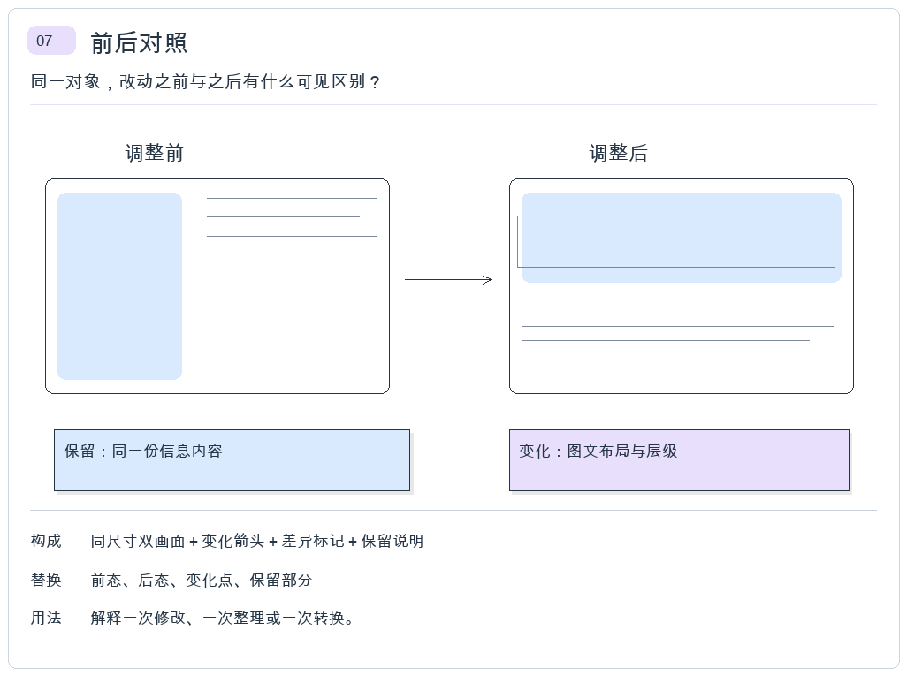

- 要回答：同一对象，改动之前与之后有什么可见区别？
- 结构：同尺寸双画面＋变化箭头＋差异标记＋保留说明。
- 可替换内容：前态、后态、变化点、保留部分。
- 使用时机：解释一次修改、一次整理或一次转换。
- 边界：必须对照同一对象；不同方案改用候选比较。

### C08 连续状态 / 分镜

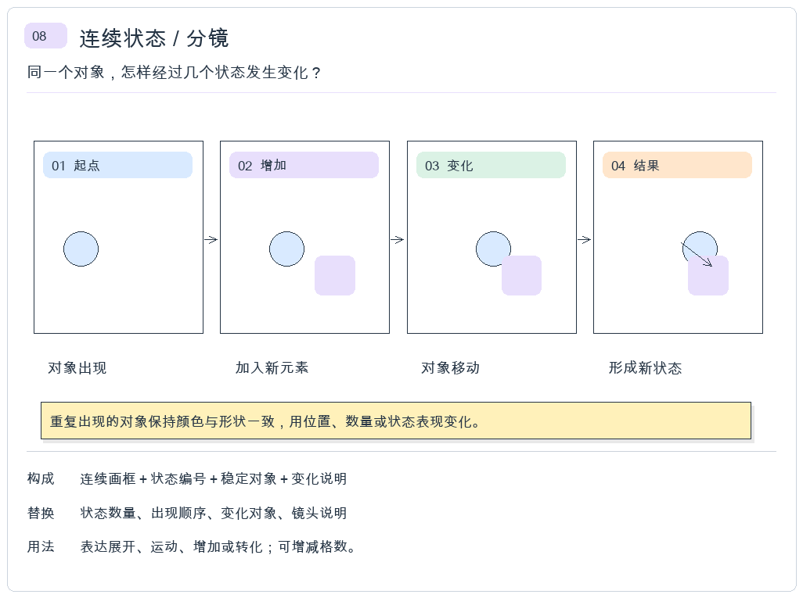

- 要回答：同一个对象，怎样经过几个状态发生变化？
- 结构：连续画框＋状态编号＋稳定对象＋变化说明。
- 可替换内容：状态数量、出现顺序、变化对象、镜头说明。
- 使用时机：表达展开、运动、增加或转化；可增减格数。
- 边界：与四格并列不同，相邻画面有明确前后关系。

### C09 分层时间轨道

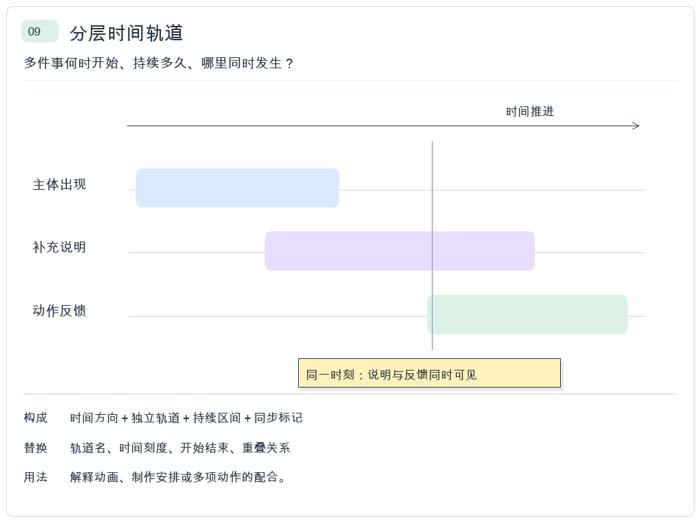

- 要回答：多件事何时开始、持续多久、哪里同时发生？
- 结构：时间方向＋独立轨道＋持续区间＋同步标记。
- 可替换内容：轨道名、时间刻度、开始结束、重叠关系。
- 使用时机：解释动画、制作安排或多项动作的配合。
- 边界：轨道表达时间；不用于无时序的组成关系。

### C10 候选方案比较与选择

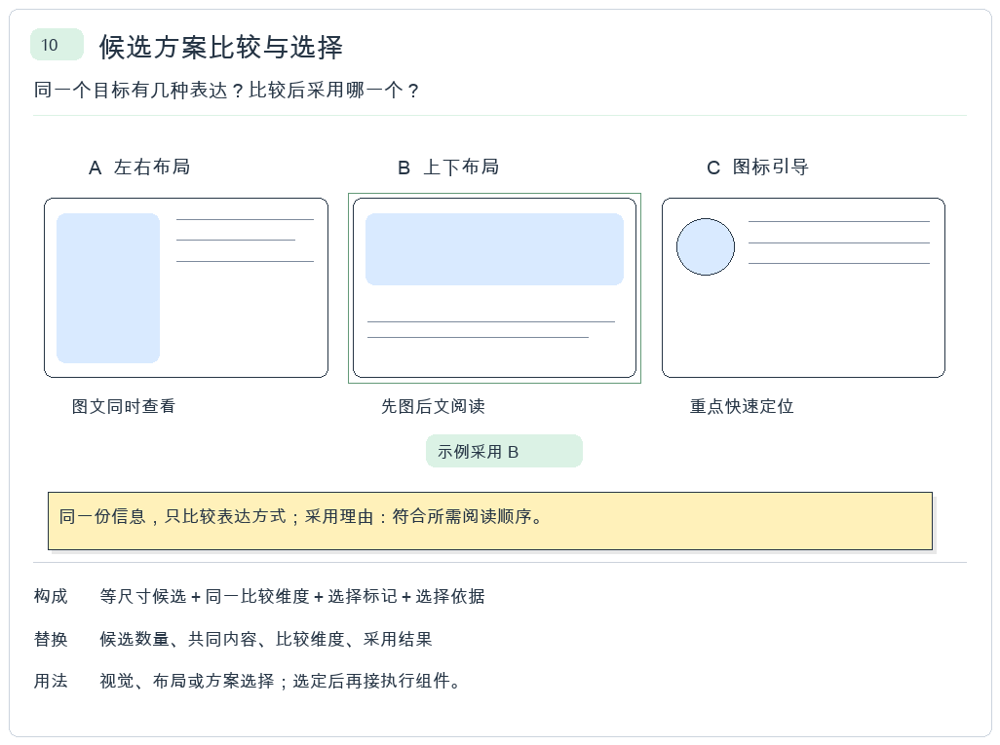

- 要回答：同一个目标有几种表达？比较后采用哪一个？
- 结构：等尺寸候选＋同一比较维度＋选择标记＋选择依据。
- 可替换内容：候选数量、共同内容、比较维度、采用结果。
- 使用时机：视觉、布局或方案选择；选定后再接执行组件。
- 边界：不能一边换内容、一边换形式，却只比较外观。

### C11 并列四格 / 案例墙

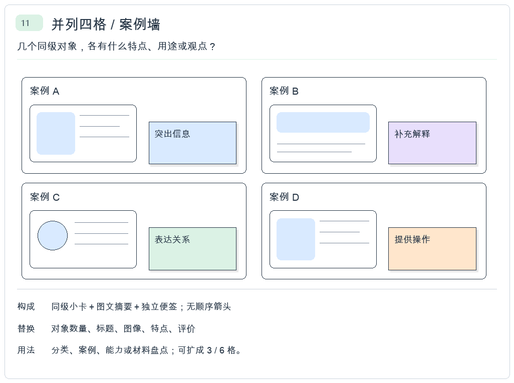

- 要回答：几个同级对象，各有什么特点、用途或观点？
- 结构：同级小卡＋图文摘要＋独立便签；无顺序箭头。
- 可替换内容：对象数量、标题、图像、特点、评价。
- 使用时机：分类、案例、能力或材料盘点；可扩成 3 / 6 格。
- 边界：格子不自动代表象限坐标，也不代表时间先后。

### C12 多路汇合 / 分流

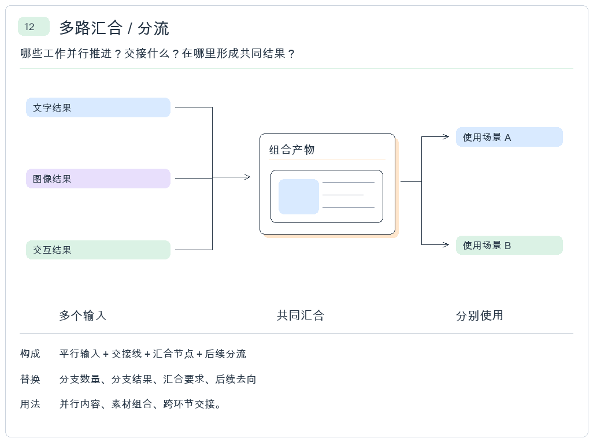

- 要回答：哪些工作并行推进？交接什么？在哪里形成共同结果？
- 结构：平行输入＋交接线＋汇合节点＋后续分流。
- 可替换内容：分支数量、分支结果、汇合要求、后续去向。
- 使用时机：并行内容、素材组合、跨环节交接。
- 边界：连接点表示依赖，不自动表示现实发生时间。

### C13 样例 → 确认 → 扩展

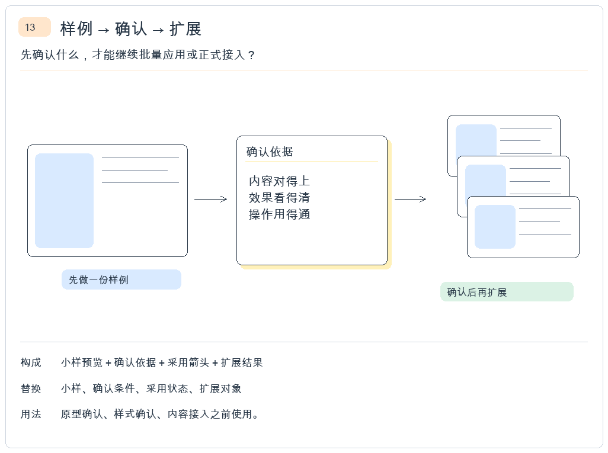

- 要回答：先确认什么，才能继续批量应用或正式接入？
- 结构：小样预览＋确认依据＋采用箭头＋扩展结果。
- 可替换内容：小样、确认条件、采用状态、扩展对象。
- 使用时机：原型确认、样式确认、内容接入之前使用。
- 边界：这是决策关口；不要把“已生成”等同“已确认”。

### C14 正常反馈与迭代

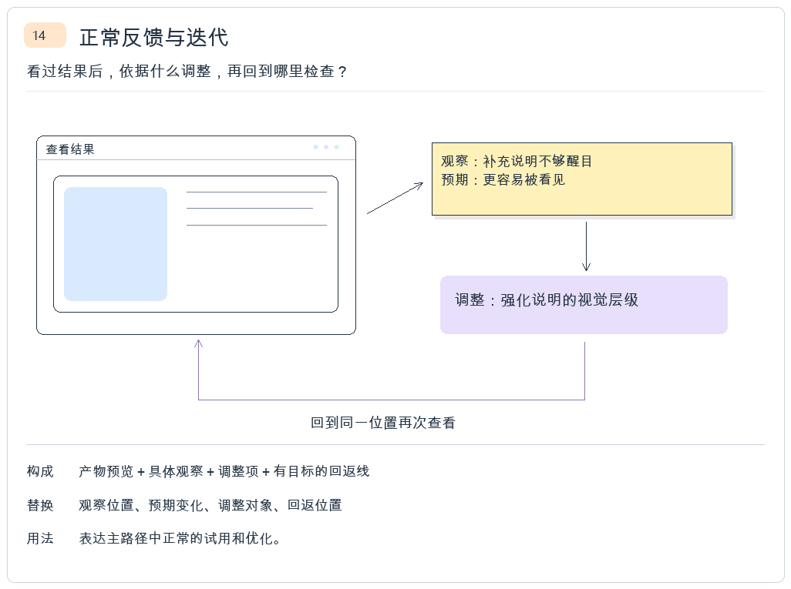

- 要回答：看过结果后，依据什么调整，再回到哪里检查？
- 结构：产物预览＋具体观察＋调整项＋有目标的回返线。
- 可替换内容：观察位置、预期变化、调整对象、回返位置。
- 使用时机：表达主路径中正常的试用和优化。
- 边界：回返箭头必须落到被修改对象，不能只画一个圆。

### C15 多轨同步对照

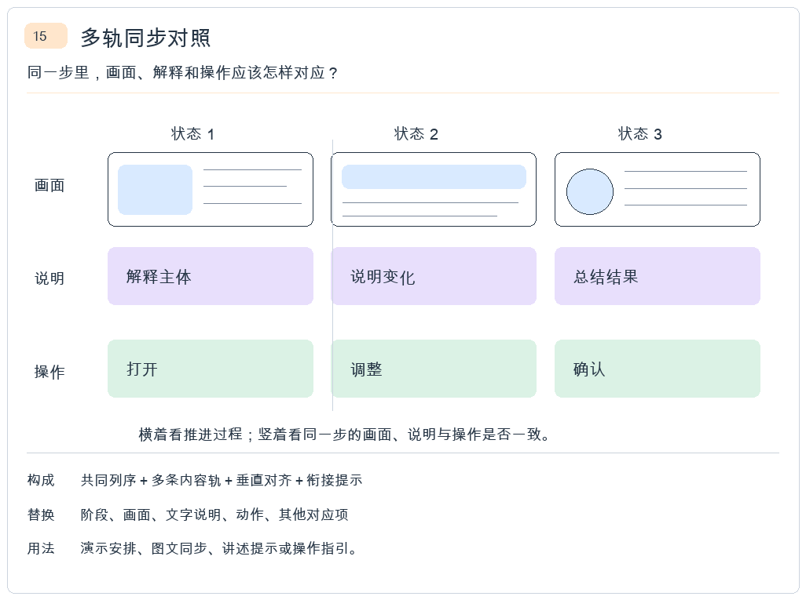

- 要回答：同一步里，画面、解释和操作应该怎样对应？
- 结构：共同列序＋多条内容轨＋垂直对齐＋衔接提示。
- 可替换内容：阶段、画面、文字说明、动作、其他对应项。
- 使用时机：演示安排、图文同步、讲述提示或操作指引。
- 边界：列表示同一时刻或阶段；行数可按需要增减。

### C16 交付包 / 组成与入口

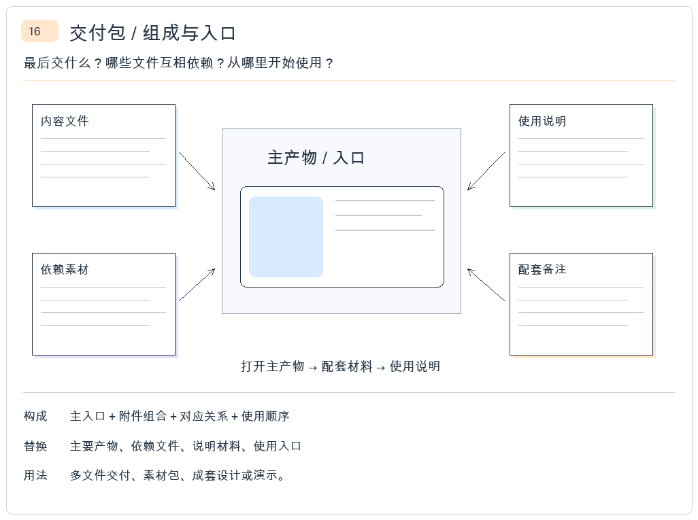

- 要回答：最后交什么？哪些文件互相依赖？从哪里开始使用？
- 结构：主入口＋附件组合＋对应关系＋使用顺序。
- 可替换内容：主要产物、依赖文件、说明材料、使用入口。
- 使用时机：多文件交付、素材包、成套设计或演示。
- 边界：不要只列文件名；要让接收者知道文件之间的关系。

### C17 全局路线与当前位置

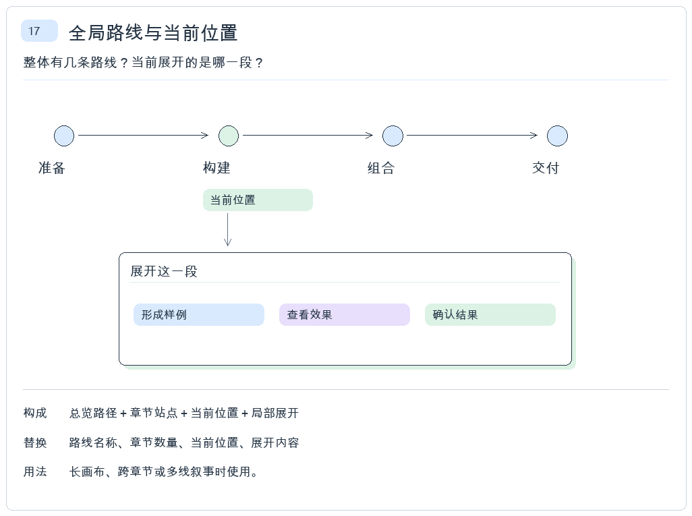

- 要回答：整体有几条路线？当前展开的是哪一段？
- 结构：总览路径＋章节站点＋当前位置＋局部展开。
- 可替换内容：路线名称、章节数量、当前位置、展开内容。
- 使用时机：长画布、跨章节或多线叙事时使用。
- 边界：总览保持简洁，细节放到局部展开中。

### C18 层级树 / 内容骨架

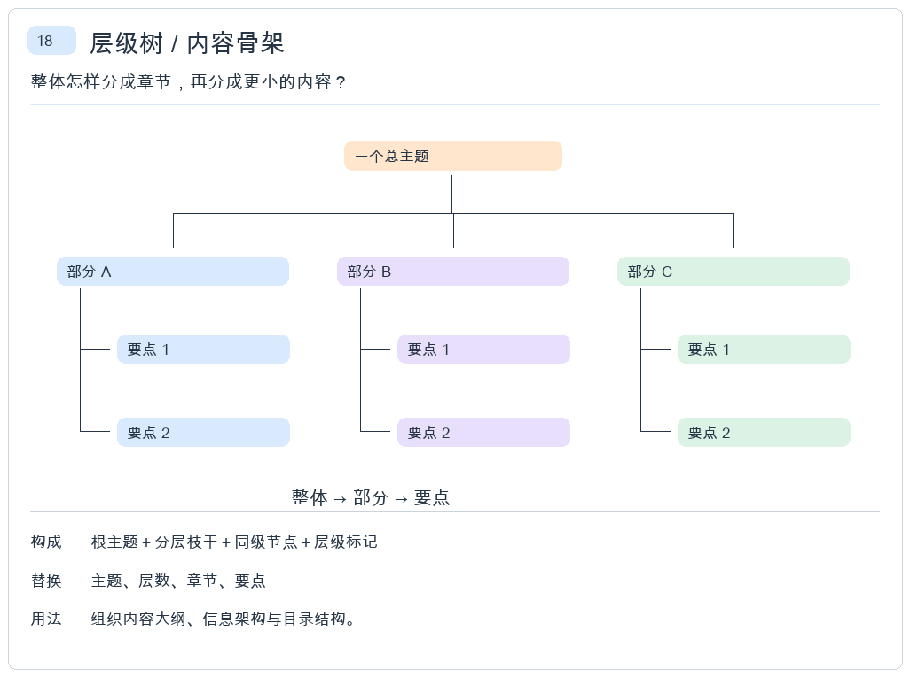

- 要回答：整体怎样分成章节，再分成更小的内容？
- 结构：根主题＋分层枝干＋同级节点＋层级标记。
- 可替换内容：主题、层数、章节、要点。
- 使用时机：组织内容大纲、信息架构与目录结构。
- 边界：树枝表达包含关系，不表达动作先后。

### C19 条件分支

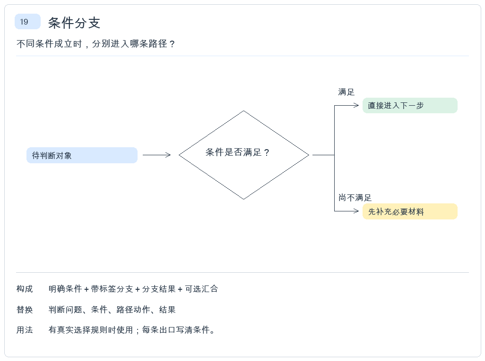

- 要回答：不同条件成立时，分别进入哪条路径？
- 结构：明确条件＋带标签分支＋分支结果＋可选汇合。
- 可替换内容：判断问题、条件、路径动作、结果。
- 使用时机：有真实选择规则时使用；每条出口写清条件。
- 边界：不要把并行工作误画成互斥选择。

### C20 二维矩阵 / 位置与依据

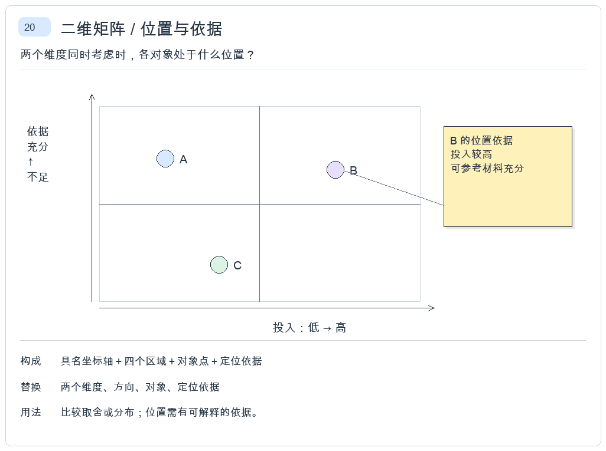

- 要回答：两个维度同时考虑时，各对象处于什么位置？
- 结构：具名坐标轴＋四个区域＋对象点＋定位依据。
- 可替换内容：两个维度、方向、对象、定位依据。
- 使用时机：比较取舍或分布；位置需有可解释的依据。
- 边界：与并列四格不同，这里的位置承载含义。

### C21 证据 → 观察 → 结论

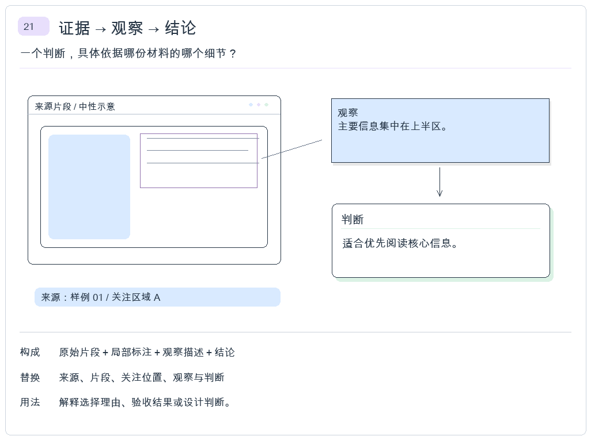

- 要回答：一个判断，具体依据哪份材料的哪个细节？
- 结构：原始片段＋局部标注＋观察描述＋结论。
- 可替换内容：来源、片段、关注位置、观察与判断。
- 使用时机：解释选择理由、验收结果或设计判断。
- 边界：把材料上能看到的事实与自己的推断分开。

### C22 版本演进与采用

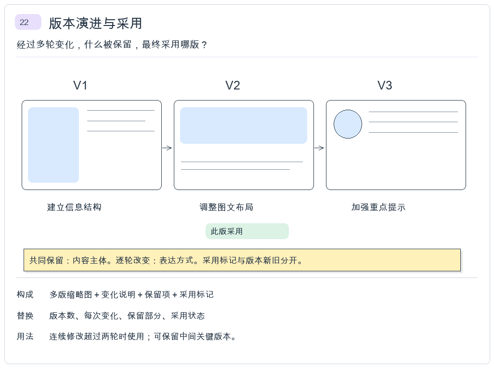

- 要回答：经过多轮变化，什么被保留，最终采用哪版？
- 结构：多版缩略图＋变化说明＋保留项＋采用标记。
- 可替换内容：版本数、每次变化、保留部分、采用状态。
- 使用时机：连续修改超过两轮时使用；可保留中间关键版本。
- 边界：最新版本不必然被采用，采用状态需单独标出。

### C23 变体示例 / 候选比较

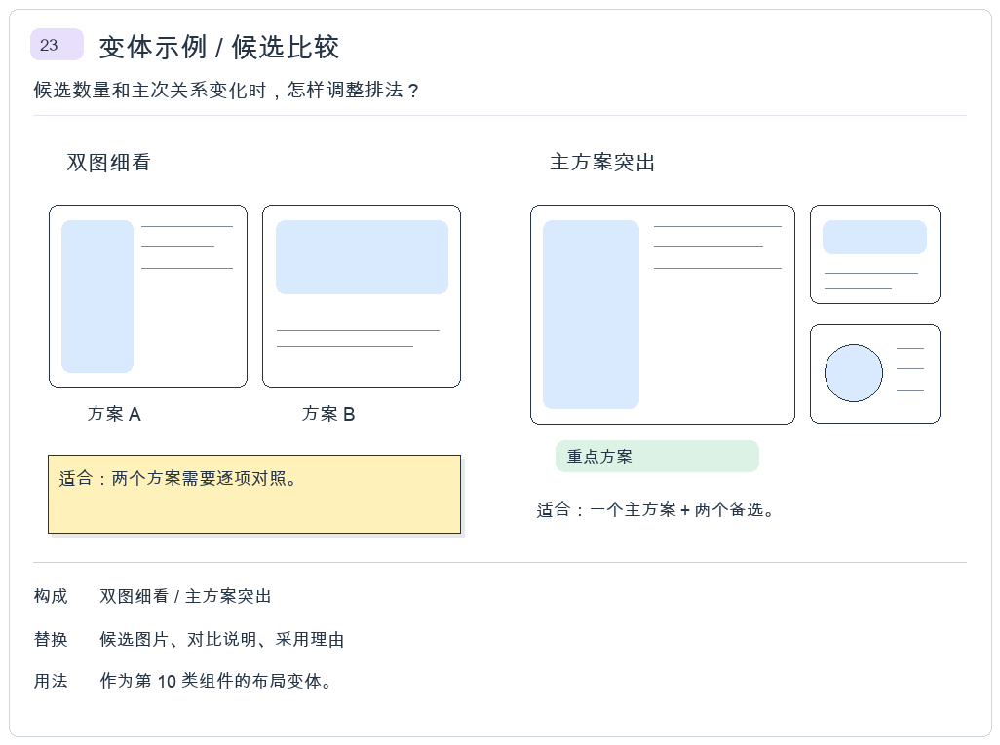

- 要回答：候选数量和主次关系变化时，怎样调整排法？
- 结构：双图细看 / 主方案突出。
- 可替换内容：候选图片、对比说明、采用理由。
- 使用时机：作为第 10 类组件的布局变体。
- 边界：仍然围绕同一目标比较，不增加新的组件类型。

### C24 变体示例 / 并列案例

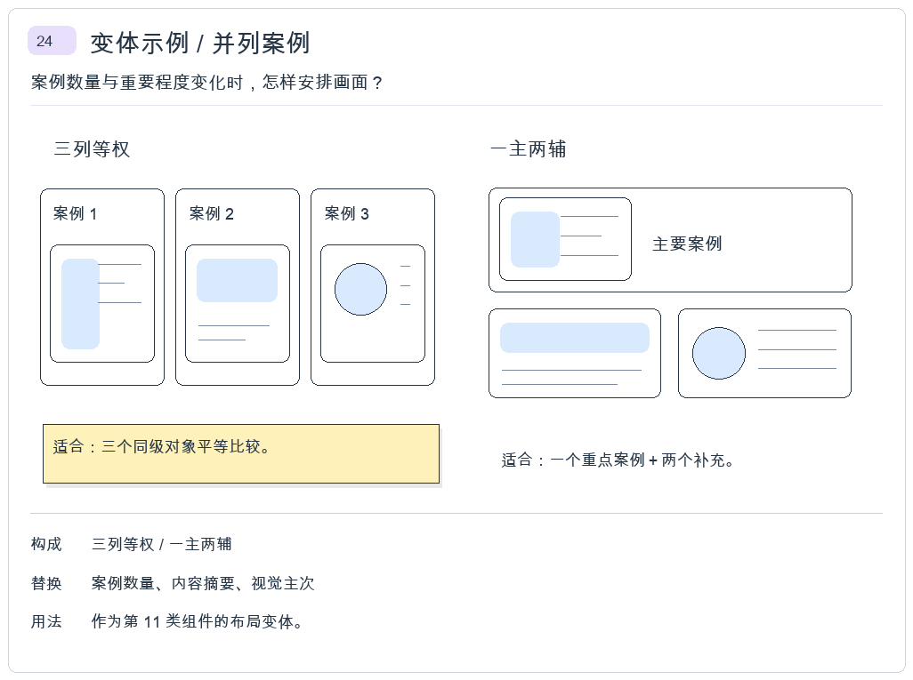

- 要回答：案例数量与重要程度变化时，怎样安排画面？
- 结构：三列等权 / 一主两辅。
- 可替换内容：案例数量、内容摘要、视觉主次。
- 使用时机：作为第 11 类组件的布局变体。
- 边界：视觉面积意味着强调程度，不能无意制造主次。

## 容易混淆的结构

- **连续分镜与并列四格**：前者看前后变化，后者看同级对象。不能因为都是四格就互相替代。
- **前后对照与候选比较**：前者解释同一对象的改变；后者比较同一目标的多种选择。
- **结构拆解与时间轨道**：前者回答“由什么组成”；后者回答“何时发生”。
- **一对多复用与多路汇合**：前者是一个规则支持多个实例；后者是多份产物汇成一个结果。
- **协作阶段与确认关口**：前者讲分工，后者讲能否继续推进的条件。

## 从正常路径提炼出的选型依据

此表只说明组件为什么值得准备，展示画布本身不填入课程实质内容。来源：[已确认的正常主路径](../课程制作主路径.mmd)。

| 主路径中反复出现的关系 | 应准备的通用组件 |
|---|---|
| 收集多份输入 | 材料集合 |
| 用户判断、AI执行、形成产物 | 协作阶段卡 |
| 文字含义转成图形 | 概念到图形映射 |
| 看原型、调参数、查看细节 | 界面标注与局部放大 |
| 研究参考并拆解方法 | 整体拆解与分层 |
| 沉淀方法，后续多处使用 | 共用规则与复用 |
| 整理或调整前后的变化 | 前后对照 |
| 内容逐步展开 | 连续状态与分镜 |
| 多种动作配合发生 | 分层时间轨道 |
| 查看样式并作出选择 | 候选比较 |
| 多种材料或案例平级盘点 | 并列四格 |
| 多条内容线交织与汇合 | 汇合与分流 |
| 先确认小样，再正式接入 | 样例确认与扩展 |
| 回顾效果并返回调整 | 正常反馈与迭代 |
| 页面、说明和操作相互对应 | 多轨同步对照 |
| 成套产物交接使用 | 交付包与入口 |

## 图形约定与核验

蓝色表示主体，紫色表示补充或变化，绿色表示采用或输出，黄色便签表示观察与依据。实线用于交付或推进；虚线用于引用规则或反馈回返。颜色不单独承担含义，旁边保留文字。

示例 UI 与文案均为中性示范，不表示任何真实产品、课程或工作已经完成。PNG / SVG 用同一组元素坐标生成，供快速审阅；手绘笔触和字体可能与 Excalidraw 原生显示略有不同。
