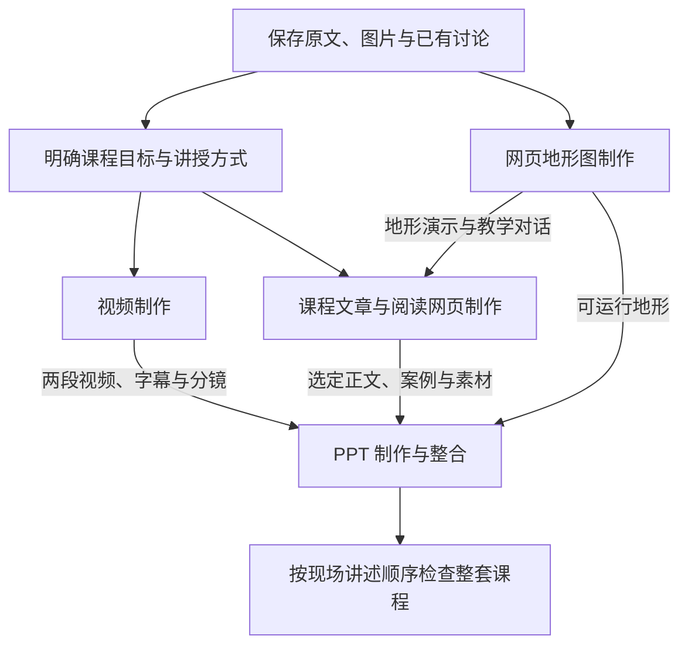
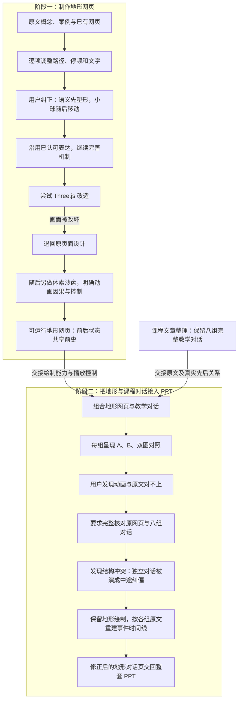
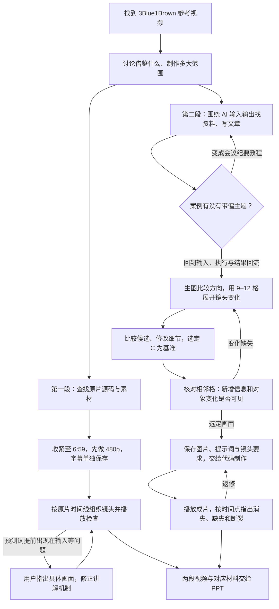
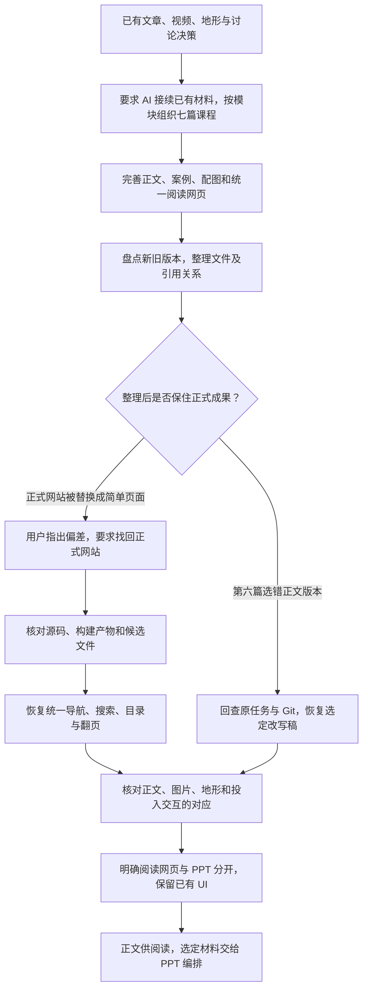
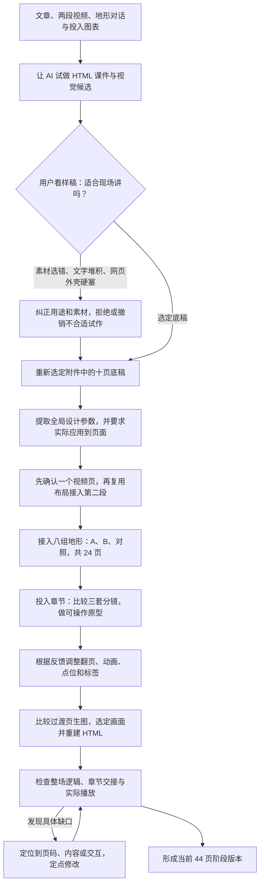

# 课程制作流程总纲

四条制作主线分别展开，在 HTML 课件中汇合。箭头表示制作推进或材料交接，不表示四条线严格依次发生。节点先保留操作、结果和关键判断，图片、UI、对话原文及验证细节后续补入。

## 整体关系

## 1. 网页地形图：先制作演示，再适配课程对话

这是前后相接的两个阶段。前一阶段交出可运行的地形网页；后一阶段将它与课程整理出的八组教学对话结合。关键冲突发生在两份材料汇合时：原网页按“共同前史后分叉”设计，课程中的很多 A/B 则是独立对话。

复用做法：复用产物时，核对它原先的前提是否仍适合新材料。原网页的“共同前史”来自当时的明确要求；后来接入独立 A/B 对话时，需要改的是事件编排，不能只调播放速度。

证据：

- [因果纠偏与认可：01a06001，M023–M044](../对话数据/Codex/01a06001-ef4f-71d1-821e-9ee52c2faff3.md)。
- [改造失败与退回：01a07a7d，M021–M033](../对话数据/Codex/01a07a7d-3269-75e2-b844-f6e50ab4a292.md)。
- [体素沙盘要求及结果：01a07e7a，M001–M017](../对话数据/Codex/01a07e7a-3064-7aa1-9661-e0660622fb55.md)。M001 明确要求干预前后共享历史；这是当时的设计前提。
- [接入、发现错配、研究与修正：01a0bc49，M058–M086](../对话数据/Codex/01a0bc49-6328-7882-abff-5887d5db5079.md)。

9 月 2–8 日作为背景，重点展开后续课程整合。地形是教学示意；完整教学对话不等于已核验的真实聊天。M086 是历史助手的完成报告，不代表本次已验收全部交互。

## 2. 视频：先找参考，再分别制作两段内容

复用做法：先确定这轮看文章、候选图、连续分镜还是视频；选择足以支持当前判断的产物；用格子编号或时间点反馈。

证据：

- [参考与第一段制作：01a0a377，M001–M145](../对话数据/Codex/01a0a377-3142-77c3-9dff-5e4d808b69ea.md)。
- [第二段内容与案例纠偏：01a0a41b，M001–M098](../对话数据/Codex/01a0a41b-40fc-7620-a4cc-d037fd5f98f4.md)。
- [候选、分镜与交接：01a0a7f4，M017–M080](../对话数据/Codex/01a0a7f4-a837-7293-a6f9-1d3bbe048171.md)；[保留 C](../对话数据/Codex/01a0a81e-f913-7d71-8b30-83c8fe648726.md)。
- [成片返修：01a0a87b，M011–M053](../对话数据/Codex/01a0a87b-54cf-7e90-8fe2-f550ac2f1076.md)。

早期自制动画不清楚、转向参考的过程作为开场背景补充，不占视频主线的中心。

## 3. 课程网页：把材料组织成可读、可找、可复用的内容

复用做法：让 AI 按引用关系和采用记录识别有效版本；整理后检查原有阅读功能和内容是否保留，不能只检查文件是否存在。

证据：

- [课程组织与原文要求：01a0a8a9，M019–M031、M070–M111](../对话数据/Codex/01a0a8a9-6d2f-7e40-8ff1-30cbfe57415b.md)。
- [网站与正文恢复：01a0b221，M053–M068](../对话数据/Codex/01a0b221-bbd4-7b83-8139-eedda28ce52e.md)。
- [阅读网页与 PPT 分开：01a0b362，M055–M088](../对话数据/Codex/01a0b362-6510-7212-b628-bb9e584521ae.md)。

## 4. PPT：选定底稿，把不同产物组合成一场讲述

复用做法：先选定一份具体底稿；区分“规范写好了”和“页面改好了”；已确认的一页可以复用，但各页的内容和事件仍需分别核对。

证据：

- [失败试作与素材纠偏：Antigravity，step 101、242、254、372](../对话数据/Antigravity/主会话-可读对话.md)。
- [拒绝预览](../对话数据/Codex/01a0b2e6-970a-7791-8623-307e485679e2.md)；[撤销试作](../对话数据/Codex/01a0b339-ea7f-7f31-b8f6-662a3edc3059.md)。
- [十页底稿、参数落地、视频与交互接入：01a0bc49](../对话数据/Codex/01a0bc49-6328-7882-abff-5887d5db5079.md)。
- [选图与 HTML 实现：01a0c158，M072–M074](../对话数据/Codex/01a0c158-8585-71e2-a817-a58f4996ef74.md)。
- [当前页码与素材对应](../页面与素材对应.md)；[来源与验证边界](../来源与完整性.md)。

44 页是当前阶段产物，不代表全部内容、视觉和交互已完成最终授课验收。
