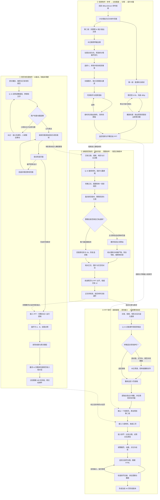

# 课程制作路径图

保留四个流程各自的节点与内部连线。虚线表示流程之间的材料交接，不表示四条线严格依次发生。

```mermaid
flowchart TB
    subgraph T[① 网页地形图制作：从能动，到能讲清楚]
        direction TD
        TA[原文概念、案例与已有地形网页] --> TB[让 AI 逐项调整路径、停顿和文字]
        TB --> TC{用户检查动画因果}
        TC -->|小球走过才出现沟壑| TD[纠正：语义先塑形，小球随后移动]
        TD --> TB
        TC -->|认可表达| TE[继续完善其他机制与地形素材]
        TE --> TF[尝试改造页面]
        TF -->|破坏原有设计| TG[回退并限定修改范围]
        TG --> TE
        TF -->|形成可用素材| TH[接入 PPT：完整对话＋运行控制]
        TH --> TI[展开为 A、B、双图对照]
        TI --> TJ[发现动画与原文错配]
        TJ --> TK[要求 AI 完整研究原网页和八组对话]
        TK --> TL[分别重建 A/B 时间线，再交给课件]
    end

    subgraph V[② 视频制作：参考 → 比较画面 → 分镜 → 成片纠偏]
        direction TD
        VA[找到 3Blue1Brown 参考视频] --> VB[讨论借鉴方式与制作范围]
        VB --> VC[第一段：查源码与素材]
        VC --> VD[限定到 6:59，先做 480p]
        VD --> VE[播放检查：指出预测词提前出现等问题]
        VE -->|修正内容与镜头| VD
        VB --> VF[第二段：先整理 AI 输入输出文章]
        VF --> VG[纠正案例带偏主题]
        VG --> VH[生图比较方向，用连续分镜展开变化]
        VH --> VI[选择 C，修改并保存视觉基准]
        VI --> VJ[交接图片、提示词和镜头要求]
        VJ --> VK[代码制作与视频渲染]
        VK --> VL[按时间点指出缺失、消失和断裂]
        VL -->|返修| VK
        VE --> VM[选定视频与字幕交给 PPT]
        VL --> VM
    end

    subgraph W[③ 课程网页制作：组织内容 → 整理材料 → 找回正确版本]
        direction TD
        WA[已有文章、视频、地形与讨论决策] --> WB[让 AI 接续材料，组织七篇课程]
        WB --> WC[完善正文、配图和统一阅读网页]
        WC --> WD[盘点新旧版本，整理目录与引用]
        WD --> WE{整理后是否保住已有成果？}
        WE -->|正式网站变成简单页面| WF[要求找回正式网站]
        WF --> WG[核对源码与构建产物，恢复导航、搜索和目录]
        WE -->|第六篇选错版本| WH[回查原任务与 Git，恢复选定稿]
        WG --> WI[核对正文、图片与交互的对应]
        WH --> WI
        WI --> WJ[阅读网页与 PPT 分开，保留已有 UI]
        WJ --> WK[正文供阅读，选定材料交给课件]
    end

    subgraph P[④ PPT 制作：选择底稿 → 逐块接入 → 检查整场讲述]
        direction TD
        PA[文章、视频、地形对话与投入图表] --> PB[让 AI 试做课件和视觉候选]
        PB --> PC{样稿适合现场讲吗？}
        PC -->|素材错、文字多、网页外壳硬塞| PD[纠正用途，拒绝或撤销试作]
        PD --> PE[重新选定十页底稿]
        PC -->|选定底稿| PE
        PE --> PF[提取全局设计参数，并应用到实际页面]
        PF --> PG[确认一个视频页，再复用到第二段]
        PG --> PH[接入八组地形，每组三页]
        PH --> PI[投入章节：比较分镜，试用交互原型]
        PI --> PJ[调整翻页、动画、点位与标签]
        PJ --> PK[选定过渡页生图，重建 HTML]
        PK --> PL[检查章节交接、讲述逻辑与播放]
        PL -->|发现缺口，按页修改| PK
        PL --> PM[形成当前 44 页阶段版本]
    end

    TE -. 地形素材进入课程整理 .-> WA
    VM -. 视频进入课程材料 .-> WA
    WK -. 选定文章与素材 .-> PA
    VM -. 视频与字幕接入视频页 .-> PG
    WK -. 完整教学对话供地形接入 .-> TH
    TL -. 校正后的地形对话页 .-> PH
```

证据入口：[PPT 与视频构建指南](../PPT与视频构建指南.md)、[关键动作与对话定位](../关键动作与对话定位.md)、[页面与素材对应](../页面与素材对应.md)。历史完成报告与当前验证边界见[来源与完整性](../来源与完整性.md)。
